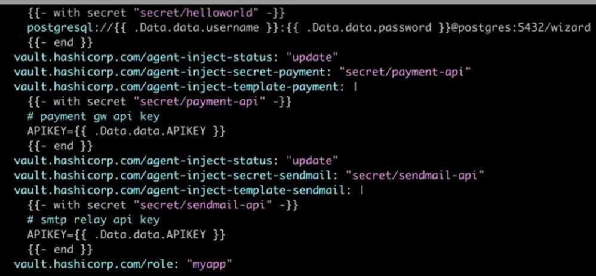
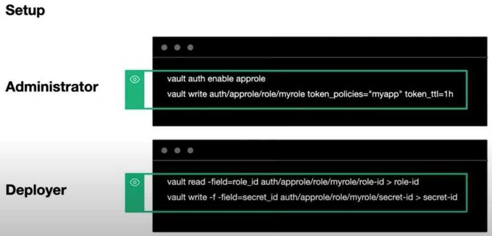
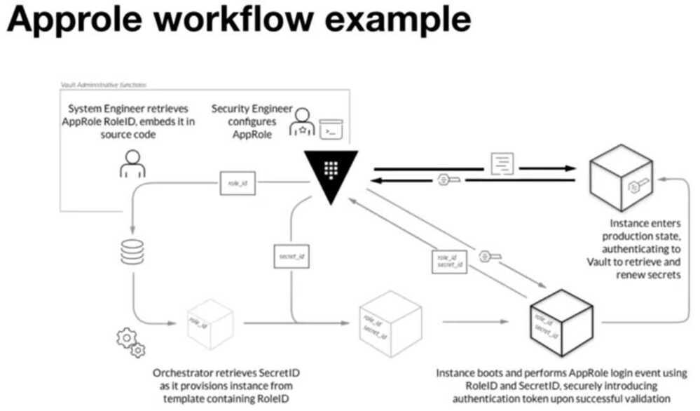
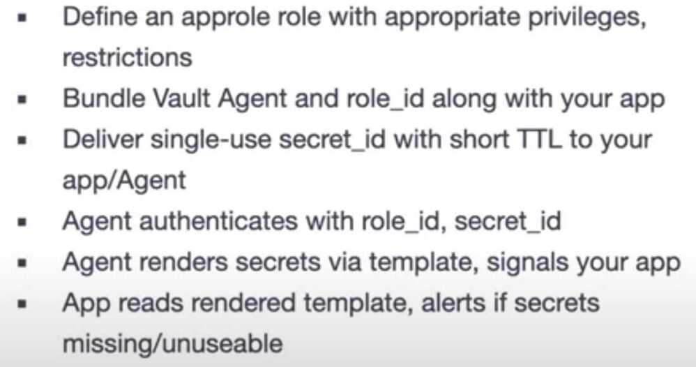
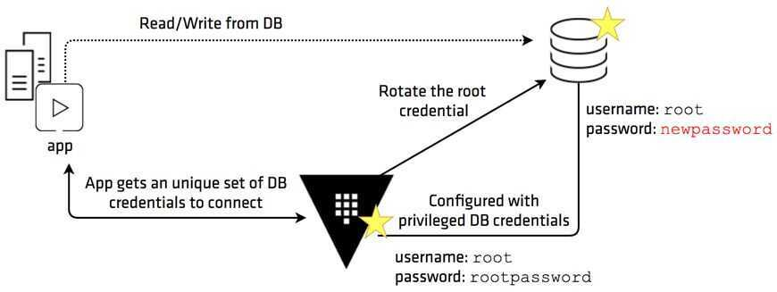

# Vault

Vault is a tool for securely accessing *secrets*. A secret is anything that you want to tightly control access to, such as API keys, passwords, or certificates. Vault provides a unified interface to any secret, while providing tight access control and recording a detailed audit log.

Vault was built to solve the secret sprawl problem in a user-friendly and auditable way. Just as immutable infrastructure gives operations certainty in server configurations and eliminates drift, Vault gives security certainty in when, where, and how secrets are being used across a system. It is the central source of security truth for modern architectures.

## Features

### Secure Secret Storage

Arbitrary key/value secrets can be stored in Vault. Vault encrypts these secrets prior to writing them to persistent storage, so gaining access to the raw storage isn't enough to access your secrets. Vault can write to disk, [Consul](https://www.consul.io/), and more.

### Dynamic Secrets

Vault can generate secrets on-demand for some systems, such as AWS or SQL databases. For example, when an application needs to access an S3 bucket, it asks Vault for credentials, and Vault will generate an AWS keypair with valid permissions on demand. After creating these dynamic secrets, Vault will also automatically revoke them after the lease is up. Thus, even if the system is breached, the attacker only has a short window of opportunity before the secret gets re-generated and access is revoked.

### Data Encryption

Vault can encrypt and decrypt data without storing it. This allows security teams to define encryption parameters and developers to store encrypted data in a location such as SQL without having to design their own encryption methods.

### Leasing and Renewal

All secrets in Vault have aleaseassociated with them. At the end of the lease, Vault will automatically revoke that secret. Clients are able to renew leases via built-in renew APIs.

### Revocation

Vault has built-in support for secret revocation. Vault can revoke not only single secrets, but a tree of secrets, for example all secrets read by a specific user, or all secrets of a particular type. Revocation assists in key rolling as well as locking down systems in the case of an intrusion.

### Limit the internal surface area of a breach to a single application instance

Fine-grained ACLs lets Vault grants specific, limited communication permissions for each secret. If a secret is compromised, it only provides access to a single service and not the entire infrastructure. In many existing security managers, obtaining one key will let an attacker have free reign throughout the system.

### Generate an audit trail of service communication

Each time a secret is generated it creates an audit log which can be used to determine the specific compromised resource in the datacenter. For example, if an application that does not have access to a database attempts to make a connection, it is clear that there has been a compromise. The audit log can be used by operators and security teams to pinpoint tainted servers and take the proper steps to restore the security of the system as a whole. It is important to note that secrets are generated after the log is stored, meaning that all access actions are guaranteed to be logged. If for some reason the log cannot be written, the secret will not be generated.

### Simplify security for large operations and infrastructures

Often the biggest hurdle to proper security is the complexity of the implementing the security solution. With simple installation and setup, Vault lowers the barrier to entry for organizations to use responsible secret management to secure their distributed infrastructure. Secrets can be written from the command line or the [complete HTTP API](http://www.google.com/url?q=http%3A%2F%2Fvaultproject.io%2Fdocs%2Fhttp%2Findex.html&sa=D&sntz=1&usg=AFQjCNFDA0tQawMLYkAwPLjf-UZLCImSPw).

### In-transit data encryption

Vault can encrypt and decrypt data without storing it. Security teams can define encryption parameters and store encrypted data in a location such as a SQL database without having to design a custom encryption method. You can read more about [how HashiCorp's Atlas uses Vault to encrypt GitHub OAuth tokens](https://www.google.com/url?q=https%3A%2F%2Fhashicorp.com%2Fblog%2Fhow-atlas-uses-vault-for-managing-secrets.html&sa=D&sntz=1&usg=AFQjCNHM-BUqX0jdzPzHtH1Wx88qQw-yJA).

### High-availability

High-availability is a requirement for large-scale infrastructures to protect against service outages. Vault can run in multi-server mode when using a [backend that supports it](https://www.google.com/url?q=https%3A%2F%2Fvaultproject.io%2Fdocs%2Fconcepts%2Fha.html&sa=D&sntz=1&usg=AFQjCNGaIQAyr3T1AgRc__VI7utYGAx-Jg), such as Consul or etcd.

### Authentication methods

Vault includes multiple methods for authentication so organizations can select the option that fits best with their setup. Vault [currently supports](https://www.google.com/url?q=https%3A%2F%2Fvaultproject.io%2Fdocs%2Fconcepts%2Fauth.html&sa=D&sntz=1&usg=AFQjCNFkbuRP8tVhRTt8aUYwQETkJZwFVw) tokens, username/password, GitHub, certificates, and more.

## Best Practices

- Don't let secrets live forever
- Distribute secrets securely
- Limit exposure if auth secret disclosed
- Break-glass procedure if auth secret stolen
- Detect unauthoried access to auth secrets

## Options

1. Deploy Vault token alongside app
2. Deploy approle roleid/secretid alongside app
3. Deploy TLS client certificates and use cert auth method

## Option 1: Distributing Tokens

One reason you might want to do this instead of using approle is its easy to use envconsul or consul-template

If distributing tokens directly:

- use a token role, similar to what we do with approle roles
- distribute single-use token with a short TTL
- use response wrapping to embed another longer-lived token

## Commands

```bash
brew install vault
vault -autocomplete-install

vault server -dev

export VAULT_ADDR='http://127.0.0.1:8200'
vault status
vault path-help aws
vault path-help aws/creds/my-non-existent-role

#DML
vault kv put secret/hello foo=world
vault kv put secret/hello foo=world excited=yes
vault kv get secret/hello
vault kv list kv/

#DDL
vault secrets list
vault token create

#Enable secret engine
vault secrets enable -path=kv kv
vault secrets enable kv
vault secrets disable kv/
vault secrets enable -path=aws aws

# Gen

# Dynamic Secrets
vault write aws/config/root \
    access_key=XXX\
    secret_key=XXX \
    region=ap-south-1

vault write aws/roles/my-role \
        credential_type=iam_user \
        policy_document=-<<EOF
{
    "Version": "2012-10-17",
    "Statement": [
    {
        "Sid": "Stmt1426528957000",
        "Effect": "Allow",
        "Action": [
        "ec2:*"
        ],
        "Resource": [
        "*"
        ]
    }
    ]
}
EOF

vault read aws/creds/my-role
vault lease revoke aws/creds/my-role/0bce0782-32aa-25ec-f61d-c026ff22106
```

## K8s annotations

remove pre-populate-only, to run sidecar that can sync credentials



```yaml
apiVersion: batch/v1beta1
kind: CronJob
metadata:
    name: reminder-test
    namespace: crons
spec:
    # never runs
    schedule: "00 00 31 2 *"
    successfulJobsHistoryLimit: 7
    failedJobsHistoryLimit: 5
    jobTemplate:
    spec:
        template:
        metadata:
            annotations:
            "vault.hashicorp.com/agent-inject": "true"
            "vault.hashicorp.com/agent-pre-populate-only": "true"
            "vault.hashicorp.com/agent-inject-secret-credentials.json": "crons/reminder-sms"
            "vault.hashicorp.com/role": "crons"
            "vault.hashicorp.com/agent-inject-template-credentials.json": |
                {{ with secret "crons/reminder-sms" }}
                {
                {{ range $k, $v := .Data.data }} "{{ $k }}": "{{ $v }}",
                {{ end }} "dummy": "yes"
                }
                {{ end }}
        spec:
            containers:
            - name: app
                image: 331916247734.dkr.ecr.ap-south-1.amazonaws.com/reminder-messages:reminder-messages-prod-2020-07-24-22-5
                imagePullPolicy: IfNotPresent
                env:
                - name: DEBUG
                    value: "True"
                - name: DEBUG_EMAIL
                    value: "deepak.sood@stashfin.com"
                - name: DEBUG_PHONE
                    value: "9425592627"
                - name: DEBUG_LIMIT
                    value: "1"
                command:
                - /bin/bash
                - -c
                - |
                    sleep infinity
                    # sh test.sh
            restartPolicy: OnFailure
```

## App Roles






## Review Approle



## Database Rotation

The database secrets engine generates database credentials dynamically based on configured roles. It works with a number of different databases through a plugin interface. There are a number of builtin database types and an exposed framework for running custom database types for extendability. This means that services that need to access a database no longer need to hardcode credentials: they can request them from Vault, and use Vault's leasing mechanism to more easily roll keys. These are referred to as "dynamic roles" or "dynamic secrets".

## Static Roles

The database secrets engine supports the concept of "static roles", which are a 1-to-1 mapping of Vault Roles to usernames in a database. The current password for the database user is stored and automatically rotated by Vault on a configurable period of time. This is in contrast to dynamic secrets, where a unique username and password pair are generated with each credential request. When credentials are requested for the Role, Vault returns the current password for the configured database user, allowing anyone with the proper Vault policies to have access to the user account in the database.- Database user credentials rotation

- Database root credentials rotation

Vault's [database secrets engine](https://www.vaultproject.io/docs/secrets/databases/index.html) provides a centralized workflow for managing credentials for various database systems. By leveraging this, every service instance gets a unique set of database credentials instead of sharing one. Having those credentials tied directly to each service instance and live only for the life of the service, any abnormal access pattern can be mapped to a specific service instance and its credential can be revoked immediately.
This reduces the manual tasks performed by the database administrator and makes the database access more efficient and secure.



https://learn.hashicorp.com/tutorials/vault/database-root-rotation

https://learn.hashicorp.com/tutorials/vault/database-secrets

https://www.vaultproject.io/docs/secrets/databases

## Audit Devices

Audit devices are the components in Vault that keep a detailed log of all requests and response to Vault. Because every operation with Vault is an API request/response, the audit log containsevery authenticatedinteraction with Vault, including errors.
Multiple audit devices can be enabled and Vault will send the audit logs to both. This allows you to not only have a redundant copy, but also a second copy in case the first is tampered with.

## Questions

- How to delete credentials from hashicorp vault and database when pod terminates? (how to tie the credentials lifecyle to a pod)
- How applications will refresh the credentials when the credentials expire? - boto3, python, php
- How to give specific username (or some prefix for a username) for a database credentials (because we will exclude this user from audit logs)
- Give all pod same credentials
- Mount vault credentials to a specific location
- How to do disaster recovery
- Vault rotate master passwords and send emails
- Proxy to a master password like api keys

## Steps

1. Enable KV Engine

2. Add ACL

```yaml
path "prod*" {
    capabilities = ["read"]
}
```

3. Create role

https://www.vaultproject.io/docs/what-is-vault

https://github.com/hashicorp/vault

https://www.vaultproject.io/docs/internals/architecture

https://learn.hashicorp.com/vault

https://blog.container-solutions.com/secret-sprawl-and-the-challenges-of-modern-enterprise-security

https://www.hashicorp.com/blog/dynamic-database-credentials-with-vault-and-kubernetes

[Kubernetes Secret Management guide beginners using Vault](https://www.youtube.com/playlist?list=PLHq1uqvAteVtq-NRX3yd1ziA_wJSBu3Oj)

## Comparison

https://www.cncf.io/announcements/2021/02/23/cncf-provides-insights-into-secrets-management-tools-with-latest-end-user-technology-radar
