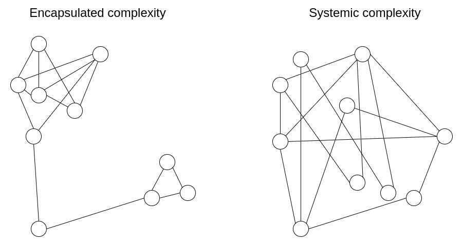

# Software Complexity

- **Learning and Discovery -** Iteration, Feedback, Incrementalism, Experimentation and Empiricism
- **Managing Complexity -** Modularity, Information Hiring, Seperation of Concerns, Loose-Coupling, Cohesion

https://dont.build

Making great software is more about **managing complexity and thinking through details** than it is about design or pretty pixels. One of the biggest misunderstandings of our era.

## No Silver Bullet-- Essence and Accident in Software Engineering

"No Silver Bullet-- Essence and Accident in Software Engineering" is a widely discussed paper on [software engineering](https://en.wikipedia.org/wiki/Software_engineering) written by [Turing Award](https://en.wikipedia.org/wiki/Turing_Award) winner [Fred Brooks](https://en.wikipedia.org/wiki/Fred_Brooks) in 1987.Brooks argues that "there is no single development, in either technology or management technique, which by itself promises even one [order of magnitude](https://en.wikipedia.org/wiki/Order_of_magnitude) (tenfold) improvement within a decade in productivity, in reliability, in simplicity." He also states that "we cannot expect ever to see two-fold gains every two years" in software development, as there is in hardware development ([Moore's law](https://en.wikipedia.org/wiki/Moore%27s_law)).

### Summary

Brooks distinguishes between two different types of complexity: **accidental complexity and essential complexity.** This is related to [Aristotle](https://en.wikipedia.org/wiki/Aristotle)'s classification. Accidental complexity relates to problems which engineers create and can fix; for example, the details of writing and optimizing [assembly](https://en.wikipedia.org/wiki/Assembly_language) code or the delays caused by batch processing. Essential complexity is caused by the problem to be solved, and nothing can remove it; if users want a program to do 30 different things, then those 30 things are essential and the program must do those 30 different things.

Brooks claims that the accidental complexity has decreased substantially, and today's programmers spend most of their time addressing essential complexity. Brooks argues that this means that shrinking all the accidental activities to zero will not give the same order-of-magnitude improvement as attempting to decrease essential complexity. While Brooks insists that there is no one [silver bullet](https://en.wikipedia.org/wiki/Silver_bullet), he believes that a series of innovations attacking essential complexity could lead to significant improvements. One technology that had made significant improvement in the area of accidental complexity was the invention of [high-level programming languages](https://en.wikipedia.org/wiki/High-level_programming_language), such as [Ada](https://en.wikipedia.org/wiki/Ada_(programming_language)).Today's languages, such as [C](https://en.wikipedia.org/wiki/C_(programming_language)), [C++](https://en.wikipedia.org/wiki/C%2B%2B), [C#](https://en.wikipedia.org/wiki/C_Sharp_(programming_language)) and [Java](https://en.wikipedia.org/wiki/Java_(programming_language)), are considered to be improvements, but not of the same order of magnitude.

Brooks advocates "growing" software organically through incremental development. He suggests devising and implementing the main and subprograms right at the beginning, filling in the working sub-sections later. He believes that programming this way excites the engineers and provides a working system at every stage of development.

Brooks goes on to argue that there is a difference between "good" designers and "great" designers. He postulates that as programming is a creative process, some designers are inherently better than others. He suggests that there is as much as a tenfold difference between an ordinary designer and a great one. He then advocates treating star designers equally well as star managers, providing them not just with equal [remuneration](https://en.wikipedia.org/wiki/Remuneration), but also all the perks of higher status: large office, staff, travel funds, etc.

https://en.wikipedia.org/wiki/No_Silver_Bullet

## Encapsulated vs systemic complexity in protocol design

**Encapsulated complexity** occurs when there is a system with sub-systems that are internally complex, but that present a simple "interface" to the outside. **Systemic complexity** occurs when the different parts of a system can't even be cleanly separated, and have complex interactions with each other.

### How do we make the tradeoff?

Often, the choice with less encapsulated complexity is also the choice with less systemic complexity, and so there is one choice that is obviously simpler. But at other times, you have to make a hard choice between one type of complexity and the other. What should be clear at this point is that **complexity is less dangerous if it is encapsulated**. The risks from complexity of a system are not a simple function of how long the specification is; a small 10-line piece of the specification that interacts with every other piece adds more complexity than a 100-line function that is otherwise treated as a black box.

However, there are limits to this approach of preferring encapsulated complexity. Software bugs can occur in any piece of code, and as it gets bigger the probability of a bug approaches 1. Sometimes, when you need to interact with a sub-system in an unexpected and new way, **complexity that was originally encapsulated can become systemic**.

Ultimately, which type of complexity to favor in any given situation is a question with no easy answers. The best that we can do is to have an attitude of moderately favoring encapsulated complexity, but not too much, and exercise our judgement in each specific case. Sometimes, a sacrifice of a little bit of systemic complexity to allow a great reduction of encapsulated complexity really is the best thing to do. And other times, you can even misjudge what is encapsulated and what isn't. Each situation is different.

[Encapsulated vs systemic complexity in protocol design](https://vitalik.ca/general/2022/02/28/complexity.html)
