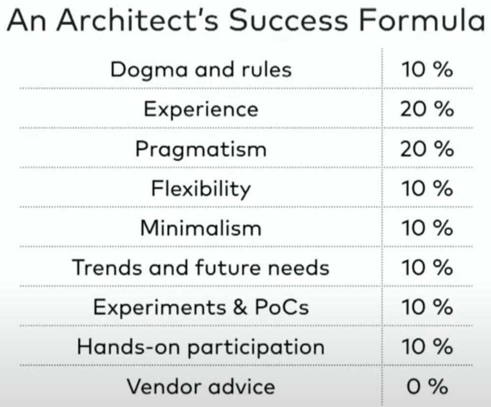
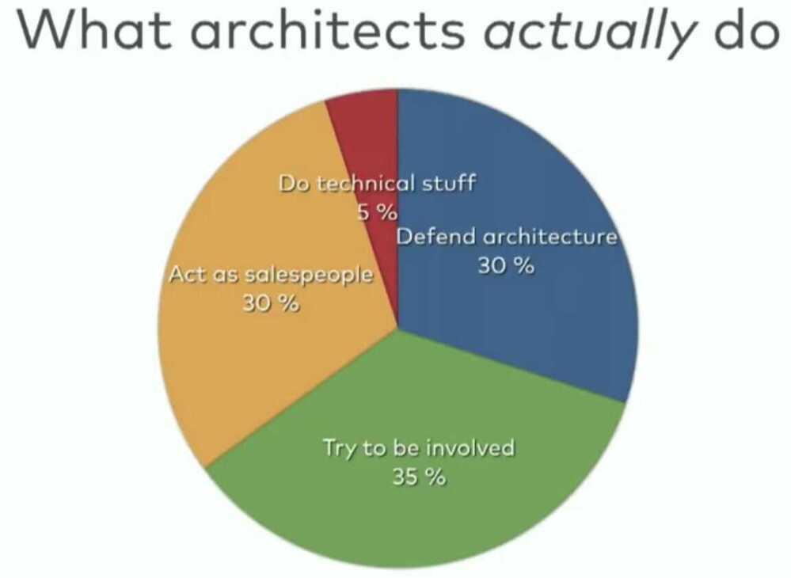
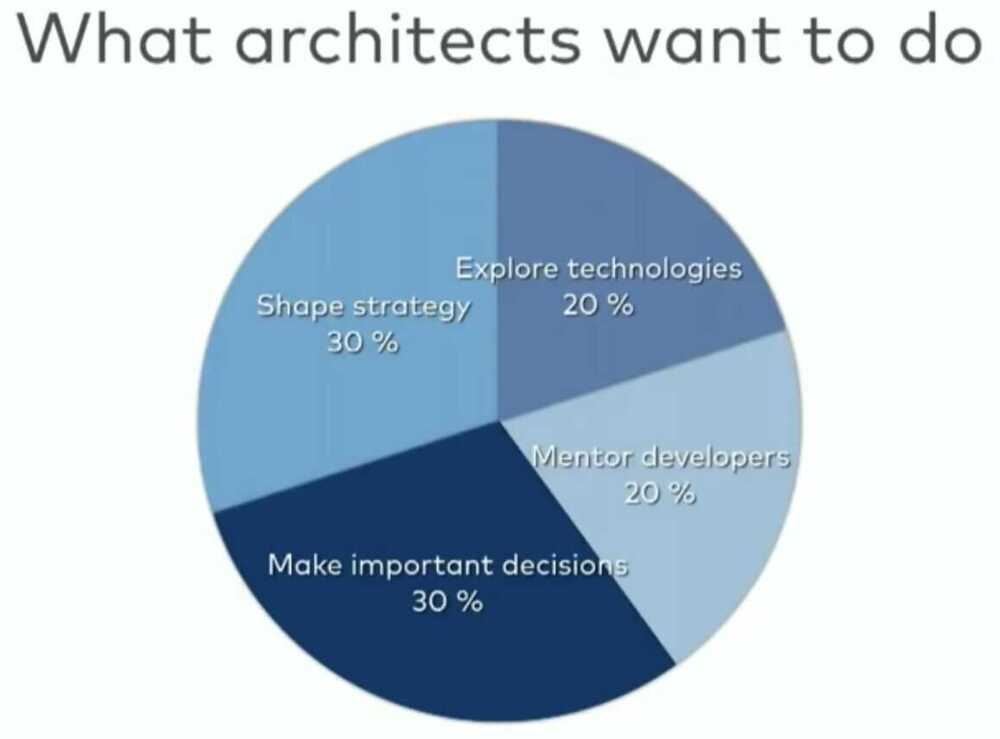

# Developer Roles

- SDET - Software Development Engineers in Test

## Junior developer training guide

- Message format for asking question
- technical private messages, all messages with pain points should be public. So if anyone else has the same question, they can refer to previous conversations
- There is no such question as a stupid question
- Business knowledge
- Tooling
- Remove or document prolific abstractions
    - Dependencies
    - Abstractions
    - Patterns
- Domain level documentation
- Make the macro intent of small classes explicit
- Screencasts as documentation
- Pair programming
- Watch other devs work
- Pairing is great, but sometimes watching is better. Just watching senior developer work you can learn a lot.
- Retention
- Promotion
- Support time-wasting
- Better use of investment time (learning lunches)
- Prioritize depth over breadth
- Occasionally, allocate full days
- Long form technical writing
- Solidifies there knowledge
- Creates documentation
- Build authority and brand
- Let devs audit extra meetings

## Developers Tips

- Draw more pictures (architecture diagram / UML diagram)
- Critique your design
- Read and write (documentation)
- Invent it here (don't use libraries for simple things)
- Learn to test
- Master the tools (ide, cli)
- Focus on fundamentals
- Value the individual
- Feel the fear
- Remember what matters

[What We Left Behind - 10 Valuable Skills From The 1990s - Garth Gilmour & Eamonn Boyle - GOTO 2020](https://www.youtube.com/watch?v=DrBPXSiUWbI)

[Career Mistakes to Avoid as a Developer](https://www.freecodecamp.org/news/career-mistakes-to-avoid-as-a-dev/)

## Non Functional Requirements

https://en.wikipedia.org/wiki/Non-functional_requirement

[How to get a promotion and become a Staff Engineer at FAANG - YouTube](https://www.youtube.com/watch?v=NJjJctW-K0g)

[How to decide which technology to learn and invest time in? - YouTube](https://www.youtube.com/watch?v=z8m_iKCPTaQ)

## Developer vs Engineer

Developer - A developer executes. Their talents often focused to a single area. Without need for the "big picture".

Engineer - An engineer designs and plans. Always aware of the "big picture". With talents in many areas. An engineer can assume the developer role. But an engineer's core focus lies with architecture.

### Engineers Salary Comparison

There is a simple reason some engineers are worth +$1,000,000 per year:

Leverage.

There are the three main ways top engineers have leverage:

#### 1. They write impactful software no one else can

Software at large companies is already high leverage. A single change can have a ton of impact (`$$$`) at scale.

This impact makes it worth it to pay a lot for their specialized skills.

#### 2. They influence large groups of engineers

Imagine a tech lead among tech leads. They might lead the planning, design, and delivery of initiatives that involve 30+ engineers.

This influence gives them leverage and amplifies their impact.

#### 3. They help engineers move faster at scale

Their work often has compounding effects by making improvements to tooling or underlying infrastructure everyone uses.

Imagine making 1000 engineers 3% faster. That "creates" 30 more engineers worth of bandwidth out of thin air.

Most engineers will not get to these levels, but there's something we can still learn from them.

The best way to have more impact is not to invest more time but to think about how to get more out of it through leverage.

[Facebook Software Engineer Salary | $2.5M-$185K+ | Levels.fyi](https://www.levels.fyi/companies/facebook/salaries/software-engineer)

## Developer Metrics / Development Metrics

### 1. Code Contribution Metrics

- **Volume of Commits**: Total number of commits per team or developer over time, to gauge activity levels.
- **Pull Request Metrics**: Number of pull requests opened, merged, and time taken for a merge. This can also include the average time a pull request remains open before being merged.
- **Code Review Efficiency**: Time taken to review and accept pull requests, along with the number of iterations per pull request. This reflects on the team's responsiveness and collaboration quality.
- **Lines of Code (LOC)**: While not always a direct indicator of productivity, changes in LOC can indicate project evolution and efforts in coding, refactoring, or documentation.

### 2. Release Metrics

- **Release Frequency**: How often new versions or features are released, indicating the pace of development and deployment.
- **Release Success Rate**: The percentage of releases that meet their objectives without causing critical issues or requiring immediate fixes (hotfixes).
- **Cycle Time**: The time it takes for a feature or bug fix to go from concept to deployment. This reflects the efficiency of the development and deployment processes.

### 3. Health of Developer and Repositories

- **Code Churn**: The percentage of a developer's or team's contributions that are subsequently modified or deleted within a short period. High churn rates can indicate issues with code quality or planning.
- **Codebase Complexity**: Metrics such as cyclomatic complexity or code maintainability scores can give insights into potential technical debt and the health of the codebase.
- **Dependency Updates**: The frequency and timeliness of third-party dependency updates, which can impact security and stability.
- **Automated Test Coverage**: The percentage of code covered by automated tests, which can indicate the potential risk of defects and the team's commitment to quality.
- **Build Pass Rate**: The success rate of builds in the CI/CD pipeline, which can highlight issues with code quality or integration practices.

### 4. Developer Satisfaction and Retention

- **Developer Retention Rate**: Measures how well the organization retains its development talent, which can indicate the health of the team environment and job satisfaction.
- **Employee Net Promoter Score (eNPS)**: This gauges team members' willingness to recommend their workplace to others, offering insights into overall job satisfaction and engagement.

### 5. Innovation and Learning

- **Time Spent on New Features vs. Maintenance**: Balancing new development with maintenance work is crucial for long-term innovation and team motivation.
- **Investment in Learning and Development**: Time allocated for developers to learn new skills or technologies, which can contribute to team growth and adaptability.

### Links

- [Contribution analytics | GitLab](https://docs.gitlab.com/ee/user/group/contribution_analytics/)
- [Contributor analytics | GitLab](https://docs.gitlab.com/ee/user/analytics/contributor_analytics.html)
- [Git Analytics: Boost Team Performance With These 9 Metrics | Dev Interrupted Powered by LinearB](https://linearb.io/blog/git-analytics)
- [What is Git Analytics and Why it Matters to Engineering Teams? - Hatica](https://www.hatica.io/blog/engineering-teams-and-git-analytics/)

### Tools

- [RepoSense - Home](https://reposense.org/)
- [GitHub - bloombar/gitlogstats: A command line tool to report statistics on the contributions of developer to a project.](https://github.com/bloombar/gitlogstats)
- [DevDynamics - Ship Better Quality Software, Faster.](https://devdynamics.ai/)
