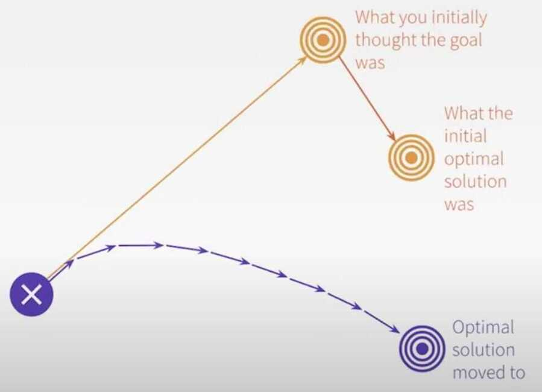

# Software Engineering

## Life Critical System

A life-critical system is a system whose failure or malfunction may result in death or serious injury. It comprises all software and hardware necessary to perform a critical function.

### Dependability

Dependability is a measure of a system's availability, reliability, and maintainability. In general, it is a measure of the confidence that a system will perform as expected.

### Safety-critical element

Safety-critical elements are systems or components that are designed to prevent, control, mitigate, or respond to system malfunctions or accidents that could lead to injury or death.

### Examples

- Automotive
- Aviation
- Communications

https://www.toptal.com/software/life-critical-systems

## Concurrent Engineering

Concurrent engineering (CE) is a work methodology emphasizing the parallelisation of tasks (i.e. performing tasks concurrently), which is sometimes called **simultaneous engineering** or **integrated product development** (IPD) using an [integrated product team](https://en.wikipedia.org/wiki/Integrated_product_team) approach. It refers to an approach used in [product development](https://en.wikipedia.org/wiki/Product_development) in which functions of design engineering, manufacturing engineering, and other functions are integrated to reduce the time required to bring a new product to market

## The Four Keys To Rapid Response Software Development

- Impeccable, reliable, automated build and deployment system
- Effective, low-friction collaboration
- Constant learning and skills improvement
- Design of replaceable, disposable software

https://toolshed.com/2019/01/FourKeys.html

## Lean Software Development

- [Eliminate waste](https://en.wikipedia.org/wiki/Lean_software_development#Eliminate_waste)
- [Amplify learning](https://en.wikipedia.org/wiki/Lean_software_development#Amplify_learning)
- [Decide as late as possible](https://en.wikipedia.org/wiki/Lean_software_development#Decide_as_late_as_possible)
- [Deliver as fast as possible](https://en.wikipedia.org/wiki/Lean_software_development#Deliver_as_fast_as_possible)
- [Empower the team](https://en.wikipedia.org/wiki/Lean_software_development#Empower_the_team)
- [Build integrity in](https://en.wikipedia.org/wiki/Lean_software_development#Build_integrity_in)
- [See the whole](https://en.wikipedia.org/wiki/Lean_software_development#See_the_whole)

https://en.wikipedia.org/wiki/Lean_software_development

## Unified Process

The Unified Software Development Process or Unified Process is an [iterative and incremental](https://en.wikipedia.org/wiki/Iterative_and_incremental_development) [software development process](https://en.wikipedia.org/wiki/Software_development_process) framework. The best-known and extensively documented refinement of the Unified Process is the [Rational Unified Process](https://en.wikipedia.org/wiki/Rational_Unified_Process)(RUP). Other examples are [OpenUP](https://en.wikipedia.org/wiki/OpenUP) and [Agile Unified Process](https://en.wikipedia.org/wiki/Agile_Unified_Process).

https://en.wikipedia.org/wiki/Unified_Process

## STAR method (Situation-Task-Action-Result)

Here's the Action-Result method:

- Action: Given the task at hand, how did you accomplish it? Once again, be clear and concise.
- Result: This is the most important part of the A-R method. Here you'll want to describe using relevant metrics what your impact was from completing the task. This is how you communicate you are a high performer.

An example: Launched Facebook Messenger from concept to launch, a way for users to message each other privately within the app, increasing D60 retention by 65% and user stickiness by 325%.

Here, the applicant clearly describes what they did (launch Facebook Messenger), and the direct result from their action (increasing D60 retention and stickiness). It's important when you articulate your result that you use numbers - they help communicate their story with more impact and believability.

## Best Practices

https://blog.usejournal.com/10-signs-you-will-suck-at-programming-5497a6a52c5c

[Software Is Details - Kevlin Henney - GOTO 2020](https://www.youtube.com/watch?v=kX0prJklhUE)

- Any program is a model of a model within a theory of a model of an abstraction of some portion of the world or of some universe of discourse
- It is an attitude that can be encapsulated in a simple but demanding rule: always think both big picture and fine detail -- Will Gompertz - Think Like an Artist

## Cycle time compression

## Time Estimation

There is a huge difference between precision and accuracy

precise != accurate

How to estimate

- Compare new work with old
- Identify work of similar complexity
- Use the actual time it took as estimate for new work

[How To Estimate Software Development Time](https://www.youtube.com/watch?v=v21jg8wb1eU)

## Antipatterns

- Centralized control and ownership: One size doesn't fit all
    - (Dis)economies of scale
    - Overzealous guardrails
    - Modification is ticket-driven
- Fragmented platform implementation
- Slow development loops: less time coding, more time toiling

## Joel Test

- Do you use source control?
- Can you make a build in one step?
- Do you make daily builds?
- Do you have a bug database?
- Do you fix bugs before writing new code?
- Do you have an up-to-date schedule?
- Do you have a spec?
- Do programmers have quiet working conditions?
- Do you use the best tools money can buy?
- Do you have testers?
- Do new candidates write code during their interview?
- Do you do hallway usability testing?

https://www.joelonsoftware.com/2000/08/09/the-joel-test-12-steps-to-better-code

https://medium.com/squad-engineering/squad-takes-the-joel-test-9189709a6235

## Resources

- [Top 10 Things That Destroy Developer Productivity](https://www.youtube.com/watch?v=O-U11s-Rk_w&ab_channel=CodingTech)
- [Top 10 Traits of The Great Technical Leaders](https://youtu.be/3AZi49wyvds)
- [Software Engineering at Google](https://abseil.io/resources/swe-book/html/toc.html)
- [Engineering for Software • Dave Farley • YOW! 2022 - YouTube](https://www.youtube.com/watch?v=J8vCm1NdKIc)
- [Calling Functions Across Languages • Richard Feldman • GOTO 2023 - YouTube](https://www.youtube.com/watch?v=ZOvxa9aKCCg)
- [Gamification, Sys. Thinking & the Power of Observability • Jessica Kerr & Jessica Cregg • GOTO 2023 - YouTube](https://www.youtube.com/watch?v=WKx9E3DRqXc)
- [The Importance of Fun in the Workplace • Holly Cummins • YOW! 2022 - YouTube](https://www.youtube.com/watch?v=trsDnGh-x4U)
- [Processing Data From The James Webb Space Telescope • John Davies • GOTO 2023 - YouTube](https://www.youtube.com/watch?v=rknJsrQiheo)
- [Technical Stories Don't Work • Dave Farley • GOTO 2023 - YouTube](https://www.youtube.com/watch?v=4drvdaZcd0Y)
- [Epiphany & Apophany • Liz Keogh • YOW! 2022 - YouTube](https://www.youtube.com/watch?v=zvwlc4lNYOY)
