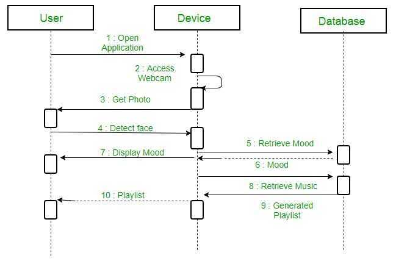
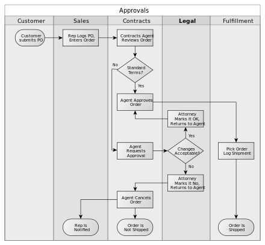

# Modeling Language

## UML (Unified Modeling Language)

Unified Modelling Language (UML) is a modeling language in the field of software engineering which aims to set standard ways to visualize the design of a system. UML guides the creation of multiple types of diagrams such as interaction , structure and behaviour diagrams.

### Types of UML

- Interaction diagram

  An interaction diagram is used to show theinteractive behaviorof a system. Since visualizing the interactions in a system can be a cumbersome task, we use different types of interaction diagrams to capture various features and aspects of interaction in a system.

- Sequence diagram

  A sequence diagram simply depicts interaction between objects in a sequential order i.e. the order in which these interactions take place. We can also use the terms event diagrams or event scenarios to refer to a sequence diagram. Sequence diagrams describe how and in what order the objects in a system function. These diagrams are widely used by businessmen and software developers to document and understand requirements for new and existing systems.

  

  <https://www.geeksforgeeks.org/unified-modeling-language-uml-sequence-diagrams>

- Flowchart
- Usecase diagram
- Class diagram
- Activity diagram
- Component diagram
- State machine diagram
- Object diagram
- Deployment diagram
- Timing diagram
- Package diagram
- Composite structure diagram
- Profile diagram
- Communication diagram

[**https://www.freecodecamp.org/news/uml-diagrams-full-course/**](https://www.freecodecamp.org/news/uml-diagrams-full-course/)

## Non-UML diagrams

- Wireframe graphical interface

<https://www.freecodecamp.org/news/what-is-a-wireframe-ux-design-tutorial-website>- Archimate diagram

- Specification and Description Language (SDL)
- Ditaa diagram
- Gantt diagram
<http://plantuml.com>

<https://mermaidjs.github.io> (Can be rendered using markdown in gitlab)

## OCL (Object Constraint Language)

## Business Process Model and Notation (BPMN)

Business Process Model and Notation(BPMN) is a [graphical representation](https://en.wikipedia.org/wiki/Information_visualization) for specifying [business processes](https://en.wikipedia.org/wiki/Business_process) in a [business process model](https://en.wikipedia.org/wiki/Business_process_modeling).

Originally developed by the [Business Process Management Initiative](https://en.wikipedia.org/wiki/Business_Process_Management_Initiative)(BPMI), BPMN has been maintained by the [Object Management Group](https://en.wikipedia.org/wiki/Object_Management_Group)(OMG) since the two organizations merged in 2005. Version 2.0 of BPMN was released in January 2011, at which point the name was amended toBusiness Process ModelandNotationto reflect the introduction of execution semantics, which were introduced alongside the existing notational and diagramming elements. Though it is an OMG specification, BPMN is also ratified as [ISO](https://en.wikipedia.org/wiki/International_Organization_for_Standardization) 19510. The latest version is BPMN 2.0.2, published in January 2014.

<https://en.wikipedia.org/wiki/Business_Process_Model_and_Notation>

<http://www.bpmn.org>

<https://camunda.com>

## Workflow

A Workflow is a series of decisions made by different people that determines what happens to a particular request that one of those people made, according to a defined and repeatable process.

## SwimLane

A swimlane (or swimlane diagram) is used in [process flow diagrams](https://www.wikiwand.com/en/Flowchart), or flowcharts, that visually distinguishes [job sharing](https://www.wikiwand.com/en/Job_sharing) and responsibilities for sub-processes of a [business process](https://www.wikiwand.com/en/Business_process). Swimlanes may be arranged either horizontally or vertically.

<https://www.wikiwand.com/en/Swim_lane>
