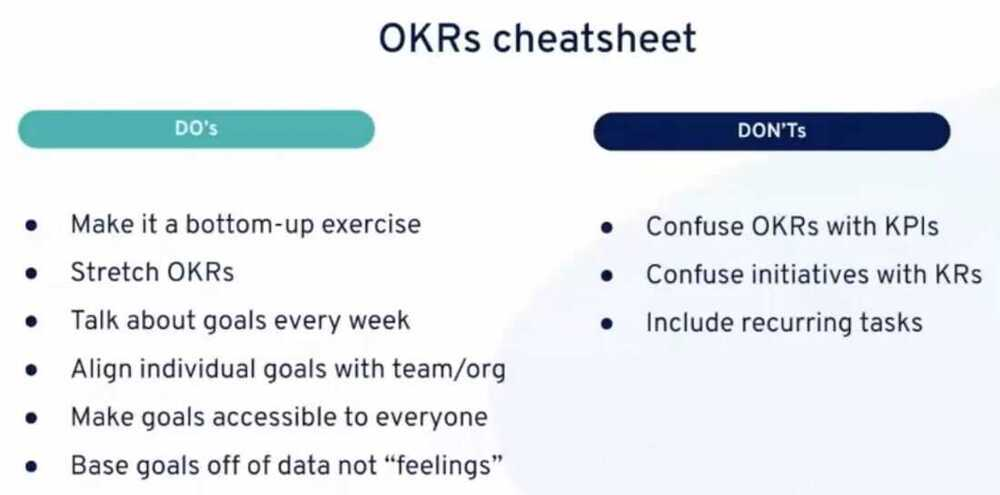
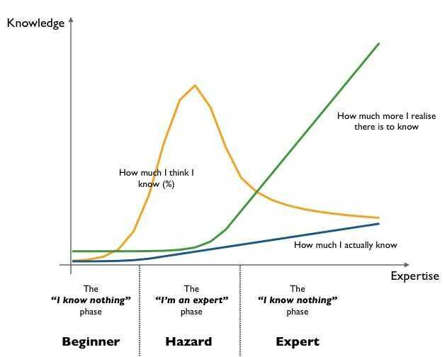

# Principles of Software Engineering

## YAGNI - You Ain't Gonna Need It. (For new features)

"You aren't gonna need it" (YAGNI)is a principle of [extreme programming](https://en.wikipedia.org/wiki/Extreme_programming)(XP) that states a [programmer](https://en.wikipedia.org/wiki/Programmer) should not add functionality until deemed necessary.

## Others

- KISS - Keep It Simple Stupid
- DRY - Don't Repeat Yourself
- DIE - Duplication Is Evil
- SoC - Separation of Concerns
- Research first code later

## Objectives and Key Results (OKR / OKRs)

Used for setting, communicating and monitoring quarterly goals and results in organizations.

- [What Matters: How to grade OKRs like John Doerr and Google](https://www.whatmatters.com/faqs/how-to-grade-okrs)
- https://soapboxhq.com/goal-examples/engineering
- https://okrexamples.co/technology-engineering-rnd-okr-examples
- https://hackernoon.com/the-mvp-is-dead-long-live-the-rat-233d5d16ab02
	- TPM - Total Productive Maintenance
	- MVP - Minimum Viable Products
	- RAT - Riskiest Assumption Test
- [Performance Management Platform Built for Business - 15Five](https://www.15five.com/)

## Yak Shaving

Yak shaving is programming lingo for the seemingly endless series of small tasks that have to be completed before the next step in a project can move forward.

### Example

- You start with the desire to wax your car.
- To wax your car, you need a water hose. Only, your water hose is busted so you need to go down to the hardware store to get a new hose.
- To get to the hardware store, you have to drive across a bridge. The bridge requires a pass or ticket. You can't find your pass, but you know your neighbor has one.
- However, your neighbor won't lend you his pass until you return a pillow that you borrowed. The reason you haven't returned it is because the pillow is missing some stuffing.
- The pillow was originally stuffed with yak hair. In order to re-stuff the pillow you need to get some new yak hair.
- And that's how you end up shaving a yak, when all you really wanted to do was wax your car.

## SLAP - Single Level of Abstraction Principle

## Engineering Principles

### ARCHITECTURE

- Build Differentiators
- Design for Emergent Reuse
- Evolutionary Systems
- Scale Horizontally
- Small and Simple
- Smarts in the Nodes not the Network

### OPERATIONAL

- Cloud Native
- Data Stewardship
- Production Ready

### ORGANISATION

- Keep Pace with Technological Change
- Model the Business Domain

### TECHNOLOGY & PRACTICES

- Secure by Design
- Automate by Default
- Consistent Environments
- Understandability
- Performance Importance
- Get Feedback Early and Often
- Design for Testability

[Home Page | John Lewis Partnership Engineering Principles](https://engineering-principles.jlp.engineering/)

## Laws

### [Zawinski's Law](https://en.wikipedia.org/wiki/Jamie_Zawinski#Principles)

"Every program attempts to expand until it can read mail. Those programs which cannot so expand are replaced by ones which can." (related:[Greenspun's tenth rule](https://en.wikipedia.org/wiki/Greenspun%27s_tenth_rule) - "any sufficiently complicated C or Fortran program contains an ad hoc, informally-specified, bug-ridden, slow implementation of half of Common Lisp.")

### [Moore's Law](https://en.wikipedia.org/wiki/Moore%27s_law)

The observation that the number of transistors in a dense integrated circuit doubles approximately every two years.

### Eroom's Law

Eroom's law is the observation that drug discovery is becoming slower and more expensive over time, despite improvements in technology (such as [high-throughput screening](https://en.wikipedia.org/wiki/High-throughput_screening), [biotechnology](https://en.wikipedia.org/wiki/Biotechnology), [combinatorial chemistry](https://en.wikipedia.org/wiki/Combinatorial_chemistry), and computational [drug design](https://en.wikipedia.org/wiki/Drug_design)), a trend first observed in the 1980s. The cost of developing a new drug roughly doubles every nine years (inflation-adjusted).In order to highlight the contrast with the exponential advancements of other forms of technology (such as [transistors](https://en.wikipedia.org/wiki/Transistor)) over time, the law was deliberately spelled as [Moore's law](https://en.wikipedia.org/wiki/Moore%27s_law) spelled backwards.

Software also getting slower with improved processors because developers are writing inefficient code.

### Haitz's law

**Haitz's law** is an observation and forecast about the steady improvement, over many years, of [light-emitting diodes](https://en.wikipedia.org/wiki/Light-emitting_diode "Light-emitting diode") (LEDs).

It claims that every decade, the cost per [lumen](https://en.wikipedia.org/wiki/Lumen_(unit) "Lumen (unit)") (unit of useful light emitted) falls by a factor of 10, and the amount of light generated per LED package increases by a factor of 20, for a given wavelength (color) of light. It is considered the LED counterpart to [Moore's law](https://en.wikipedia.org/wiki/Moore%27s_law "Moore's law"), which states that the number of transistors in a given integrated circuit doubles every 18 to 24 months. Both laws rely on the [process optimization](https://en.wikipedia.org/wiki/Process_optimization "Process optimization") of the production of [semiconductor devices](https://en.wikipedia.org/wiki/Semiconductor_device "Semiconductor device").

[Haitz's law - Wikipedia](https://en.wikipedia.org/wiki/Haitz%27s_law)

### Dennard scaling

In [semiconductor electronics](https://en.wikipedia.org/wiki/Semiconductor_electronics "Semiconductor electronics"), **Dennard scaling**, also known as **MOSFET scaling**, is a [scaling law](https://en.wikipedia.org/wiki/Scaling_law "Scaling law") which states roughly that, as [transistors](https://en.wikipedia.org/wiki/Transistor "Transistor") get smaller, their [power density](https://en.wikipedia.org/wiki/Power_density "Power density") stays constant, so that the power use stays in proportion with area; both [voltage](https://en.wikipedia.org/wiki/Voltage "Voltage") and [current](https://en.wikipedia.org/wiki/Electric_current "Electric current") scale (downward) with length. The law, originally formulated for [MOSFETs](https://en.wikipedia.org/wiki/MOSFET "MOSFET"), is based on a 1974 paper co-authored by [Robert H. Dennard](https://en.wikipedia.org/wiki/Robert_H._Dennard "Robert H. Dennard"), after whom it is named.

[Dennard scaling - Wikipedia](https://en.wikipedia.org/wiki/Dennard_scaling)

### [Metcalfe's Law](https://en.wikipedia.org/wiki/Metcalfe%27s_law#Limitations)

The value of a telecommunications network is proportional to the square of the number of connected users of the system...Within the context of social networks, many, including Metcalfe himself, have proposed modified models using (n× logn) proportionality rather than n^2 proportionality.

### [Clarke's Third Law](https://en.wikipedia.org/wiki/Clarke%27s_three_laws)

Any sufficiently advanced technology is indistinguishable from magic.

## Links

- [The problem with software engineering - YouTube](https://www.youtube.com/watch?v=M-ThkvdcYmo&ab_channel=HusseinNasser)
- [13 Laws of Software Engineering — Part 1 - by Vivek Kant](https://vivekkant.substack.com/p/13-laws-of-software-engineering-part)
	- Parkinson’s Law - Work expands to fill the time available
	- Hofstadter’s Law - It always takes longer than you expect, even when you take into account Hofstadter’s Law
	- Brooks’ Law - Adding manpower to a late software project makes it later
	- Conway’s Law - Organizations design systems that mirror their communication structures
	- Cunningham’s Law - The best way to get the right answer on the internet is not to ask a question, but to post the wrong answer
	- Sturgeon’s Law - 90% of everything is crap
- [13 Laws of Software Engineering — Part 2 - by Vivek Kant](https://vivekkant.substack.com/p/13-laws-of-software-engineering-part-9f1)
	- Zawinski’s Law - Every program attempts to expand until it can read mail. Those programs which cannot so expand are replaced by ones that can
	- Hyrum’s Law - With a sufficient number of users of an API, it does not matter what you promise in the contract: all observable behaviors of your system will be depended on by somebody
	- Price’s Law - In any group, 50% of the work is done by the square root of the number of people
	- The Ringelmann Effect - The tendency for individual members of a group to become increasingly less productive as the size of their group increases
	- Goodhart’s Law - When a measure becomes a target, it ceases to be a good measure
	- Gilb’s Law - Anything you need to quantify can be measured in some way that is superior to not measuring it at all
	- Murphy’s Law - Anything that can go wrong will go wrong
