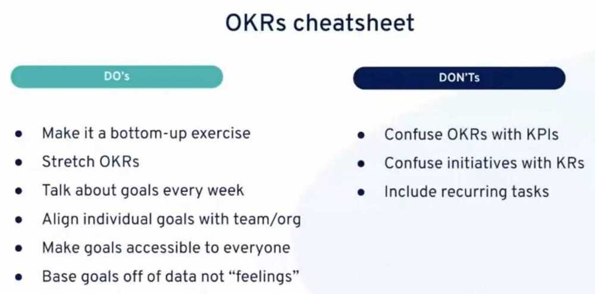
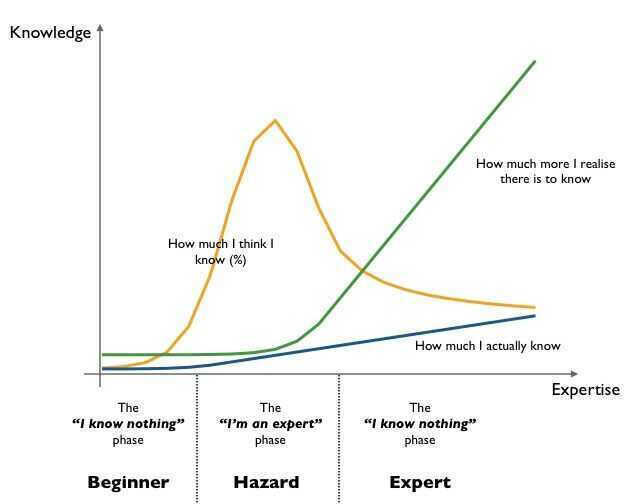

# Principles of sofware design

## YAGNI - You Ain't Gonna Need It. (For new features)

"You aren't gonna need it" (YAGNI)is a principle of [extreme programming](https://en.wikipedia.org/wiki/Extreme_programming)(XP) that states a [programmer](https://en.wikipedia.org/wiki/Programmer) should not add functionality until deemed necessary.

## Others

- KISS - Keep It Simple Stupid
- DRY - Don't Repeat Yourself
- DIE - Duplication Is Evil
- SoC - Separation of Concerns
- Research first code later

## Objectives and Key Results (OKR / OKRs)

Used for setting, communicating and monitoring quarterly goals and results in organizations.

[What Matters: How to grade OKRs like John Doerr and Google](https://www.whatmatters.com/faqs/how-to-grade-okrs)

https://soapboxhq.com/goal-examples/engineering

https://okrexamples.co/technology-engineering-rnd-okr-examples

https://hackernoon.com/the-mvp-is-dead-long-live-the-rat-233d5d16ab02

- TPM - Total Productive Maintenance
- MVP - Minimum Viable Products
- RAT - Riskiest Assumption Test

[Performance Management Platform Built for Business - 15Five](https://www.15five.com/)

## Yak Shaving

Yak shaving is programming lingo for the seemingly endless series of small tasks that have to be completed before the next step in a project can move forward.

### Example

- You start with the desire to wax your car.
- To wax your car, you need a water hose. Only, your water hose is busted so you need to go down to the hardware store to get a new hose.
- To get to the hardware store, you have to drive across a bridge. The bridge requires a pass or ticket. You can't find your pass, but you know your neighbor has one.
- However, your neighbor won't lend you his pass until you return a pillow that you borrowed. The reason you haven't returned it is because the pillow is missing some stuffing.
- The pillow was originally stuffed with yak hair. In order to re-stuff the pillow you need to get some new yak hair.
- And that's how you end up shaving a yak, when all you really wanted to do was wax your car.

## SLAP - Single Level of Abstraction Principle

## Engineering Principles

### ARCHITECTURE

- Build Differentiators
- Design for Emergent Reuse
- Evolutionary Systems
- Scale Horizontally
- Small and Simple
- Smarts in the Nodes not the Network

### OPERATIONAL

- Cloud Native
- Data Stewardship
- Production Ready

### ORGANISATION

- Keep Pace with Technological Change
- Model the Business Domain

### TECHNOLOGY & PRACTICES

- Secure by Design
- Automate by Default
- Consistent Environments
- Understandability
- Performance Importance
- Get Feedback Early and Often
- Design for Testability

[Home Page | John Lewis Partnership Engineering Principles](https://engineering-principles.jlp.engineering/)

## Links

[The problem with software engineering - YouTube](https://www.youtube.com/watch?v=M-ThkvdcYmo&ab_channel=HusseinNasser)
