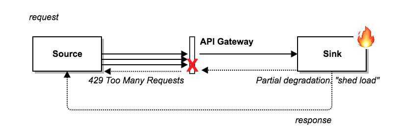

# Addressing Failures

## Cascading Failures

A cascading failure is a failure that grows over time as a result of positive feedback.[^107^](https://landing.google.com/sre/book/chapters/addressing-cascading-failures.html#id-GbduZFnh9) It can occur when a portion of an overall system fails, increasing the probability that other portions of the system fail. For example, a single replica for a service can fail due to overload, increasing load on remaining replicas and increasing their probability of failing, causing a domino effect that takes down all the replicas for a service.

## Causes

1. Server Overload

2. Resource Exhaustion

3. CPU

   - Increased number of in-flight requests

   - Excessively long queue lengths

   - Thread starvation

   - CPU or request starvation

   - Missed RPC Deadlines

   - Reduced CPU caching benefits

4. Memory

   - Dying tasks

   - Increases rate of Garbage Collection (GC), resulting in increased CPU Usage

   - Reduction in cache hit rates

5. Threads

6. File Descriptors

7. Dependencies among resources

8. Service Unavailability

## Prevention

1. Load test the server's capacity limits, and test the failure mode for overload

2. Serve degraded results

3. Instrument the server to reject requests when overloaded

4. Instrument higher-level systems to reject requests, rather than overloading servers

5. Perform capacity planning

6. Queue Management

7. Load Shedding and Graceful Degradation

## Load Shedding

The idea is to ignore some requests rather than crashing a system and making it fail to serve any request.

8. Retries

9. Latency and Deadlines

10. Picking a Deadline

11. Missing Deadlines

12. Deadline Propagation

13. Cancellation Propagation

14. Bimodal Latency

15. Slow Startup and Cold Caching

16. Always go Downward in the Stack

## Triggering Conditions for Cascading Failures

1. Process Death

2. Process Updates

3. New Rollouts

4. Organic Growth

5. Planned Changes, Drains, or Turndowns

6. Request Profile Changes

7. Resource Limits

## Testing for Cascading Failures

1. Test Until Failure and Beyond

2. Test Popular Clients

3. Test Noncritical Backends

## Immediate Steps to Address Cascading Failures

1. Increase Resources

2. Stop Health Check Failures/Deaths

3. Restart Servers

4. Drop Traffic

5. Enter Degraded Modes

6. Eliminate Batch Load

7. Eliminate Bad Traffic

## Reference

http://highscalability.com/blog/2018/4/25/google-addressing-cascading-failures.html
