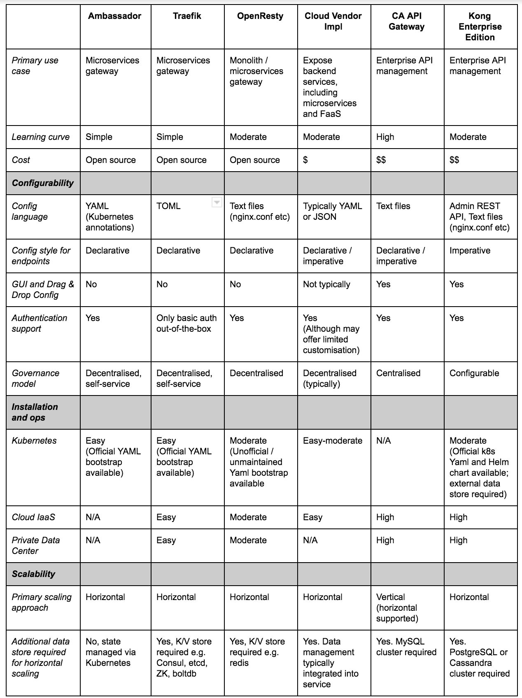

# API Gateway

## API Design

[Designing APIs: Less Data is More || Damir Svrtan](https://www.youtube.com/watch?v=DC9032_nkyc)

## Features

1. Authentication
2. Authorization
3. Security
4. SSL termination
5. DDOS protection / Throttling
6. Adaptor (that will consolidate all information from all services and return as one response)
7. Serve static content
8. Cache responses
9. Request routing
10. Router & Load Balancer
11. A/B Testing
12. Canary Testing
13. Protocol Adapter
14. Monitoring all api's performance
15. Rate Limiting
16. Expose as API service

## Using an API gateway has the following benefits

- Insulates the clients from how the application is partitioned into microservices
- Insulates the clients from the problem of determining the locations of service instances
- Provides the optimal API for each client
- Reduces the number of requests/roundtrips. For example, the API gateway enables clients to retrieve data from multiple services with a single round-trip. Fewer requests also means less overhead and improves the user experience. An API gateway is essential for mobile applications.
- Simplifies the client by moving logic for calling multiple services from the client to API gateway
- Translates from a "standard" public web-friendly API protocol to whatever protocols are used internally

## The API gateway pattern has some drawbacks

- Increased complexity - the API gateway is yet another moving part that must be developed, deployed and managed
- Increased response time due to the additional network hop through the API gateway - however, for most applications the cost of an extra roundtrip is insignificant.

## Tools

1. **Cloud**

   - Apigee
   - AWS API Gateway
   - Azure API Gateway
   - Google cloud endpoints
   - WSO2 API Manager

2. **Self Managed**

   - Apache
   - HAProxy
   - Nginx
   - Spring cloud gateway
   - https://apisix.apache.org

## API Gateways

### Gloo

The Hybrid Application Gateway built on top of Envoy
Gloo is a feature-rich, Kubernetes-native ingress controller, and next-generation API gateway. Gloo is exceptional in its function-level routing; its support for legacy apps, microservices and serverless; its discovery capabilities; its numerous features; and its tight integration with leading open-source projects. Gloo is uniquely designed to support hybrid applications, in which multiple technologies, architectures, protocols, and clouds can coexist

https://github.com/solo-io/gloo

### Ambassador

[Ambassador](https://www.getambassador.io/) is an open source Kubernetes-native API Gateway built on [Envoy](https://www.envoyproxy.io/), designed for microservices. Ambassador essentially serves as an Envoy ingress controller, but with many more features.
Key features include:

- Self-service configuration, via Kubernetes annotations
- First class [gRPC and HTTP/2 support](https://www.getambassador.io/user-guide/grpc)
- Support for CORS, timeouts, weighted round robin ([canary](https://www.getambassador.io/reference/canary)), [rate limiting](https://www.getambassador.io/reference/services/rate-limit-service)
- [Istio integration](https://www.getambassador.io/user-guide/with-istio)
- [Authentication](https://www.getambassador.io/reference/services/auth-service)
- Robust TLS support, including TLS client-certificate authentication

https://github.com/datawire/ambassador

https://microservices.io/patterns/apigateway.html

Rate Limiting Service

[What is an API Gateway?](https://www.youtube.com/watch?v=vHQqQBYJtLI)

https://blog.christianposta.com/microservices/do-i-need-an-api-gateway-if-i-have-a-service-mesh

https://developer.ibm.com/apiconnect/2018/11/13/service-mesh-vs-api-management

https://blog.christianposta.com/microservices/api-gateways-are-going-through-an-identity-crisis

https://konghq.com/blog/the-difference-between-api-gateways-and-service-mesh

### [API Platform | Tailcall](https://tailcall.run/)

A cloud native solution to streamline API management across **edge**, **middle**, and **service**

[Problem Statement | Tailcall](https://tailcall.run/docs/)

[GitHub - tailcallhq/tailcall: A high-performance no-code GraphQL backend](https://github.com/tailcallhq/tailcall)

## API Security

- Use HTTPS
- Use OAuth2
- Use WebAuthn
- Use Leveled API Keys
- Authorization
- Rate Limiting
- API Versioning
- Whitelisting
- Check OWASP API Security Risks
- Use API Gateway
- Error Handling
- Input Validation

[API Gateway - ByteByteGo Newsletter](https://blog.bytebytego.com/p/api-gateway)
