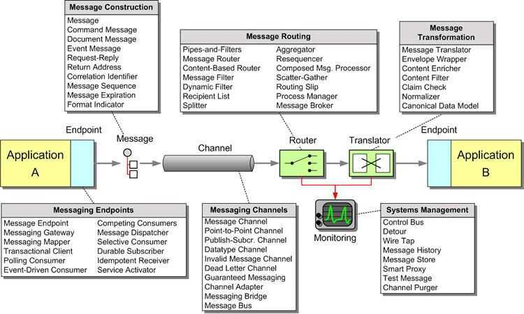

# Enterprise Integration Patterns

The patterns provide technology-independent design guidance for developers and architects to describe and develop robust integration solutions.

- https://www.enterpriseintegrationpatterns.com/patterns/messaging/index.html
- https://www.enterpriseintegrationpatterns.com/patterns/messaging/toc.html

## ESB vs Message Brokers

Enterprise service buses (ESBs) and message brokers are both messaging middlewares that help applications communicate with each other. They have different strengths and weaknesses, so it's important to consider your needs when choosing between them:

### ESBs

These are built on a central system and are well suited for complex application designs. They focus on higher-level communication patterns like publish/subscribe, request/response, and message transformation. ESBs also provide a higher-level abstraction, often including business-level features and logic. They can be a good choice for simple solutions for monolithic applications or apps with few services. ESBs also have robust transactional handling capabilities.

### Message brokers

These are better suited for simple asynchronous communication and can handle many-to-many communication between distributed microservice applications. They focus on message routing, delivery, and ensuring reliable communication between applications. Message brokers are a good choice for processing online orders because they can enhance fault tolerance and guarantee that messages are consumed only once. They can also be used to protect sensitive data at rest and in transit.

[Message Brokers vs. Enterprise Service Buses | Baeldung on Computer Science](https://www.baeldung.com/cs/message-broker-vs-esb)

[Enterprise Service Bus vs. Message Brokers vs. EAI vs. SOA](https://www.linkedin.com/pulse/enterprise-service-bus-vs-message-brokers-eai-soa-anuj-varma/)
