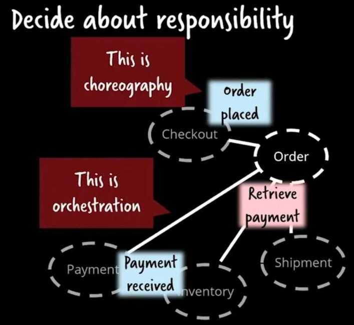

# Event driven architecture

## Event Driven Architecture / Event Sourcing

An event records the fact that "something happened" in the world.Conceptually, an event has a key, value, and timestamp. A concrete event could be a plain notification without any additional information, but it could also include the full details of what exactly happened to facilitate subsequent processing. For instance:

- Event key: "Alice"
- Event value: "Has arrived in Rome"
- Event timestamp: "Dec. 3, 2019 at 9:06 a.m."

Other example events include

- A good was sold
- A row was updated in a database table
- A wind turbine sensor measured 14 revolutions per minute
- An action occurred in a video game, such as "White moved the e2 pawn to e4"
- A payment of $200 was made by Frank to Sally on Nov. 24, 2019, at 5:11 p.m.

1. Event Notification

   - **Events** (Fire and forget, does not mandate someone to take an action. Someone listening can take an action or do nothing)

   - **Commands** (Tells some service to do a particular thing)

   - Problem

       - No statement of overall behavior (There is no fixed set of tasks that must be performed when some event happens)

2. Event-carried state transfer
    - All the state is transfered with the event like what has old state, what is new state.
    - Save all the data that system needs locally. Therefore source system broadcast all its event so the downstream system can save all the data locally whenever there is a change.

3. Event sourcing

Event sourcing system have two components -

- Application state - current state of the systems,
- Log - logs for all the events that has happened.

Replaying all the events from the logs can give any state of the system at any time.

- Example -

    1. Version control - git
    2. Accounting ledgers

- Can be used for
    - Audit
    - Debugging
    - Historic State
    - Alternative State
    - Memory Image

2. CQRS - Command and Query Responsibility Segregation

CQRS is a fancy name for an architecture that uses different data models to represent read and write operations.

At its heart is the notion that you can use a different model to update information than the model you use to read information.

Event-driven architecture (EDA) means constructing your system as a series of commands and/or events. A user submits an online form to make a purchase: that's a command. The items in stock are reserved: that's an event. A confirmation is sent to the user: that's an event. The concept is very simple. Everything in our system is either a command or an event. Commands lead to events and events may lead to new commands and so on.

**Event Sourcing is a style of application design where state changes are logged as a time-ordered sequence of records**

## Publisher subscriber rule

- Consumers should not know who producers are
- Producers should not know who consumers are

## Streams and Tables in Kafka

- A **stream** provides immutable data. It supports only inserting (appending) new events, whereas existing events cannot be changed. Streams are persistent, durable, and fault tolerant. Events in a stream can be keyed, and you can have many events for one key, like "all of Bob's payments." If you squint a bit, you could consider a stream to be like a table in a relational database (RDBMS) that has no unique key constraint and that is append only.
- A **table** provides mutable data. New events - rows - can be inserted, and existing rows can be updated and deleted. Here, an event's key aka row key identifies which row is being mutated. Like streams, tables are persistent, durable, and fault tolerant. Today, a table behaves much like an RDBMS materialized view because it is being changed automatically as soon as any of its input streams or tables change, rather than letting you directly run insert, update, or delete operations against it.

|                                          | **Stream** | **Table**   |
|-------------------------------------------|------------|-------------|
| First event with key bob arrives          | Insert     | Insert      |
| Another event with key bob arrives        | Insert     | Update      |
| Event with key bob and value null arrives | Insert     | Delete      |
| Event with key null arrives               | Insert     | ignored |

## Stream-table duality

Not withstanding their differences, we can observe that there is a close relationship between a stream and a table. We call this the [stream-table duality](https://www.confluent.io/blog/streams-tables-two-sides-same-coin/). What this means is:

- We can turn a stream into a table by aggregating the stream with operations such asCOUNT()orSUM(), for example. In our chess analogy, we could reconstruct the board's latest state (table) by replaying all recorded moves (stream).
- We can turn a table into a stream by capturing the changes made to the table - inserts, updates, and deletes - into a "change stream." This process is often called [change data capture](https://en.wikipedia.org/wiki/Change_data_capture) or CDC for short. In the chess analogy, we could achieve this by observing the last played move and recording it (into the stream) or, alternatively, by comparing the board's state (table) before and after the last move and then recording the difference of what changed (into the stream), though this is likely slower than the first option.

In fact, a table is fully defined by its underlying change stream. If you have ever worked with a relational database such as Oracle or MySQL, these change streams exist there, too! Here, however, they are a hidden implementation detail - albeit an absolutely critical one - and have names like [redo log](https://docs.oracle.com/cd/B28359_01/server.111/b28310/onlineredo001.htm#ADMIN11302) or [binary log](https://dev.mysql.com/doc/internals/en/binary-log-overview.html). In event streaming, the redo log is much more than an implementation detail. It's a first-class entity: a stream. We can turn streams into tables and tables into streams, which is one reason why we say that event streaming and Kafka are [turning the database inside out](https://www.confluent.io/blog/turning-the-database-inside-out-with-apache-samza/).

https://www.confluent.io/blog/kafka-streams-tables-part-1-event-streaming

## Asynchronous Messaging

Consider these patterns when implementing asynchronous messaging:

### - [Competing Consumers Pattern](https://docs.microsoft.com/en-us/azure/architecture/patterns/competing-consumers)

Multiple consumers may need to compete to read messages from a queue. This pattern explains how to process multiple messages concurrently to optimize throughput, to improve scalability and availability, and to balance the workload.

### - [Priority Queue Pattern](https://docs.microsoft.com/en-us/azure/architecture/patterns/priority-queue)

For cases where the business logic requires that some messages are processed before others, this pattern describes how messages posted by a producer that have a higher priority can be received and processed more quickly by a consumer than messages of a lower priority.

### - [Queue-based Load Leveling Pattern](https://docs.microsoft.com/en-us/azure/architecture/patterns/queue-based-load-leveling)

This pattern uses a message broker to act as a buffer between a producer and a consumer to help to minimize the impact on availability and responsiveness of intermittent heavy loads for both those entities.

### - [Retry Pattern](https://docs.microsoft.com/en-us/azure/architecture/patterns/retry)

A producer or consumer might be unable connect to a queue, but the reasons for this failure may be temporary and quickly pass. This pattern describes how to handle this situation to add resiliency to an application.

### - [Scheduler Agent Supervisor Pattern](https://docs.microsoft.com/en-us/azure/architecture/patterns/scheduler-agent-supervisor)

Messaging is often used as part of a workflow implementation. This pattern demonstrates how messaging can coordinate a set of actions across a distributed set of services and other remote resources, and enable a system to recover and retry actions that fail.

### - [Choreography pattern](https://docs.microsoft.com/en-us/azure/architecture/patterns/choreography)

This pattern shows how services can use messaging to control the workflow of a business transaction.

### - [Claim-Check Pattern](https://docs.microsoft.com/en-us/azure/architecture/patterns/claim-check)

This pattern shows how to split a large message into a claim check and a payload.

https://docs.microsoft.com/en-us/azure/architecture/guide/technology-choices/messaging

[Kafka in the Wild - Laura Schornack & Maureen Penzenik - GOTO 2021](https://www.youtube.com/watch?v=iMx8otu3rFg&ab_channel=GOTOConferences)

## Choreography vs Orchestration

Orchestration - command-driven architecture

Choreography - event-driven communication

https://www.youtube.com/watch?v=zt9DFMkjkEA&ab_channel=GOTOConferences

1. Microservices - also known as the microservice architecture - is an architectural style that structures an application as a collection of services that are: 1) Highly maintainable and testable 2) Loosely coupled 3) Independently deployable.

2. But, in microservices architecture too, there are different ways to implement it. At a high level, there are two approaches to getting microservices to work together toward a common goal: orchestration and choreography.

3. Orchestration entails actively controlling all elements and interactions like a conductor directs the musicians of an orchestra, while choreography entails establishing a pattern or routine that microservices follow as the music plays, without requiring supervision and instructions.

4. So, in orchestration there is one coordinator which coordinates different mini-services. The coordinates which service to call first, and then which service to call next on the basis of the output of the first service. These are mostly workflow-based systems.

5. In Choreography, there is an event broker and no coordinator. Each service that is subscribed to this event broker, picks up the message from the queue and performs execution. After completion of its task, it publishes the message on the channel and another service performs its tasks asynchronously. This system can be thought of as consisting of a queue like Kafka, SQS, and various services/lambdas performing computations.

6. Both of these methods have their own disadvantages and advantages. In some cases, orchestration is better whereas in others choreography is better.

7. Major advantages of choreography over orchestration:1) Orchestration suffers from tight coupling, whereas choreography offers loose coupling. 2) Orchestration depends on RESTful APIs and hence requires more maintenance due to failures whereas choreography requires less maintenance and is fault-tolerant because it is mostly stateless and messages can be retried.

https://www.youtube.com/watch?v=ePHpAPacOdI

https://segment.com/blog/exactly-once-delivery

[GOTO 2017 - The Many Meanings of Event-Driven Architecture - Martin Fowler](https://www.youtube.com/watch?v=STKCRSUsyP0)

LMAX Architecture

- https://martinfowler.com/articles/lmax.html
- https://lmax-exchange.github.io/disruptor

https://cloudplatform.googleblog.com/2018/04/Cloud-native-architecture-with-serverless-microservices-the-Smart-Parking-story.html

[Design Patterns: Why Event Sourcing?](https://www.youtube.com/watch?v=rUDN40rdly8)

## Task Queues

Task queues manage background work that must be executed outside the usual HTTP request-response cycle.

### Why are task queues necessary?

Tasks are handled asynchronously either because they are not initiated by an HTTP request or because they are long-running jobs that would dramatically reduce the performance of an HTTP response.

For example, a web application could poll the GitHub API every 10 minutes to collect the names of the top 100 starred repositories. A task queue would handle invoking code to call the GitHub API, process the results and store them in a persistent database for later use.

Another example is when a database query would take too long during the HTTP request-response cycle. The query could be performed in the background on a fixed interval with the results stored in the database. When an HTTP request comes in that needs those results a query would simply fetch the precalculated result instead of re-executing the longer query. This precalculation scenario is a form of [caching](https://www.fullstackpython.com/caching.html) enabled by task queues.

Other types of jobs for task queues include

- spreading out large numbers of independent database inserts over time instead of inserting everything at once
- aggregating collected data values on a fixed interval, such as every 15 minutes
- scheduling periodic jobs such as batch processes

https://www.fullstackpython.com/task-queues.html

## Links

- [Scaling EDA Workloads with Kubernetes, KEDA & Karpenter • Natasha Wright • GOTO 2024 - YouTube](https://www.youtube.com/watch?v=AzxOG-RXDpc)
