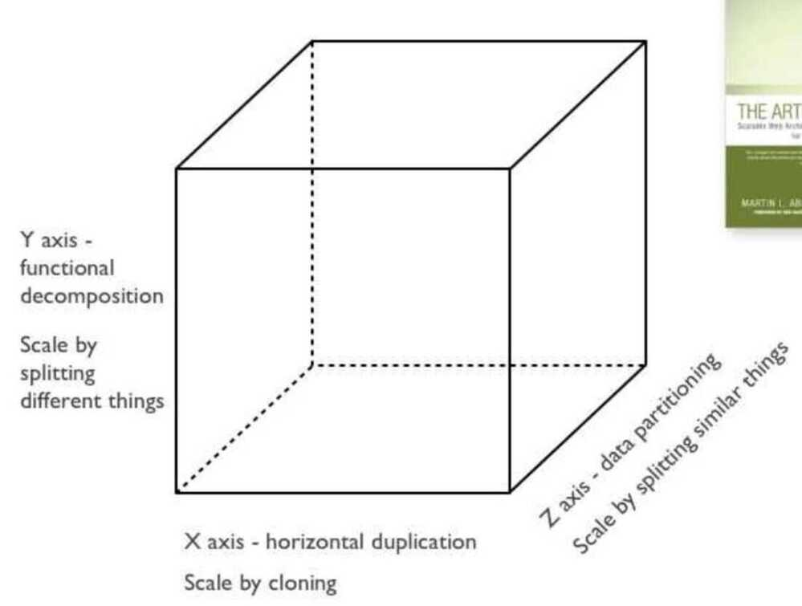
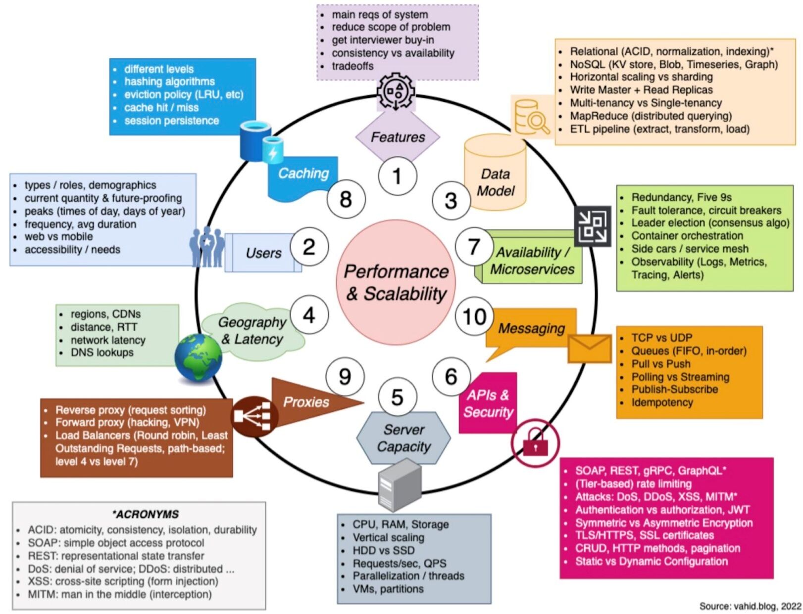

# Intro

Systems design is the process of defining the [architecture](https://en.wikipedia.org/wiki/Systems_architecture), modules, interfaces, and [data](https://en.wikipedia.org/wiki/Data) for a [system](https://en.wikipedia.org/wiki/System) to satisfy specified [requirements](https://en.wikipedia.org/wiki/Requirement). Systems design could be seen as the application of [systems theory](https://en.wikipedia.org/wiki/Systems_theory) to [product development](https://en.wikipedia.org/wiki/Product_development). There is some overlap with the disciplines of [systems analysis](https://en.wikipedia.org/wiki/Systems_analysis), [systems architecture](https://en.wikipedia.org/wiki/Systems_architecture) and [systems engineering](https://en.wikipedia.org/wiki/Systems_engineering)

- Inversion Of Control
- Callbacks
- Hollywood principle - Don't call me, we will call you
- Android - Used Interface for callback onSuccess of async task
- Build vs Buy vs Get for Free
- Planet Scale Systems

### Answering system design interview questions

1. Get domain knowledge of what are we building
2. Core features - Only design 2-3 core features for a system design question
3. For what scale we are building

## Introduction

1. Features
2. Define APIs
3. CAP Theorem

- Consistency
- Availability, and
- Partition Tolerance

4. Latency Performance (If customer facing application, then latency matters)
5. Scalability (Add more users and requests)
6. Durability (Data is not lost or compromised)
7. Class Diagrams
8. Security & Privacy
9. Cost Effective

## Approaching a system design problem

### Gather requirements (Functional and non-functional requirements)

- Functional
    - sendMessage(messageBody)
    - receiveMessage()
- Non-functional
    - Scalable (handles load increases, more queues and messages)
    - Highly available (services hardware/network failures)
    - Highly performent (single digit latency for main operations)
    - Durable (once submitted, data is not lost)
    - What is the expected read-to-write ratio?
- How many **concurrent requests** should we expect?
- What's the average expected response time?
- What's the limit of the data we allow users to provide?
- How many customers
- RPS / Traffic
- Who are the users

### Establish the Scope

- Do we want to discuss the end-to-end experience or just the API?
- What clients do we want to support (mobile, web, etc)?
- Do we require authentication? Analytics? Integrating with existing systems?

### High level design

- Cloud - CDN / LoadBalancers / Servers / Queues
- Database layer
- Scalability

### Low level design

- DS + Algo
- API
- Data model
- Database schema
- Optimizations
- Edge cases
    - Viral Videos
    - High number of followers

### Others

- Security
- Reliability
- Replication
- Tradeoffs

https://www.freecodecamp.org/news/systems-design-for-interviews

https://hackernoon.com/anatomy-of-a-system-design-interview-4cb57d75a53f

https://towardsdatascience.com/the-complete-guide-to-the-system-design-interview-ba118f48bdfc

[System Design Introduction For Interview. - YouTube](https://www.youtube.com/watch?v=UzLMhqg3_Wc)

### Scaling

- Vertical Scaling / Scale up (Add more CPU, RAM, Storage to an existing host)
- Horizontal Scaling / Scale out (Keep one host small and add another host)

Vertical Scaling is expensive and have a limit whereas Horizontal Scaling is cheap. But we have to take care of distributed systems problem in Horizontal Scaling and not in Vertical Scaling.

### Data Centers / Rack / Hosts

Consider latency between cross racks, cross hosts

### CPU / Memory / HardDrive / Network Bandwidth

All of the above are limited resources. How to improve limitations while scaling

### Random vs Sequential read/writes on disk

Always sequential read is far faster than random read/write on a disk.

### CDNs and Edge

CDN - Content Delivery Network

Edge - You do processing close to the end user. It has dedicated network from the edge to all the way to the data center so your request could be routed over this dedicated network instead of going over the general internet.

### Virtual machines and containers

Virtual Machines - are a way of giving you an OS on top of a shared resource such that you feel like you are the exclusive owner of that hardware while in reality that hardware is shared between different isolated operating system.
Containers - is a way of running your applications and its dependencies in an isolated environment.

### Publisher - Subscriber or Queue

- Queuing is a *point-to-point communication model* - a pool of consumers may read from a server and each message is delivered to one of them - it allows you to divide up the processing of data over multiple consumer instances and scale your processing.
- Publish-subscribe is a *broadcast communication model* - a message is broadcast to all the consumers.

### Thin clients, Thick clients, Dumb clients, Smart client

Kafka clients tend to be "thick" and have a lot of complexity. That is, they do a lot because the broker is designed to be simple. That's my guess as to why there are so few native client libraries up to par with the Java client. NATS Streaming clients, on the other hand, are relatively "thin" because the server does more. We end up just pushing the complexity around based on our design decisions, but one can argue that the [smart client and dumb server](https://bravenewgeek.com/smart-endpoints-dumb-pipes/) is a more scalable approach.

### Availability

|**Nines**|**Percent**|**Downtime/Year**|**σ Level**|
|---|---|---|---|
|4|99.99%|52.596 minutes|4σ|
|5|99.999%|5.2596 minutes|-|
|6|99.9999%|31.5576 seconds|5σ|
|7|99.99999%|3.15576 seconds|-|
|8|99.999999%|315.6 milliseconds|6σ|

[5 9s (99.999%) or higher scenario with a recovery time under one minute - Reliability Pillar](https://docs.aws.amazon.com/wellarchitected/latest/reliability-pillar/s-99.999-or-higher-scenario-with-a-recovery-time-under-1-minute.html)

[System Design](https://www.youtube.com/playlist?list=PLkQkbY7JNJuBoTemzQfjym0sqbOHt5fnV)

## ADR - Architecture Design Record

Architects are often writing the ADRs ([Architecture Decision Record](https://github.com/joelparkerhenderson/architecture_decision_record#suggestions-for-writing-good-adrs)), those are documents that are helping anyone in the company to understand why a decision was made describing the context, the options available, the chosen one and finally the consequences generated by this decision.- An**architecture decision record(ADR)** is a document that captures an important architectural decision made along with its context and consequences.

- An **architecture decision(AD)** is a software design choice that addresses a significant requirement.
- An **architecture decision log(ADL)** is the collection of all ADRs created and maintained for a particular project (or organization).
- An **architecturally-significant requirement(ASR)** is a requirement that has a measurable effect on a software system's architecture.
- All these are within the topic of **architecture knowledge management(AKM).**

https://github.com/joelparkerhenderson/architecture-decision-record

https://cognitect.com/blog/2011/11/15/documenting-architecture-decisions

## Scale Cube

Thescale cubeis a technology model that indicates three methods (or approaches) by which technology platforms may be scaled to meet increasing levels of demand upon the system in question. The three approaches defined by the model include scaling through replication or cloning (the "X axis"), scaling through segmentation along service boundaries or dissimilar components (the "Y axis") and segmentation or partitioning along similar components (the "Z axis").

### 3 Dimensions to Scaling

https://en.wikipedia.org/wiki/Scale_cube

https://microservices.io/articles/scalecube.html

### LLD (Low Level Design)

https://www.youtube.com/playlist?list=PLAC2AM9O1C5KioUMeH9qIjbAV_RMmX8rd

## When building a full-stack feature, start where the data is

### Exposing some data from the database?

Start with the backend. Build the API first and then consume it in the front end

### Is it coming from a user input?

Start with the front end. Build the form and then build an API to publish it to

This helps as you no longer have to make assumptions about

- the format of the data,
- the data types of each field, or
- what data is even available

## Links

[System Design Blueprint: The Ultimate Guide | by Love Sharma | Apr, 2023 | Dev Genius](https://blog.devgenius.io/system-design-blueprint-the-ultimate-guide-e27b914bf8f1)

- [System Designs - YouTube](https://www.youtube.com/playlist?list=PLQnljOFTspQXSevtRqvMNycWfHM7cXc3d)
- [System Design Master Template: How to Answer Any System Design Interview Question. | by Arslan Ahmad | Level Up Coding](https://levelup.gitconnected.com/system-design-master-template-how-to-answer-any-system-design-interview-question-ee5dc332acd5)
- [Mastering the Art of Caching for System Design Interviews: A Complete Guide | by Arslan Ahmad | Level Up Coding](https://levelup.gitconnected.com/master-the-art-of-caching-for-system-design-interviews-a-complete-guide-676bb49d194)
- [How to Use Consistent Hashing in a System Design Interview? | by Arslan Ahmad | InterviewNoodle](https://interviewnoodle.com/how-to-use-consistent-hashing-in-a-system-design-interview-b738be3a1ae3)
- [System Design Interview Basics: CAP vs. PACELC | by Arslan Ahmad | InterviewNoodle](https://interviewnoodle.com/system-design-interview-basics-cap-vs-pacelc-cf7c5eebc313)
- [System Design Interviews: A Step-By-Step Guide | by Arslan Ahmad | InterviewNoodle](https://interviewnoodle.com/system-design-interviews-a-step-by-step-guide-cb30496f31a5)
- [System Design Interview Question: Designing a URL Shortening Service | by Arslan Ahmad | InterviewNoodle](https://interviewnoodle.com/system-design-interview-question-designing-a-url-shortening-service-eac7b147295)
- [System Design Interviews: What distinguishes you from others? | by Arslan Ahmad | InterviewNoodle](https://interviewnoodle.com/system-design-interviews-what-distinguishes-you-from-others-7095405ec48)
- [The Complete Guide to Ace the System Design Interview in 2023 | by Arslan Ahmad | CodeX | Medium](https://medium.com/codex/the-complete-guide-to-ace-the-system-design-interview-in-2022-2d21c9534905)
- [Top 7 Facebook System Design Interview Questions and Answers (2023) | by Arslan Ahmad | CodeX | Medium](https://medium.com/codex/top-7-facebook-system-design-interview-questions-and-answers-2022-8c2dd329038)
- [System Design Tutorial: 3 Must-Know Distributed Systems Concepts | by Arslan Ahmad | Geek Culture | Medium](https://medium.com/geekculture/system-design-tutorial-3-must-know-distributed-systems-concepts-279d4e9718e8)
- [Brief History of Scaling Uber](https://highscalability.com/brief-history-of-scaling-uber/)
- [Behind AWS S3’s Massive Scale](https://highscalability.com/behind-aws-s3s-massive-scale/)
- [Software Architecture Patterns - ByteByteGo Newsletter](https://blog.bytebytego.com/p/software-architecture-patterns)

