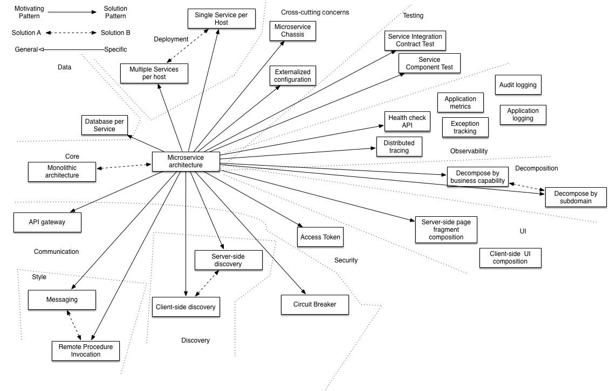

# Design Patterns

## Design Patterns of Microservices

1. [Aggregator](https://www.edureka.co/blog/microservices-design-patterns#Aggregator)
2. [**API Gateway**](https://www.edureka.co/blog/microservices-design-patterns#APIGateway)
3. [**Chained or Chain of Responsibility**](https://www.edureka.co/blog/microservices-design-patterns#Chained)
4. [**Asynchronous Messaging**](https://www.edureka.co/blog/microservices-design-patterns#AsynchronousMessaging)
5. [Database or Shared Data](https://www.edureka.co/blog/microservices-design-patterns#Database)
6. [Event Sourcing](https://www.edureka.co/blog/microservices-design-patterns#EventSourcing)
7. [Branch](https://www.edureka.co/blog/microservices-design-patterns#Branch)
8. [Command Query Responsibility Segregator](https://www.edureka.co/blog/microservices-design-patterns#CQRS)
9. [Circuit Breaker](https://www.edureka.co/blog/microservices-design-patterns#CircuitBreaker)
10. [Decomposition](https://www.edureka.co/blog/microservices-design-patterns#Decomposition)

https://www.edureka.co/blog/microservices-design-patterns

- Decomposition patterns
    - [Decompose by business capability](https://microservices.io/patterns/decomposition/decompose-by-business-capability.html)
    - [Decompose by subdomain](https://microservices.io/patterns/decomposition/decompose-by-subdomain.html)

## Functional Decomposition

Functional decomposition is a term that engineers use to describea set of steps in which they break down the overall function of a device, system, or process into its smaller parts. A function is simply a task that is performed by a device, system, or process. Decomposition is a process of breaking down.

https://en.wikipedia.org/wiki/Functional_decomposition- The [Database per Service pattern](https://microservices.io/patterns/data/database-per-service.html) describes how each service has its own database in order to ensure loose coupling.

- The [API Gateway pattern](https://microservices.io/patterns/apigateway.html) defines how clients access the services in a microservice architecture.
- The [Client-side Discovery](https://microservices.io/patterns/client-side-discovery.html) and [Server-side Discovery](https://microservices.io/patterns/server-side-discovery.html) patterns are used to route requests for a client to an available service instance in a microservice architecture.
- The Messaging and Remote Procedure Invocation patterns are two different ways that services can communicate.
- The [Single Service per Host](https://microservices.io/patterns/deployment/single-service-per-host.html) and [Multiple Services per Host](https://microservices.io/patterns/deployment/multiple-services-per-host.html) patterns are two different deployment strategies.
- Cross-cutting concerns patterns:[Microservice chassis pattern](https://microservices.io/patterns/microservice-chassis.html) and [Externalized configuration](https://microservices.io/patterns/externalized-configuration.html)
- Testing patterns:[Service Component Test](https://microservices.io/patterns/testing/service-component-test.html) and [Service Integration Contract Test](https://microservices.io/patterns/testing/service-integration-contract-test.html)
- [Circuit Breaker](https://microservices.io/patterns/reliability/circuit-breaker.html)
- [Access Token](https://microservices.io/patterns/security/access-token.html)
- Observability patterns:
    - [Log aggregation](https://microservices.io/patterns/observability/application-logging.html)
    - [Application metrics](https://microservices.io/patterns/observability/application-metrics.html)
    - [Audit logging](https://microservices.io/patterns/observability/audit-logging.html)
    - [Distributed tracing](https://microservices.io/patterns/observability/distributed-tracing.html)
    - [Exception tracking](https://microservices.io/patterns/observability/exception-tracking.html)
    - [Health check API](https://microservices.io/patterns/observability/health-check-api.html)
    - [Log deployments and changes](https://microservices.io/patterns/observability/log-deployments-and-changes.html)
- UI patterns:
    - [Server-side page fragment composition](https://microservices.io/patterns/ui/server-side-page-fragment-composition.html)
    - [Client-side UI composition](https://microservices.io/patterns/ui/client-side-ui-composition.html)

https://microservices.io/patterns/microservices.html

## Catalog of patterns

| **Pattern** | **Summary** | **Category** |
| --- | --- | --- |
| [Ambassador](https://learn.microsoft.com//ambassador) | Create helper services that send network requests on behalf of a consumer service or application. | [Design and Implementation](https://learn.microsoft.com//category/design-implementation) [Operational Excellence](https://learn.microsoft.com//en-us/azure/architecture/framework/devops/devops-patterns) |
| [Anti-Corruption Layer](https://learn.microsoft.com//anti-corruption-layer) | Implement a façade or adapter layer between a modern application and a legacy system. | [Design and Implementation](https://learn.microsoft.com//category/design-implementation), [Operational Excellence](https://learn.microsoft.com//en-us/azure/architecture/framework/devops/devops-patterns) |
| [Asynchronous Request-Reply](https://learn.microsoft.com//async-request-reply) | Decouple backend processing from a frontend host, where backend processing needs to be asynchronous, but the frontend still needs a clear response. | [Messaging](https://learn.microsoft.com//category/messaging) |
| [Backends for Frontends](https://learn.microsoft.com//backends-for-frontends) | Create separate backend services to be consumed by specific frontend applications or interfaces. | [Design and Implementation](https://learn.microsoft.com//category/design-implementation) |
| [Bulkhead](https://learn.microsoft.com//bulkhead) | Isolate elements of an application into pools so that if one fails, the others will continue to function. | [Reliability](https://learn.microsoft.com//en-us/azure/architecture/framework/resiliency/reliability-patterns) |
| [Cache-Aside](https://learn.microsoft.com//cache-aside) | Load data on demand into a cache from a data store | [Data Management](https://learn.microsoft.com//category/data-management), [Performance Efficiency](https://learn.microsoft.com//en-us/azure/architecture/framework/scalability/performance-efficiency-patterns) |
| [Choreography](https://learn.microsoft.com//choreography) | Let each service decide when and how a business operation is processed, instead of depending on a central orchestrator. | [Messaging](https://learn.microsoft.com//category/messaging), [Performance Efficiency](https://learn.microsoft.com//en-us/azure/architecture/framework/scalability/performance-efficiency-patterns) |
| [Circuit Breaker](https://learn.microsoft.com//circuit-breaker) | Handle faults that might take a variable amount of time to fix when connecting to a remote service or resource. | [Reliability](https://learn.microsoft.com//en-us/azure/architecture/framework/resiliency/reliability-patterns) |
| [Claim Check](https://learn.microsoft.com//claim-check) | Split a large message into a claim check and a payload to avoid overwhelming a message bus. | [Messaging](https://learn.microsoft.com//category/messaging) |
| [Compensating Transaction](https://learn.microsoft.com//compensating-transaction) | Undo the work performed by a series of steps, which together define an eventually consistent operation. | [Reliability](https://learn.microsoft.com//en-us/azure/architecture/framework/resiliency/reliability-patterns) |
| [Competing Consumers](https://learn.microsoft.com//competing-consumers) | Enable multiple concurrent consumers to process messages received on the same messaging channel. | [Messaging](https://learn.microsoft.com//category/messaging) |
| [Compute Resource Consolidation](https://learn.microsoft.com//compute-resource-consolidation) | Consolidate multiple tasks or operations into a single computational unit | [Design and Implementation](https://learn.microsoft.com//category/design-implementation) |
| [CQRS](https://learn.microsoft.com//cqrs) | Segregate operations that read data from operations that update data by using separate interfaces. | [Data Management](https://learn.microsoft.com//category/data-management), [Design and Implementation](https://learn.microsoft.com//category/design-implementation), [Performance Efficiency](https://learn.microsoft.com//en-us/azure/architecture/framework/scalability/performance-efficiency-patterns) |
| [Deployment Stamps](https://learn.microsoft.com//deployment-stamp) | Deploy multiple independent copies of application components, including data stores. | [Reliability](https://learn.microsoft.com//en-us/azure/architecture/framework/resiliency/reliability-patterns), [Performance Efficiency](https://learn.microsoft.com//en-us/azure/architecture/framework/scalability/performance-efficiency-patterns) |
| [Event Sourcing](https://learn.microsoft.com//event-sourcing) | Use an append-only store to record the full series of events that describe actions taken on data in a domain. | [Data Management](https://learn.microsoft.com//category/data-management), [Performance Efficiency](https://learn.microsoft.com//en-us/azure/architecture/framework/scalability/performance-efficiency-patterns) |
| [External Configuration Store](https://learn.microsoft.com//external-configuration-store) | Move configuration information out of the application deployment package to a centralized location. | [Design and Implementation](https://learn.microsoft.com//category/design-implementation), [Operational Excellence](https://learn.microsoft.com//en-us/azure/architecture/framework/devops/devops-patterns) |
| [Federated Identity](https://learn.microsoft.com//federated-identity) | Delegate authentication to an external identity provider. | [Security](https://learn.microsoft.com//en-us/azure/architecture/framework/security/security-patterns) |
| [Gatekeeper](https://learn.microsoft.com//gatekeeper) | Protect applications and services by using a dedicated host instance that acts as a broker between clients and the application or service, validates and sanitizes requests, and passes requests and data between them. | [Security](https://learn.microsoft.com//en-us/azure/architecture/framework/security/security-patterns) |
| [Gateway Aggregation](https://learn.microsoft.com//gateway-aggregation) | Use a gateway to aggregate multiple individual requests into a single request. | [Design and Implementation](https://learn.microsoft.com//category/design-implementation), [Operational Excellence](https://learn.microsoft.com//en-us/azure/architecture/framework/devops/devops-patterns) |
| [Gateway Offloading](https://learn.microsoft.com//gateway-offloading) | Offload shared or specialized service functionality to a gateway proxy. | [Design and Implementation](https://learn.microsoft.com//category/design-implementation), [Operational Excellence](https://learn.microsoft.com//en-us/azure/architecture/framework/devops/devops-patterns) |
| [Gateway Routing](https://learn.microsoft.com//gateway-routing) | Route requests to multiple services using a single endpoint. | [Design and Implementation](https://learn.microsoft.com//category/design-implementation), [Operational Excellence](https://learn.microsoft.com//en-us/azure/architecture/framework/devops/devops-patterns) |
| [Geodes](https://learn.microsoft.com//geodes) | Deploy backend services into a set of geographical nodes, each of which can service any client request in any region. | [Reliability](https://learn.microsoft.com//en-us/azure/architecture/framework/resiliency/reliability-patterns), [Operational Excellence](https://learn.microsoft.com//en-us/azure/architecture/framework/devops/devops-patterns) |
| [Health Endpoint Monitoring](https://learn.microsoft.com//health-endpoint-monitoring) | Implement functional checks in an application that external tools can access through exposed endpoints at regular intervals. | [Reliability](https://learn.microsoft.com//en-us/azure/architecture/framework/resiliency/reliability-patterns), [Operational Excellence](https://learn.microsoft.com//en-us/azure/architecture/framework/devops/devops-patterns) |
| [Index Table](https://learn.microsoft.com//index-table) | Create indexes over the fields in data stores that are frequently referenced by queries. | [Data Management](https://learn.microsoft.com//category/data-management), [Performance Efficiency](https://learn.microsoft.com//en-us/azure/architecture/framework/scalability/performance-efficiency-patterns) |
| [Leader Election](https://learn.microsoft.com//leader-election) | Coordinate the actions performed by a collection of collaborating task instances in a distributed application by electing one instance as the leader that assumes responsibility for managing the other instances. | [Design and Implementation](https://learn.microsoft.com//category/design-implementation), [Reliability](https://learn.microsoft.com//en-us/azure/architecture/framework/resiliency/reliability-patterns) |
| [Materialized View](https://learn.microsoft.com//materialized-view) | Generate prepopulated views over the data in one or more data stores when the data isn't ideally formatted for required query operations. | [Data Management](https://learn.microsoft.com//category/data-management), [Operational Excellence](https://learn.microsoft.com//en-us/azure/architecture/framework/devops/devops-patterns) |
| [Pipes and Filters](https://learn.microsoft.com//pipes-and-filters) | Break down a task that performs complex processing into a series of separate elements that can be reused. | [Design and Implementation](https://learn.microsoft.com//category/design-implementation), [Messaging](https://learn.microsoft.com//category/messaging) |
| [Priority Queue](https://learn.microsoft.com//priority-queue) | Prioritize requests sent to services so that requests with a higher priority are received and processed more quickly than those with a lower priority. | [Messaging](https://learn.microsoft.com//category/messaging), [Performance Efficiency](https://learn.microsoft.com//en-us/azure/architecture/framework/scalability/performance-efficiency-patterns) |
| [Publisher/Subscriber](https://learn.microsoft.com//publisher-subscriber) | Enable an application to announce events to multiple interested consumers asynchronously, without coupling the senders to the receivers. | [Messaging](https://learn.microsoft.com//category/messaging) |
| [Queue-Based Load Leveling](https://learn.microsoft.com//queue-based-load-leveling) | Use a queue that acts as a buffer between a task and a service that it invokes in order to smooth intermittent heavy loads. | [Reliability](https://learn.microsoft.com//en-us/azure/architecture/framework/resiliency/reliability-patterns), [Messaging](https://learn.microsoft.com//category/messaging), [Resiliency](https://learn.microsoft.com//en-us/azure/architecture/framework/resiliency/reliability-patterns), [Performance Efficiency](https://learn.microsoft.com//en-us/azure/architecture/framework/scalability/performance-efficiency-patterns) |
| [Retry](https://learn.microsoft.com//retry) | Enable an application to handle anticipated, temporary failures when it tries to connect to a service or network resource by transparently retrying an operation that's previously failed. | [Reliability](https://learn.microsoft.com//en-us/azure/architecture/framework/resiliency/reliability-patterns) |
| [Scheduler Agent Supervisor](https://learn.microsoft.com//scheduler-agent-supervisor) | Coordinate a set of actions across a distributed set of services and other remote resources. | [Messaging](https://learn.microsoft.com//category/messaging), [Reliability](https://learn.microsoft.com//en-us/azure/architecture/framework/resiliency/reliability-patterns) |
| [Sequential Convoy](https://learn.microsoft.com//sequential-convoy) | Process a set of related messages in a defined order, without blocking processing of other groups of messages. | [Messaging](https://learn.microsoft.com//category/messaging) |
| [Sharding](https://learn.microsoft.com//sharding) | Divide a data store into a set of horizontal partitions or shards. | [Data Management](https://learn.microsoft.com//category/data-management), [Performance Efficiency](https://learn.microsoft.com//en-us/azure/architecture/framework/scalability/performance-efficiency-patterns) |
| [Sidecar](https://learn.microsoft.com//sidecar) | Deploy components of an application into a separate process or container to provide isolation and encapsulation. | [Design and Implementation](https://learn.microsoft.com//category/design-implementation), [Operational Excellence](https://learn.microsoft.com//en-us/azure/architecture/framework/devops/devops-patterns) |
| [Static Content Hosting](https://learn.microsoft.com//static-content-hosting) | Deploy static content to a cloud-based storage service that can deliver them directly to the client. | [Design and Implementation](https://learn.microsoft.com//category/design-implementation), [Data Management](https://learn.microsoft.com//category/data-management), [Performance Efficiency](https://learn.microsoft.com//en-us/azure/architecture/framework/scalability/performance-efficiency-patterns) |
| [Strangler Fig](https://learn.microsoft.com//strangler-fig) | Incrementally migrate a legacy system by gradually replacing specific pieces of functionality with new applications and services. | [Design and Implementation](https://learn.microsoft.com//category/design-implementation), [Operational Excellence](https://learn.microsoft.com//en-us/azure/architecture/framework/devops/devops-patterns) |
| [Throttling](https://learn.microsoft.com//throttling) | Control the consumption of resources used by an instance of an application, an individual tenant, or an entire service. | [Reliability](https://learn.microsoft.com//en-us/azure/architecture/framework/resiliency/reliability-patterns), [Performance Efficiency](https://learn.microsoft.com//en-us/azure/architecture/framework/scalability/performance-efficiency-patterns) |
| [Valet Key](https://learn.microsoft.com//valet-key) | Use a token or key that provides clients with restricted direct access to a specific resource or service. | [Data Management](https://learn.microsoft.com//category/data-management), [Security](https://learn.microsoft.com//en-us/azure/architecture/framework/security/security-patterns) |

https://docs.microsoft.com/en-us/azure/architecture/patterns

## Enterprise Application Architecture

- **Domain Logic Patterns:** Transaction Script, Domain Model, Table Module, Service Layer.
- **Data Source Architectural Patterns:** Table Data Gateway, Row Data Gateway, Active Record, Data Mapper.
- **Object-Relational Behavioral Patterns:** Unit of Work, Identity Map, Lazy Load
- **Object-Relational Structural Patterns:** Identity Field, Foreign Key Mapping, Association Table Mapping, Dependent Mapping, Embedded Value, Serialized LOB, Single Table Inheritance, Class Table Inheritance, Concrete Table Inheritance, Inheritance Mappers.
- **Object-Relational Metadata Mapping Patterns:** Metadata Mapping, Query Object, Repository.
- **Web Presentation Patterns:** Model View Controller, Page Controller, Front Controller, Template View, Transform View, Two-Step View, Application Controller.
- **Distribution Patterns:** Remote Facade, Data Transfer Object
- **Offline Concurrency Patterns:** Optimistic Offline Lock, Pessimistic Offline Lock, Coarse Grained Lock, Implicit Lock.
- **Session State Patterns:** Client Session State, Server Session State, Database Session State.
- **Base Patterns:** Gateway, Mapper, Layer Supertype, Separated Interface, Registry, Value Object, Money, Special Case, Plugin, Service Stub, Record Set

https://martinfowler.com/eaaCatalog/index.html

## Self Contained System (SCS)

The Self-contained System (SCS) approach is an architecture that focuses on a separation of the functionality into many independent systems, making the complete logical system a collaboration of many smaller software systems. This avoids the problem of large monoliths that grow constantly and eventually become unmaintainable.

https://scs-architecture.org
