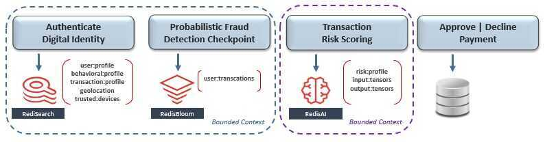

# Domain Driven Design

Domain-driven design(DDD) is the concept that the structure and language of software code (class names, class methods, class variables) should match the [business domain](https://en.wikipedia.org/wiki/Business_domain). For example, if a software processes loan applications, it might have classes such as LoanApplication and Customer, and methods such as AcceptOffer and Withdraw.

DDD connects the [implementation](https://en.wikipedia.org/wiki/Implementation) to an evolving model.

Domain-driven design is predicated on the following goals

- placing the project's primary focus on the core [domain](https://en.wikipedia.org/wiki/Domain_(software_engineering)) and domain logic;
- basing complex designs on a model of the domain;
- initiating a creative collaboration between technical and [domain experts](https://en.wikipedia.org/wiki/Domain_expert) to iteratively refine a conceptual model that addresses particular domain problems.

Two synergic properties in software design

- High cohesion
- Low coupling

DDD is an approach to software development that tackles complex systems by mapping activities, tasks, events, and data from a business domain to software artifacts. One of the most important concepts of DDD is the *bounded context*, which is a cohesive and well-defined unit within the business model in which you define the boundaries of your software artifacts

https://en.wikipedia.org/wiki/Domain-driven_design

## Financial System

## Design Pattern: Bounded Context -> Domain-Driven Design

Our first challenge is to logically segment the business into micro-subdomains, so that each can be supported by a smallempowered autonomous team. Each subdomain's scope should be bound by its team's capacity to manage the lifecycle of its supporting microservice(s) - from inception to post-production. This shift from working on transient-projects to autonomous domain-ownership incentivizes accountability for all aspects of microservice design and empowers agile decision-making - which results inimproved time-to-market.
Think of the prefix "micro" alluding to the size of the team needed to support the entire lifecycle of the microservice(s) within its bounded business subdomain.
Within the context of our mockup architecture, let's begin the organizational design process by starting with the payment-processing domain - which includes fraud detection, payments, settlement, and more. Since this scope is likely too complicated for a small team to manage, let's choose to narrow their ownership boundary down to just the fraud-detection subdomain.

The diagram above shows that fraud-detection is composed of the workflow's first three microservices - which include digital identities, statistical analysis, and AI-based transaction risk-scoring. Since their scope is likely still too broad for a small team to manage, let's split fraud detection further down into two subdomains - which finally seems more manageable.

At a very high level, the process we just followed is called [Domain-Driven Design (DDD)](https://dddcommunity.org/learning-ddd/what_is_ddd/), which is supported by the recommended pattern to bind each microservice's scope and ownership claim to a business subdomain called [bounded context](https://martinfowler.com/bliki/BoundedContext.html).

Notice that each microservice has its own dedicated database for **isolation**. The **empowered autonomous team** that owns the blue bounded context chose [RediSearch](https://redislabs.com/modules/redis-search/) to support their "Authenticate Digital Identity" microservice, and [RedisBloom](https://redislabs.com/modules/redis-bloom/) to support their "Probabilistic Fraud Detection Checkpoint" microservice. Meanwhile, a separate team that owns the purple bounded context chose [RedisAI](https://redislabs.com/modules/redis-ai/) to support "Transaction Risk Scoring" in real-time.

https://www.domainlanguage.com/ddd/reference/attachment/pattern-language-overview-med

https://www.youtube.com/watch?v=hv-LiKQgN90

[Domain Driven Design Patterns in Python](https://youtu.be/v0wBmQq8qcA)
