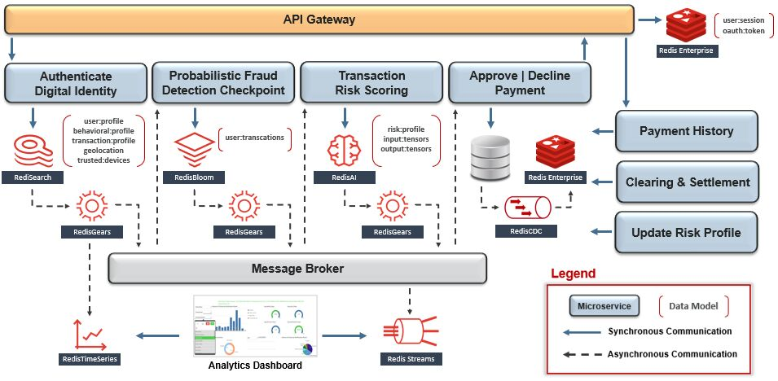
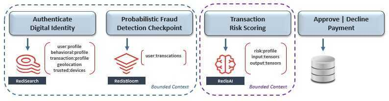
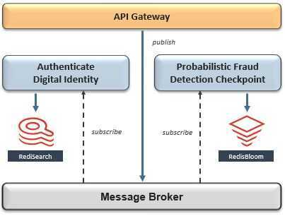
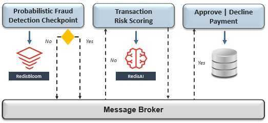
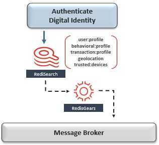
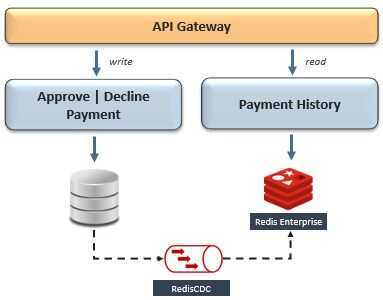
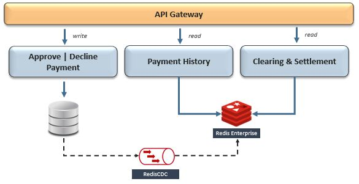
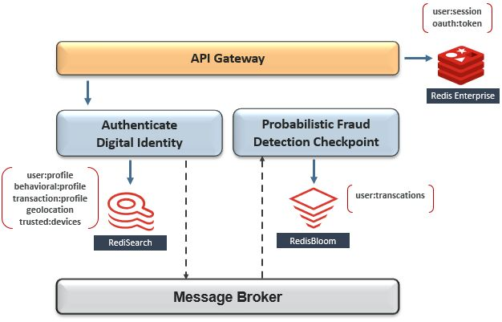

# Example

https://thenewstack.io/how-redis-simplifies-microservices-design-patterns

## Financial System

## Design Pattern: Bounded Context -> Domain-Driven Design

Our first challenge is to logically segment the business into micro-subdomains, so that each can be supported by a small empowered autonomous team. Each subdomain's scope should be bound by its team's capacity to manage the lifecycle of its supporting microservice(s) - from inception to post-production. This shift from working on transient-projects to autonomous domain-ownership incentivizes accountability for all aspects of microservice design and empowers agile decision-making - which results in improved time-to-market.

Think of the prefix "micro" alluding to the size of the team needed to support the entire lifecycle of the microservice(s) within its bounded business subdomain.
Within the context of our mockup architecture, let's begin the organizational design process by starting with the payment-processing domain - which includes fraud detection, payments, settlement, and more. Since this scope is likely too complicated for a small team to manage, let's choose to narrow their ownership boundary down to just the fraud-detection subdomain.

The diagram above shows that fraud-detection is composed of the workflow's first three microservices - which include digital identities, statistical analysis, and AI-based transaction risk-scoring. Since their scope is likely still too broad for a small team to manage, let's split fraud detection further down into two subdomains - which finally seems more manageable.

At a very high level, the process we just followed is called [Domain-Driven Design (DDD)](https://dddcommunity.org/learning-ddd/what_is_ddd/), which is supported by the recommended pattern to bind each microservice's scope and ownership claim to a business subdomain called [bounded context](https://martinfowler.com/bliki/BoundedContext.html).
Notice that each microservice has its own dedicated database for **isolation**. The**empowered autonomous team**that owns the blue bounded context chose [RediSearch](https://redislabs.com/modules/redis-search/) to support their "Authenticate Digital Identity" microservice, and [RedisBloom](https://redislabs.com/modules/redis-bloom/) to support their "Probabilistic Fraud Detection Checkpoint" microservice. Meanwhile, a separate team that owns the purple bounded context chose [RedisAI](https://redislabs.com/modules/redis-ai/) to support "Transaction Risk Scoring" in real-time.

## Design Pattern: Asynchronous Messaging -> Interservice Communication

Now that we've identified a bounded context and optimal data model for each microservice, our next challenge is to enable communication between them without breaking compliance to **isolation**. This can be solved byembracing**eventual consistency**, which presumes the microservice on the receiving end of interservice communication will not be available during outbound transmission, however, can consume the message as soon as availability is restored.

The recommended pattern for interservice communication is [asynchronous messaging](https://microservices.io/patterns/communication-style/messaging.html) using a publish-subscribe message broker as its event distribution hub. In this pattern, a producer can publish an event without requisite awareness of whether or not any consumer is listening, and - in the same way - consumers of that event can react to it at their convenience or ignore it altogether. This is typically the foundation of an event-driven architecture.

Since we have already chosen Redis as the primary database for multiple microservices, we can simplify our architecture by also using it to implement this pattern with [Redis Streams](https://university.redislabs.com/courses/ru202/). Redis Streams is an immutable time-ordered log data structure that allows a producer to publish asynchronous messages to multiple subscribed consumers. This ensures the microservice that is publishing events will remain decoupled from the microservice(s) consuming them - so there are no cross-dependencies on availability and release cycles. In addition, Redis Streams can be configured to handle different delivery guarantees, support consumer groups, and other nuances that are similar in nature to [Kafka](https://kafka.apache.org/) - also a staple across microservice architectures.

## Design Pattern: Choreography-Based Saga -> Distributed Transactions

Now that we've enabled interservice communication, our next challenge is to handle transactions that span across multiple bounded contexts without breaking compliance to isolation. In the past, this was trivial to implement, since all operations within the transactional scope were executed against a single RDBMS that provided row-locking, deadlock-detection, and roll-back features. Once data became distributed across multiple databases, the Two-Phase Commit protocol (2PC) became a standard for distributed transactions. However, while both approaches worked, they were not designed with eventual consistency in mind.

If we presume a dependency will be unavailable during a distributed transaction, then we should also presume frequent rollbacks will cause sporadic unavailability across the system - which is neither cloud native nor improves time-to-market.
This can be solved by relaxing strict requirements for ACID guarantees, which have propped up relational databases across most traditional architectures for decades. While relational databases have their place within microservice architectures, their relevance becomes much more situational. For example, if referential integrity is not a requirement then why wouldn't an empowered autonomous team choose to optimize their microservice with a NoSQL database that is purpose-built to handle their specific data access patterns and SLAs.

Recall that our payment-processing workflow is composed of multiple microservices that are organized into separate bounded contexts and supported by Redis - a NoSQL database. Within this context, the recommended pattern to handle distributed transactions is a [choreography-based saga](https://microservices.io/patterns/data/saga.html), which performs a sequence of isolated local transactions with published events facilitating the transition between workflow stages.

Each microservice participating in the saga will listen only for its own workflow-related event, which will notify it to perform a local database transaction and subsequently publish its own event to the message broker. This event-driven choreography can include compensating microservices for rollback purposes and decision services for complex business processes.

It's worth noting that in a choreography-based saga there is no central orchestrator, which avoids coupling the release cycles of participating microservices. However, it is not always the right solution. There can be cases where strong consistency is an absolute requirement - such as account transfers. Within that context, either an orchestration-based saga might be better suited, or relying on a 2PC between microservices within the same bounded context.

## Design Pattern: Transactional Outbox and Message Relay -> Consistency

Now that we've choreographed transactions that span multiple bounded contexts, our next challenge is to mitigate the risks of inconsistency between a microservice's database and the message broker - even if Redis is used for both. Recall that in the previous two design patterns, each microservice committed locally to its database and subsequently published an event. If this is implemented using some variation of the [dual writes](https://thorben-janssen.com/dual-writes/) pattern, communication could become lost and distributed transactions could become orphaned - especially in a cloud environment.
Code-complexity can be added to each microservice to handle various failure and inconsistency scenarios, however consider this effort multiplied across 100s of teams and the risks of incorrect implementations - all adding no business value.

To avoid the risks and costs of various application-level implementations, the recommended patterns are [transactional outbox and message replay](https://microservices.io/patterns/data/transactional-outbox.html). Redis simplifies and supports the combined implementation of both patterns, known as [write-behind](https://github.com/RedisGears/rgsync), by using [Redis Streams](https://university.redislabs.com/courses/ru202/) as the transactional outbox and [RedisGears](https://redislabs.com/modules/redis-gears/) as the message relay. Within Redis a secondary thread can listen for changed-data events, durably store them in time order, and publish them to the message broker - whenever it's available. This can be uniformly enabled or upgraded on each Redis database at the same time withinfrastructure automation.

https://microservices.io/patterns/data/transactional-outbox.html

## Design Pattern: Command Query Responsibility Segregation (CQRS) -> Performance

Notice that when we defined our fraud-related bounded contexts, we left out the final stage of the payment-processing workflow. This was because itsempowered autonomous teamchose a non-Redis database to support its microservice.

So, let's now assume that the "Approve | Decline Payment" microservice is supported by a disk-based database which is not optimized for query-performance. Since it presumably has strong durability guarantees, it's a logical choice for record-keeping - however, what if its bounded context also includes a microservice that requires this data for query. This means our next challenge is to optimize query-performance when Redis is not the system-of-record.

The recommended pattern is [CQRS](https://martinfowler.com/bliki/CQRS.html), which segregates the responsibility for a dataset's writes - Command - and reads - Query. Implementing CQRS by using separate databases optimizes the data structure, or data model, to the data access pattern on both sides of the segregation and their individual SLAs. Since our goal is to optimize performance, the direction of data replication will typically flow into Redis from a disk-based database - i.e. MongoDB, Cassandra, RDBMS, etc. Easy, right?
Here's the catch - to implement this pattern we will need to solve for near-real-time continuous data replication, maintaineventual consistencybetween heterogeneous databases, and transform the data to avoid an impedance mismatch between Command and Query data-structures. This should sound familiar, since we did this when Redis was the source database - recall the transactional outbox and message relay patterns. However, since in this case Redis is the target and most other databases don't support [write-behind](https://github.com/RedisGears/rgsync), we'll need an external implementation to replicate changed-data events.

Within this context, we can simplify the implementation of CQRS by using a Change Data Capture (CDC) framework that can integrate with both Command and Query databases. CDC frameworks typically use [transaction-log tailing](https://microservices.io/patterns/data/transaction-log-tailing.html) or [polling-publisher](https://microservices.io/patterns/data/polling-publisher.html) patterns to scan for changed-data events on the Command database and replicate them as a transformed payload to the Query database. Notice how this is different than using Redis in a [cache-aside](https://redislabs.com/solutions/use-cases/caching/) pattern, since it does not couple the databases at the microservice level - maintainingisolation.

## Design Pattern: Shared Data -> Reusability

Now that we've addressed optimizing performance when Redis is not the system-of-record, our next challenge is to handle shared data between microservices that are separated by different bounded contexts or a database outside of the microservice architecture.
A real-world example of the latter, is a [strangler application](https://martinfowler.com/bliki/StranglerFigApplication.html) migration from a monolithic to microservice architecture. In this case, a microservice's database could be reliant on an external system-of-record for multiple years, or even indefinitely, as part of a Hybrid Cloud deployment. We actually solved this when we introduced the CQRS pattern, however let's extend the problem statement to include microservices that share the same data and data-access pattern.
In this case, here are some applicable patterns where Redis simplifies the implementation:

[Read Replicas](https://docs.redislabs.com/5.2/rs/administering/intercluster-replication/replica-of/) - replicate source data to multiple destinations

- [Shared Database](https://microservices.io/patterns/data/shared-database.html) - allow cross-dependencies between separate bounded contexts
- [Domain-Driven Design](https://dddcommunity.org/learning-ddd/what_is_ddd/) - include all microservices sharing data within a single bounded context

Here's the catch - while these patterns address shared data between a few bounded contexts, none of them would scale at a global level.

For global data, the recommended pattern is anisolateddatabase for the API Gateway. Since this database could potentially be accessed by every transaction that flows through the architecture, we must consider business continuity, scalability, and performance as critical success criteria for its selection.
