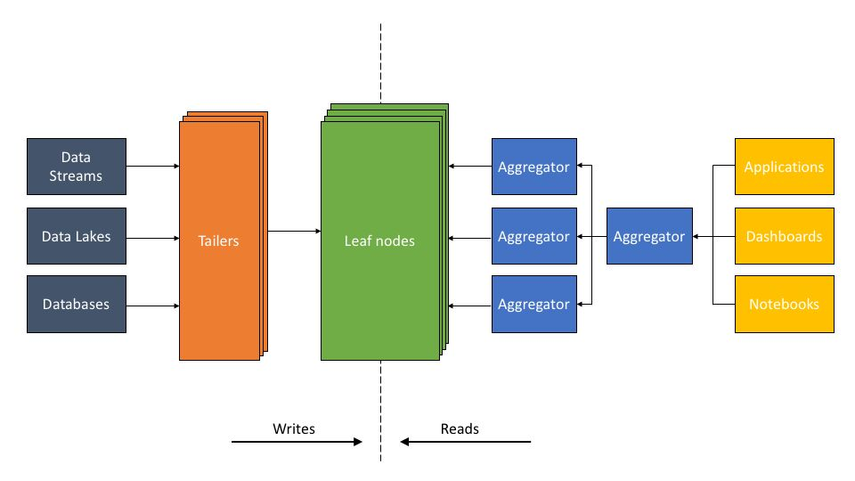

# Others

## Grid FTP

GridFTPis an extension of the [File Transfer Protocol (FTP)](https://en.wikipedia.org/wiki/File_Transfer_Protocol) for [grid computing](https://en.wikipedia.org/wiki/Grid_computing).The protocol was defined within the GridFTP working group of the [Open Grid Forum](https://en.wikipedia.org/wiki/Open_Grid_Forum). There are multiple implementations of the protocol; the most widely used is that provided by the [Globus Toolkit](https://en.wikipedia.org/wiki/Globus_Toolkit).

The aim of GridFTP is to provide a more reliable and high performance file transfer, for example to enable the transmission of very large files. GridFTP is used extensively within large science projects such as the [Large Hadron Collider](https://en.wikipedia.org/wiki/LHC) and by many supercomputer centers and other scientific facilities.

GridFTP also addresses the problem of incompatibility between storage and access systems. Previously, each data provider would make their data available in their own specific way, providing a library of access functions. This made it difficult to obtain data from multiple sources, requiring a different access method for each, and thus dividing the total available data into partitions. GridFTP provides a uniform way of accessing the data, encompassing functions from all the different modes of access, building on and extending the universally accepted FTP standard. FTP was chosen as a basis for it because of its widespread use, and because it has a well defined architecture for extensions to the protocol (which may be dynamically discovered).

Globus Toolkit - GSIFTP

https://en.wikipedia.org/wiki/GridFTP

## Real-Time Analytics

1. Ingestion
2. Store
3. Visualize
4. Act
5. Predict

## ALT (Aggregator Leaf Tailer) - Real-Time Analytics Without Pipelines

Aggregator Leaf Tailer (ALT)is the data architecture favored by web-scale companies, like Facebook, LinkedIn, and Google, for its efficiency and scalability.

The ALT architecture addresses these shortcomings of Lambda architectures. The key component of ALT is a high-performance serving layer that serves complex queries, and not just key-value lookups. The existence of this serving layer obviates the need for complex data pipelines.

### The ALT architecture described

1. The Tailer pulls new incoming data from a static or streaming source into an indexing engine. Its job is to fetch from all data sources, be it a data lake, like S3, or a dynamic source, like Kafka or Kinesis.

2. The Leaf is a powerful indexing engine. It indexes all data as and when it arrives via the Tailer. The indexing component builds multiple types of indexes - inverted, columnar, document, geo, and many others - on the fields of a data set. The goal of indexing is to make any query on any data field fast.

3. The scalable Aggregator tier is designed to deliver low-latency aggregations, be it columnar aggregations, joins, relevance sorting, or grouping. The Aggregators leverage indexing so efficiently that complex logic typically executed by pipeline software in other architectures can be executed on the fly as part of the query.

### Advantages of ALT

The ALT architecture enables the app developer or data scientist to run low-latency queries on raw data sets without any prior transformation. A large portion of the data transformation process can occur as part of the query itself. How is this possible in the ALT architecture?

- Indexing is critical to making queries fast.The Leaves maintain a variety of indexes concurrently, so that data can be quickly accessed regardless of the type of query - aggregation, key-value, time series, or search. Every document and field is indexed, including both value and type of each field, resulting in fast query performance that allows significantly more complex data processing to be inserted into queries.

- Queries are distributed across a scalable Aggregator tier.The ability to scale the number of Aggregators, which provide compute and memory resources, allows compute power to be concentrated on any complex processing executed on the fly.

- The Tailer, Leaf, and Aggregator run as discrete microservices in disaggregated fashion.Each Tailer, Leaf, or Aggregator tier can be independently scaled up and down as needed. The system scales Tailers when there is more data to ingest, scales Leaves when data size grows, and scales Aggregators when the number or complexity of queries increases. This independent scalability allows the system to bring significant resources to bear on complex queries when needed, while making it cost-effective to do so.

The most significant difference is that the Lambda architecture performs data transformations up front so that results are pre-materialized, while the ALT architecture allows for query on demand with on-the-fly transformations.

https://rockset.com/blog/aggregator-leaf-tailer-an-architecture-for-live-analytics-on-event-streams

## Dead Letter Queues

In [message queueing](https://en.wikipedia.org/wiki/Message_queue) the dead letter queue is a service implementation to store messages that meet one or more of the following criteria:

1. Message that is sent to a queue that does not exist.
2. Queue length limit exceeded.
3. Message length limit exceeded.
4. Message is rejected by another queue exchange.
5. Message reaches a threshold read counter number, because it is not consumed. Sometimes this is called a "back out queue".

Dead letter queue storing of these messages allows developers to look for common patterns and potential software problems.

Queueing systems that incorporate dead letter queues include [Amazon Simple Queue Service](https://en.wikipedia.org/wiki/Amazon_Simple_Queue_Service), [Apache ActiveMQ](https://en.wikipedia.org/wiki/Apache_ActiveMQ), [HornetQ](https://en.wikipedia.org/wiki/HornetQ), [Microsoft Message Queuing](https://en.wikipedia.org/wiki/Microsoft_Message_Queuing), [WebSphere MQ](https://en.wikipedia.org/wiki/WebSphere_MQ), [Rabbit MQ](https://en.wikipedia.org/wiki/Rabbit_MQ) and Apache Pulsar

https://en.wikipedia.org/wiki/Dead_letter_queue

Amazon SQS supports *dead-letter queues*, which other queues (*source queues*) can target for messages that can't be processed (consumed) successfully. Dead-letter queues are useful for debugging your application or messaging system because they let you isolate problematic messages to determine why their processing doesn't succeed.

Do use dead-letter queues to decrease the number of messages and to reduce the possibility of exposing your system to *poison-pill messages* (messages that can be received but can't be processed).

https://docs.aws.amazon.com/AWSSimpleQueueService/latest/SQSDeveloperGuide/sqs-dead-letter-queues.html

https://aws.amazon.com/blogs/compute/designing-durable-serverless-apps-with-dlqs-for-amazon-sns-amazon-sqs-aws-lambda

## Systemantics

General Systemantics(retitled toSystemanticsin its second edition andThe Systems Biblein its third) is a [systems engineering](https://en.wikipedia.org/wiki/Systems_engineering) treatise by [John Gall](https://en.wikipedia.org/wiki/John_Gall_(author)) in which he offers practical principles of systems design based on experience and anecdotes.
It is offered from the perspective of hownotto design systems, based on system engineering failures. The primary precept of treatise is that large [complex systems](https://en.wikipedia.org/wiki/Complex_system) are extremely difficult to design correctly despite best intentions, so care must be taken to design smaller, less-complex systems and to do so with incremental functionality based on close and continual touch with user needs and measures of effectiveness.

https://en.wikipedia.org/wiki/Systemantics

https://www.freecodecamp.org/news/have-an-idea-want-to-build-a-product-from-scratch-heres-a-checklist-of-things-you-should-go-through-in-your-backend-software-architecture

## Notification System

- APNS - Apple Push Notification System - [GitHub - samuraisam/pyapns: An APNS provider with multi-app support.](https://github.com/samuraisam/pyapns)
- FCM - Firebase Cloud Messaging

## Callbacks and Webhooks

### Callbacks

Handoff from an external page back to your page, you can send a callback url, that System B will use to redirect back to when it's operation is finished.

Ex - Swiggy -> Razorpay -> Back to swiggy after payment finishes

So swiggy will pass a callback url to razorpay, which razorpay will call after payment success/failure, so that user is directed back to swiggy, with status of payment, which swiggy can use to show appropriate page to users.

### Webhooks

A webhook is a hook in the web. Typically used to make two distinct systems communicate and typically to go away from polling towards a publisher-subscriber model.

## Updates

### Hard updates

refer to when the user is forced to update the client version to a higher version number than what is installed on their mobile.

### Soft updates

refer to when the user is shown a prompt that a new version is available and they can update their app to the new version if they want to.
Hard updates are not encouraged, but there are times when you need to enforce them. Whatever the case you should definitely consider how you are going to implement this for your applications.
You can do this by implementing or configuring it in the Play Store or App Store. Another way is to create an API in your backend application that will be hit every time the mobile app is launched. This will send two keys: hard_update -> true/false and soft_update -> true/false, depending upon the user's version and the hard and soft update versions set in your backend system.
A good place to store these versions is in your cache (Redis/Memcache), which you can change on the fly without needing to deploy your application.

[Stop using client-side route redirects](https://kentcdodds.com/blog/stop-using-client-side-route-redirects)

## Distributed Locks

A distributed lock is a mechanism that ensures mutual exclusion across a distributed system.

### Top 6 Use Cases for Distributed Locks

1. **Leader Election -** Distributed locks can be used to ensure that only one node becomes the leader at any given time.
2. **Task Scheduling -** In a distributed task scheduler, distributed locks ensure that a scheduled task is executed by only one worker node, preventing duplicate execution.
3. **Resource Allocation -** When managing shared resources like file systems, network sockets, or hardware devices, distributed locks ensure that only one process can access the resource at a time.
4. **Microservices Coordination -** When multiple microservices need to perform coordinated operations, such as updating related data in different databases, distributed locks ensure that these operations are performed in a controlled and orderly manner.
5. **Inventory Management -** In e-commerce platforms, distributed locks can manage inventory updates to ensure that stock levels are accurately maintained when multiple users attempt to purchase the same item simultaneously.
6. **Session Management -** When handling user sessions in a distributed environment, distributed locks can ensure that a user session is only modified by one server at a time, preventing inconsistencies.

