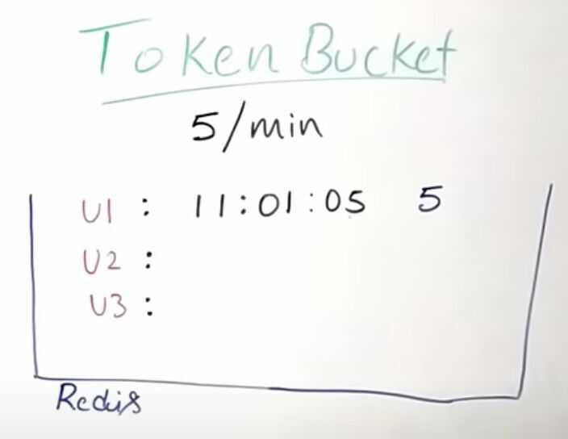

# Rate Limiting

## Endpoint Protection

In [computer networks](https://en.wikipedia.org/wiki/Computer_network), rate limiting is used to control the rate of traffic sent or received by a [network interface controller](https://en.wikipedia.org/wiki/Network_interface_controller) and is used to prevent [DoS attacks](https://en.wikipedia.org/wiki/Denial-of-service_attack).

## Hardware appliances

Hardware appliances can limit the rate of requests on layer 4 or 5 of the [OSI model](https://en.wikipedia.org/wiki/OSI_model).

Rate limiting can be induced by the network protocol stack of the sender due to a received [ECN](https://en.wikipedia.org/wiki/Explicit_Congestion_Notification)-marked packet and also by the [network scheduler](https://en.wikipedia.org/wiki/Network_scheduler) of any router along the way.

While a hardware appliance can limit the rate for a given range of IP-addresses on layer 4, it risks blocking a networks with many users, which are masked by [NAT](https://en.wikipedia.org/wiki/Network_address_translation) with a single IP-address of an [ISP](https://en.wikipedia.org/wiki/Internet_service_provider).

[Deep packet inspection](https://en.wikipedia.org/wiki/Deep_packet_inspection) can be used to filter on the session layer, but will effectively disarm encryption protocols like [TLS](https://en.wikipedia.org/wiki/Transport_Layer_Security) and [SSL](https://en.wikipedia.org/wiki/Secure_Sockets_Layer) between the appliance and the web server.

## Web servers

[Web servers](https://en.wikipedia.org/wiki/Web_server) typically use a central [in-memory](https://en.wikipedia.org/wiki/In-memory_database)[key-value database](https://en.wikipedia.org/wiki/Key-value_database), like [Redis](https://en.wikipedia.org/wiki/Redis) or [Aerospike](https://en.wikipedia.org/wiki/Aerospike_(database)), for session management. A rate limiting algorithm is used to check if the user session (or IP-address) has to be limited based on the information in the session cache.

In case a client made too many requests within a given timeframe, [HTTP](https://en.wikipedia.org/wiki/Hypertext_Transfer_Protocol)-Servers can respond with status code [429: Too Many Requests](https://en.wikipedia.org/wiki/List_of_HTTP_status_codes#429_Too_Many_Requests).

However, the session management and rate limiting algorithm usually must be built into the application running on the web server, rather than the web server itself.

## Datacenters

Datacenters widely use rate-limiting to control the share of resources given to different tenants and applications according to their service level agreement.A variety of rate-limiting techniques are applied in datacenters using software and hardware. Virtualized datacenters may also apply rate-limiting at the hypervisor layer. Two important performance metrics of rate-limiters in datacenters are resource footprint (memory and CPU usage) which determines scalability, and precision. There usually exists a trade-off, that is, higher precision can be achieved by dedicating more resources to the rate-limiters. A considerable body of research exists with focus on improving performance of rate-limiting in datacenters.

https://en.wikipedia.org/wiki/Rate_limiting

## Uses

- Limit use of an API in API as a service
- Prevent DDOS attack

## Why

- UX
- Security
- Operational cost

## Kinds

- User based rate limiting (per api key)
- Concurrency (how many sessions per user)
- Location / IP
- Server

## Algorithms for rate limiting

- Token bucket
- Leaky bucket
- Fixed window counter
- Sliding window log
- Sliding window counter

## Token Bucket

The token bucket is an [algorithm](https://en.wikipedia.org/wiki/Algorithm) used in [packet switched](https://en.wikipedia.org/wiki/Packet-switching)[computer networks](https://en.wikipedia.org/wiki/Computer_network) and [telecommunications networks](https://en.wikipedia.org/wiki/Telecommunication). It can be used to check that [data transmissions](https://en.wikipedia.org/wiki/Data_transmission), in the form of [packets](https://en.wikipedia.org/wiki/Network_packet), conform to defined limits on [bandwidth](https://en.wikipedia.org/wiki/Bandwidth_(computing)) and [burstiness](https://en.wikipedia.org/wiki/Burst_transmission)(a measure of the unevenness or variations in the [traffic](https://en.wikipedia.org/wiki/Network_traffic_measurement) flow). It can also be used as a [scheduling algorithm](https://en.wikipedia.org/wiki/Scheduling_algorithm) to determine the timing of transmissions that will comply with the limits set for the bandwidth and burstiness.

The token bucket algorithm can be conceptually understood as follows

- A token is added to the bucket every *1/r* seconds.
- The bucket can hold at the most *b* tokens. If a token arrives when the bucket is full, it is discarded.
- When a packet (network layer [PDU](https://en.wikipedia.org/wiki/Protocol_data_unit)) of *n* bytes arrives,
- If at least *n* tokens are in the bucket, *n* tokens are removed from the bucket, and the packet is sent to the network.
- If fewer than *n* tokens are available, no tokens are removed from the bucket, and the packet is considered to benon-conformant.

This solution can have problem in a distributed environment where each user can come at a different server. Can cause a race condition too.

## Hierarchical Token Bucket

The hierarchical token bucket (HTB) is a faster replacement for the [class-based queueing](https://en.wikipedia.org/wiki/Class-based_queueing) (CBQ) [queuing discipline](https://en.wikipedia.org/wiki/Queuing_discipline) in [Linux](https://en.wikipedia.org/wiki/Linux). It is useful to limit a client's [download](https://en.wikipedia.org/wiki/Download)/[upload](https://en.wikipedia.org/wiki/Upload) rate so that the limited client cannot saturate the total bandwidth.

Conceptually, HTB is an arbitrary number of token buckets arranged in a hierarchy. The primary egress queuing discipline (qdisc) on any device is known as the root qdisc. The root qdisc will contain one class. This single HTB class will be set with two parameters, a rate and a ceil. These values should be the same for the top-level class, and will represent the total available bandwidth on the link.

In HTB, rate means the guaranteed bandwidth available for a given class and ceil is short for ceiling, which indicates the maximum bandwidth that class is allowed to consume. Any bandwidth used between rate and ceil is borrowed from a parent class, hence the suggestion that rate and ceil be the same in the top-level class.

Hierarchical Token Bucket implements a classful queuing mechanism for the linux traffic control system, and provides rate and ceil to allow the user to control the absolute bandwidth to particular classes of traffic as well as indicate the ratio of distribution of bandwidth when extra bandwidth become available(up to ceil).

https://en.wikipedia.org/wiki/Token_bucket

## Leaky Bucket

[Leaky bucket](https://en.wikipedia.org/wiki/Leaky_bucket)(closely related to [token bucket](https://en.wikipedia.org/wiki/Token_bucket)) is an algorithm that provides a simple, intuitive approach to rate limiting via a queue which you can think of as a bucket holding the requests. When a request is registered, it is appended to the end of the queue. At a regular interval, the first item on the queue is processed. This is also known as a first in first out (FIFO) queue. If the queue is full, then additional requests are discarded (or leaked).

The advantage of this algorithm is that it smooths out bursts of requests and processes them at an approximately average rate. It's also easy to implement on a single server or load balancer, and is memory efficient for each user given the limited queue size.

However, a burst of traffic can fill up the queue with old requests and starve more recent requests from being processed. It also provides no guarantee that requests get processed in a fixed amount of time. Additionally, if you load balance servers for fault tolerance or increased throughput, you must use a policy to coordinate and enforce the limit between them.

https://en.wikipedia.org/wiki/Leaky_bucket

## Fixed Window

In a fixed window algorithm, a window size of n seconds (typically using human-friendly values, such as 60 or 3600 seconds) is used to track the rate. Each incoming request increments the counter for the window. If the counter exceeds a threshold, the request is discarded. The windows are typically defined by the floor of the current timestamp, so 12:00:03 with a 60 second window length, would be in the 12:00:00 window.

The advantage of this algorithm is that it ensures more recent requests gets processed without being starved by old requests. However, a single burst of traffic that occurs near the boundary of a window can result in twice the rate of requests being processed, because it will allow requests for both the current and next windows within a short time. Additionally, if many consumers wait for a reset window, for example at the top of the hour, then they may stampede your API at the same time.

## Sliding Log

Sliding Lograte limiting involves tracking a time stamped log for each consumer's request. These logs are usually stored in a hash set or table that is sorted by time. Logs with timestamps beyond a threshold are discarded. When a new request comes in, we calculate the sum of logs to determine the request rate. If the request would exceed the threshold rate, then it is held.

The advantage of this algorithm is that it does not suffer from the boundary conditions of fixed windows. The rate limit will be enforced precisely. Also, because the sliding log is tracked for each consumer, you don't have the stampede effect that challenges fixed windows. However, it can be very expensive to store an unlimited number of logs for every request. It's also expensive to compute because each request requires calculating a summation over the consumer's prior requests, potentially across a cluster of servers. As a result, it does not scale well to handle large bursts of traffic or denial of service attacks.

## Sliding Window Counter

This is a hybrid approach that combines the low processing cost of the fixed window algorithm, and the improved boundary conditions of the sliding log. Like the fixed window algorithm, we track a counter for each fixed window. Next, we account for a weighted value of the previous window's request rate based on the current timestamp to smooth out bursts of traffic. For example, if the current window is 25% through, then we weight the previous window's count by 75%. The relatively small number of data points needed to track per key allows us to scale and distribute across large clusters.

We recommend thesliding windowapproach because it gives the flexibility to scale rate limiting with good performance. The rate windows are an intuitive way she to present rate limit data to API consumers. It also avoids the starvation problem of leaky bucket, and the bursting problems of fixed window implementations.

**Lossy Count**

It is used to identify elements in a data stream whose frequency count exceeds a user-given threshold.

**Use Case:** Frequency count over the data streams.

https://konghq.com/blog/how-to-design-a-scalable-rate-limiting-algorithm

https://blog.cloudflare.com/counting-things-a-lot-of-different-things

https://www.figma.com/blog/an-alternative-approach-to-rate-limiting

Youtube - [Rate Limiting system design | TOKEN BUCKET, Leaky Bucket, Sliding Logs](https://www.youtube.com/watch?v=mhUQe4BKZXs)
