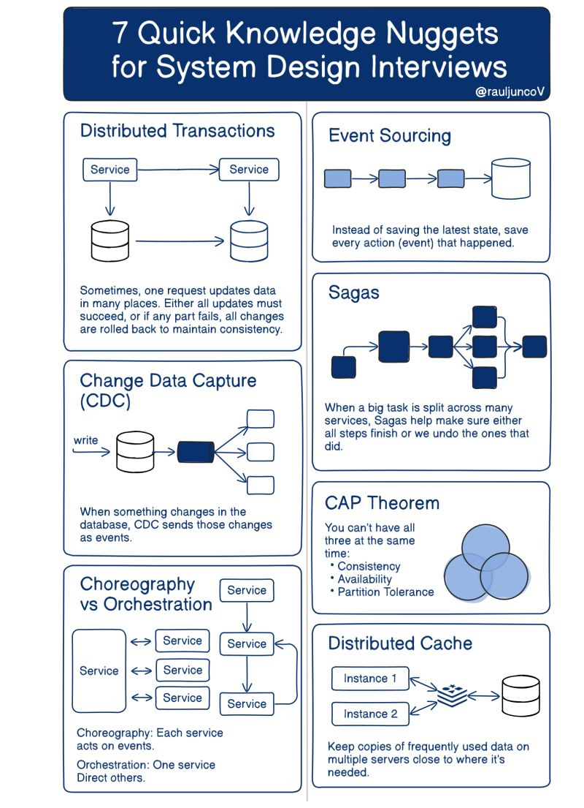

## Core Concepts

- [Introduction to System Design](intro.md)
- [Trade-offs in System Design](trade-offs.md)
- [Architecture Guide](architecture-guide.md)
- [Addressing Failures](addressing-failures.md)

## Architecture Patterns

- [Cloud Native Architecture](cloud-native.md)
- [N-tier Application Architecture](n-tier-application-architecture.md)
- [Event Driven Architecture](event-driven-architecture.md)
- [Message Oriented Architecture (MOM)](message-oriented-architecture-mom.md)
- [Microservice Architecture](microservice-architecture/readme.md)
- [Serverless Architecture](serverless-architecture.md)
- [Reactive Microservices Manifesto](reactive-microservices-manifesto.md)

## Design Patterns & Best Practices

- [Enterprise Integration Patterns](enterprise-integration-patterns.md)
- [API Gateway](api-gateway.md)
- [Rate Limiting](rate-limiting.md)
- [Retries](retries.md)
- [Twelve-Factor App](twelve-factor-app.md)

## Case Studies & Examples

- [Case Study - Big Friendly Bank](case-study/readme.md)
- [Interview System Design Examples](interview-examples/) - Real-world system design problems (Uber, Twitter, YouTube, TinyURL, etc.)

## Additional Resources

- [Others](computer-science/system-design/others.md)
- [More Interview Questions](../interview-prep/readme.md)

## Architectural Patterns

## Top 6 Cloud Messaging Patterns

### Asynchronous Request-Reply

This pattern aims at providing determinism for long-running backend tasks. It decouples backend processing from frontend clients.

In the diagram below, the client makes a synchronous call to the API, triggering a long-running operation on the backend. The API returns an HTTP 202 (Accepted) status code, acknowledging that the request has been received for processing. Once the work is complete, the status endpoint can either return a resource that indicates completion, or redirect to another resource URL (HTTP 302).

### Publisher-Subscriber

This pattern targets decoupling senders from consumers, and avoiding blocking the sender to wait for a response.

This increases scalability and improves responsiveness of the sender, allowing for deferred or scheduled processing. It enables simpler integration between systems using different platforms, programming languages, or communication protocols, as well as between on-premises systems and applications running in the cloud.

### Claim Check

This pattern solves the transmission of large messages. It stores the whole message payload into a database and transmits only the reference to the message, which will be used later to retrieve the payload from the database.

### Priority Queue

This pattern prioritizes requests sent to services so that requests with a higher priority are received and processed more quickly than those with a lower priority.

### Saga Pattern

Saga is used to manage data consistency across multiple services in distributed systems, especially in microservices architectures where each service manages its own database.

The saga pattern addresses the challenge of maintaining data consistency without relying on distributed transactions, which are difficult to scale and can negatively impact system performance.

[The Saga Pattern - ByteByteGo Newsletter](https://blog.bytebytego.com/p/the-saga-pattern)

### Competing Consumers

This pattern enables multiple concurrent consumers to process messages received on the same messaging channel. There is no need to configure complex coordination between the consumers. However, this pattern cannot guarantee message ordering.

## API vs SDK

