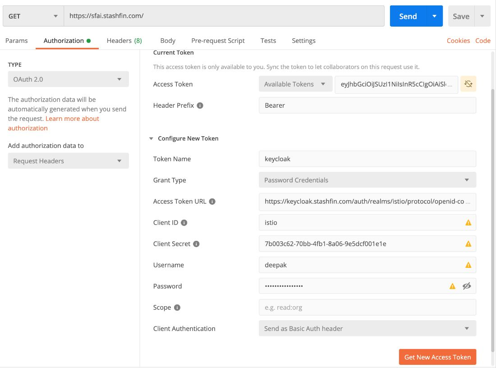

# Postman

## Fake API REST Mocks Server Tests

- https://reqres.in
- http://example.com
- [**https://jsonplaceholder.typicode.com/**](https://jsonplaceholder.typicode.com/)
- https://mockae.com/
- https://fakerapi.it/api/v1/persons?_quantity=1
- https://github.com/n0shake/Public-APIs
- [http://slowwly.robertomurray.co.uk/delay/3000/url/http://www.google.co.uk](http://slowwly.robertomurray.co.uk/delay/3000/url/http:/www.google.co.uk)
- [**https://fakestoreapi.com/**](https://fakestoreapi.com/)
- https://anapioficeandfire.com
- Twitter Developer APIs
- [Pushshift | Guide](https://api.pushshift.io/guide)
    - [GitHub - mattpodolak/pmaw: A multithread Pushshift.io API Wrapper for reddit.com comment and submission searches.](https://github.com/mattpodolak/pmaw)
- News API
    - [News API - Search News and Blog Articles on the Web](https://newsapi.org/)
    - [Free News API](https://www.newscatcherapi.com/free-news-api)
    - [News API | Best API to find the latest and archive news](https://www.newsapi.ai/)
    - [World News API](https://worldnewsapi.com/)
    - [NewsData - News API to Search & Collect Worldwide News](https://newsdata.io/)

## Local Infra Mock

[LocalStack - A fully functional local cloud stack](https://localstack.cloud/)

[GitHub - localstack/localstack: 💻 A fully functional local AWS cloud stack. Develop and test your cloud & Serverless apps offline](https://github.com/localstack/localstack)

**Fake S3 storage on Local - For local testing**

```bash
git clone https://github.com/johannesboyne/gofakes3.git
cd gofakes3
go build
go run cmd/gofakes3/main.go -backend memory -autobucket
Use this endpoint for testing : http://localhost:9000
```

## Public APIs

https://github.com/public-apis/public-apis

https://anapioficeandfire.com

[**https://httpdump.io/**](https://httpdump.io/)

https://github.com/typicode/json-server

https://my-json-server.typicode.com

## API Marketplace

https://www.programmableweb.com

https://rapidapi.com

## Variables

Variables allow you to store and reuse values in your requests and scripts. By storing a value in a variable, you can reference it throughout your collections, environments, and requests - and if you need to update the value, you only have to change it in one place.

Postman supports the following variable scopes:

- Global
- Collection
- Environment
- Data
- Local

https://learning.postman.com/docs/postman/variables-and-environments/variables

## Environments

Environments allow you to run requests and collections against different data sets. For example, you could have an environment for development, one for testing, and another for production. You can use variables to pass data between requests and tests, for example if you are chaining requests using a collection.

## Dynamic Variables

Postman provides dynamic variables that you can use in your requests.

Examples of dynamic variables are as follows:

- `{{$guid}}`: Av4 style guid
- `{{$timestamp}}`: The current timestamp (Unix timestamp in seconds)
- `{{$randomInt}}`: A random integer between 0 and 1000
- `{{$randomPhoneNumber}}`

https://learning.postman.com/docs/postman/variables-and-environments/variables/#using-dynamic-variables

## Runner

The Collection Runner allows you to run sets of requests in a specified sequence. The Collection Runner will log your request test results, and your scripts can pass data between requests as well as altering the request workflow.

You can run collections against specific environments, and can pass data files into a run. Collection runs allow you to automate your API testing, and you can schedule runs using monitors. You can integrate collection runs to your CI/CD pipeline using Postman's CLI Newman.

https://learning.postman.com/docs/running-collections/intro-to-collection-runs

## Mock Server

## Monitoring

https://medium.com/aubergine-solutions/api-testing-using-postman-323670c89f6d

https://www.guru99.com/api-testing.html

## Newman

Newman is a command line Collection Runner for Postman. It allows you to run and test a Postman Collection directly from the command line. It is built with extensibility in mind so that you can easily integrate it with your continuous integration servers and build systems.

https://learning.postman.com/docs/running-collections/using-newman-cli/command-line-integration-with-newman

## Pre-Request Script

```js
var key='xxx';
var finalstring = '';
for (var i =0; i < pm.request.body.urlencoded.toJSON().length; i++) {
    if (pm.request.body.urlencoded.toJSON()[i].key != 'checksum') {
        if (i != 0) {
            finalstring += '&';
        }
        finalstring += pm.request.body.urlencoded.toJSON()[i].key + '=' + pm.request.body.urlencoded.toJSON()[i].value;
    }
}
finalstring = finalstring;
var signature = CryptoJS.HmacSHA256(finalstring, key).toString();
postman.setEnvironmentVariable("checksum", signature);
pm.variables.get("variable_key");
```

## Shortcuts

- CMD + / - show all shortcuts
- CMD + ? - show all shortcuts
- CMD +  - show/hide sidebar

## OAuth 2.0 - Authentication and Authorization with Identity Server (KeyCloak)



## Alternatives

Hoppscotch - https://github.com/hoppscotch/hoppscotch

https://hypertest.co

Thunder Client - https://www.thunderclient.com


## Others

https://www.freecodecamp.org/news/what-is-an-api-and-how-to-test-it

[Testing your APIs with Postman and Newman](https://www.youtube.com/watch?v=fTtA9qXkNAk)

[Testing Your APIs: Postman, Newman & Beyond, Mike Amundsen | Postman Galaxy 2021](https://www.youtube.com/watch?v=DGxvFSy-i78&ab_channel=Postman)

[Master API Testing with Postman](https://www.freecodecamp.org/news/master-api-testing-with-postman/)
