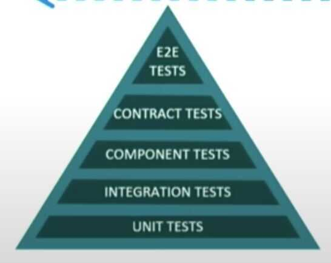
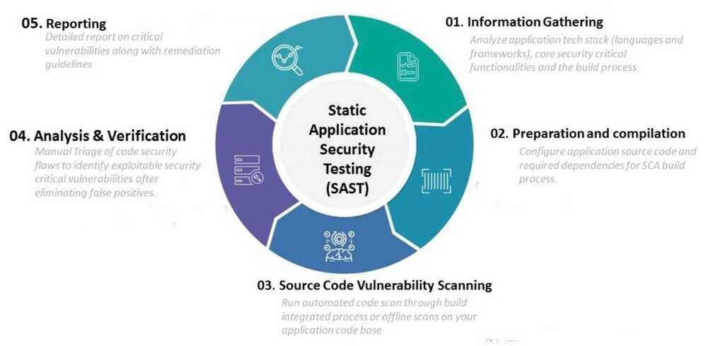
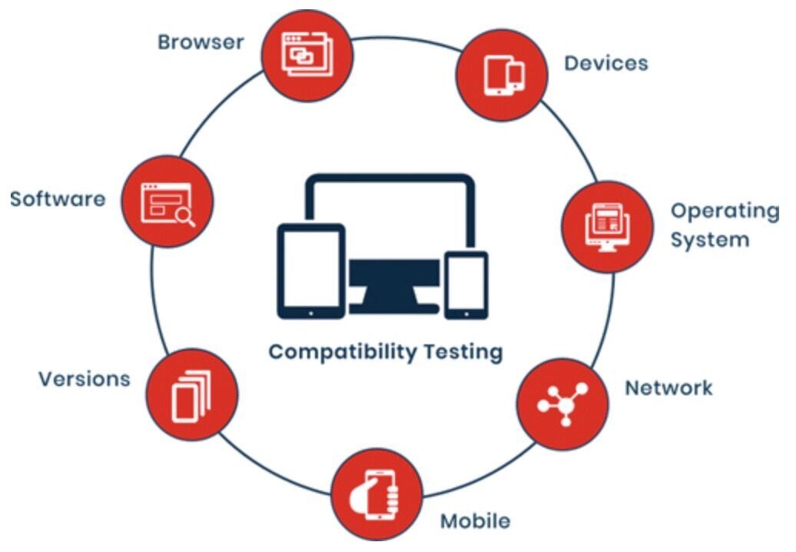

# Test Pyramid

## Typical Test Pyramid

### Unit tests

Tests that cover the smallest piece of testable functionality in your software.
Unit testing the process of testing an atomic function by passing known values into that function and asserting an expected result is produced by the function.

### Integration tests

Integration tests, in this context, deal with testing integrations and interface defects for components within your service; these are more granular tests.

### Component tests

When you look at component tests for microservices, a component is a service that exposes certain functionalities. Therefore, component tests for microservice can just be acceptance tests for services and your tests need to validate whether the service provides the functionality that it promises to.

### Contract tests

Another category of tests that's very applicable to microservices are contract tests. They test the contracts of APIs of your services to see if the API is valid or if the microservice honors its API. A cool variation of these contract tests is consumer driven contract tests. These tests are written by consumer services of an API; the consumers codify this contract in a suite of tests that get run on every change to the API. That way, if a change to the API breaks a contract that one of its consumers expect, this breaking change is caught early in the CD pipeline.

### End-to-end tests

The test suites we discussed earlier are applicable to testing individual services. End-to-end tests, however, are more coarse-grained and try to test the functionality of an overall system. Depending on the deployment architecture you're going for, if you are deploying all of your services in a pre-production environment in an aggregate manner, you can run end-to-end tests there. Since end-to-end tests are usually brittle and take a long time to run, you'll usually want to restrict the number of these tests to as few as possible. If you have microservices that are completely independent and don't get deployed to a pre-production test environment, then consider approaches that test in production.

### Integration tests vs end-to-end tests

#### Integration testing

Focuses on the interaction between software components. It ensures that components can communicate and exchange data. Integration testing is used to test a single process from third-party software.

#### End-to-end testing

Tests the entire software system, from the user interface to the database. It simulates user behavior and usage patterns. End-to-end testing can be used for a single process or for multiple applications.

## Fault Injection

Introducing errors in a controlled manner in production to see if your system can hold up to those errors.

## Multivariate testing

Another interesting variation of this kind of testing is multivariate testing, where you're not really testing your new service against defects, instead, you are A/B testing new release features behind A/B testing toggles. The purpose of this type of testing is to see how well these features are received. You can decide roll it out to your entire set of users or make fixes where necessary.

https://martinfowler.com/articles/practical-test-pyramid.html

## Automated vs. Manual Testing

Exploratory testing (Manual Testing) is a form of testing that is done without a plan. In an exploratory test, you're just exploring the application

This is where **automated testing** comes in. Automated testing is the execution of your test plan (the parts of your application you want to test, the order in which you want to test them, and the expected responses) by a script instead of a human. Python already comes with a set of tools and libraries to help you create automated tests for your application. We'll explore those tools and libraries in this tutorial.

## Unit vs Integration Tests

Think of how you might test the lights on a car. You would turn on the lights (known as thetest step) and go outside the car or ask a friend to check that the lights are on (known as thetest assertion). Testing multiple components is known asintegration testing.

A major challenge with integration testing is when an integration test doesn't give the right result. It's very hard to diagnose the issue without being able to isolate which part of the system is failing. If the lights didn't turn on, then maybe the bulbs are broken. Is the battery dead? What about the alternator? Is the car's computer failing?
If you have a fancy modern car, it will tell you when your light bulbs have gone. It does this using a form of **unit test.**

A unit test is a smaller test, one that checks that a single component operates in the right way. A unit test helps you to isolate what is broken in your application and fix it faster.

You have just seen two types of tests:

1. An integration test checks that components in your application operate with each other.
2. A unit test checks a small component in your application.

## Application Security Testing

Security testing helps you identify application vulnerabilities that could be exploited by hackers and correct them before you release your product or app.

There are a [range of application security tests](https://securityboulevard.com/2020/03/application-security-testing-trends-in-2020/) available to you with different tests that are applicable at different parts of the software development life cycle.

## Static Application Security Testing (SAST) (White-box)

SAST analyzes the code itself rather than the final application, and you can run it without actually executing the code.

## Dynamic Application Security Testing (DAST) (Black-box)

Runs on fully compiled application. You design and run these tests without any knowledge of the underlying structures or code.

Because DAST applies the hacker's perspective, it is known as black box, or outside in, testing.

DAST operates by attacking the running code and seeking to exploit potential vulnerabilities. DAST may employ such common attack techniques as cross-site scripting and SQL injection.

### What are SAST and DAST?

SAST and DAST are application security testing methodologies used to find security vulnerabilities that can make an application susceptible to attack. Static application security testing (SAST) is a white box method of testing. It examines the code to find software flaws and weaknesses such as SQL injection and others listed in the [OWASP Top 10](https://www.synopsys.com/glossary/what-is-owasp-top-10.html). Dynamic application security testing (DAST) is a black box testing method that examines an application as it’s running to find vulnerabilities that an attacker could exploit.

|S.NO.|Static Application Security Testing|Dynamic Application Security Testing|
|---|---|---|
|1.|SAST is a type of [White Box security testing.](https://www.geeksforgeeks.org/software-engineering-white-box-testing/)|DAST is type of [Black Box security testing](https://www.geeksforgeeks.org/software-engineering-black-box-testing/).|
|2.|In SAST, application is tested from inside out.|In DAST, application is tested from outside in.|
|3.|This type testing is a developers approach of testing.|This type testing is a hackers approach of testing.|
|4.|No deployed application is required for Static Application Security Testing.|A running application is required for Dynamic Application Security Testing.|
|5.|Finding vulnerabilities, identifying and fixing bugs is easier in SAST.|Finding vulnerabilities towards end of SDLC.|
|6.|Fixing vulnerabilities is possible with little cost assistance.|It finds vulnerabilities towards end of SDLC, hence it is expensive to do so.|
|7.|SAST can not discover issues related run time and environment.|DAST can discover issues related to run time and environment.|
|8.|Typically it supports all types of software like web applications, web services, thick client.|Typically it only scans apps like web applications, web services but not other types of software.|
|9.|In this testing, developer has knowledge about design, application framework and implementation.|In this testing, tester has no knowledge about application, design, frameworks and implementation that application is built on.|
|10.|SAST testing requires source code to perform testing operation.|DAST testing does not require source code to perform testing operation.|
|11.|As it scans static code and performs its testing operation that is why it is called Static Application Security Testing (SAST).|As it scans dynamic code and performs its testing operation that is why it is called Dynamic Application Security Testing (DAST).|
|12.|This testing is performed in early stages of Software Development Life Cycle (SDLC).|This testing is performed at end of Software Development Life Cycle (SDLC).|
|13.|In SAST, there is costly long duration dependent on experience of tester.|In DAST, tester is unable to perform comprehensive application analysis since this is carried our externally.|
|14.|In SAST, tester is able to perform comprehensive application analysis.|DAST can be done faster as compared to other types of testing due to restricted scope.|

[SAST vs. DAST: What’s the Difference? | Synopsys Blog](https://www.synopsys.com/blogs/software-security/sast-vs-dast-difference.html)

[Difference between SAST and DAST - GeeksforGeeks](https://www.geeksforgeeks.org/difference-between-sast-and-dast/)

## Interactive Application Security Testing

Interactive application security testing (IAST) is a newer testing methodology that [combines the effectiveness of SAST and DAST](https://developer.ibm.com/recipes/tutorials/what-is-interactive-application-security-testing/) while overcoming the issues associated with these more established tests.

IAST conducts continuous real-time scanning of an application for errors and vulnerabilities using an inserted monitoring agent. Even though IAST operates in a running application, it is considered an early SDLC test process.

## Compatibility Testing

Compatibility testing assesses how your application operates and how secure it is on various devices and environments, including mobile devices and on different operating systems.

Compatibility testing can also assess whether a current version of software is compatible with other software versions. Version testing can be backward or forward facing.

Examples of compatibility testing include:

- browser testing (checking to make sure your website or mobile site is fully compatible with different browsers)
- mobile testing (making sure your application is compatible with iOS and Android)
- or software testing (if you're going to be creating multiple software applications that need to be interacting with one another, you'll need to conduct compatibility testing to ensure that they actually do so).

https://www.freecodecamp.org/news/types-of-software-testing

## Testing

1. Unit Testing: Ensures individual code components work correctly in isolation.
2. Integration Testing: Verifies that different system parts function seamlessly together.
3. System Testing: Assesses the entire system's compliance with user requirements and performance
4. Load Testing: Tests a system's ability to handle high workloads and identifies performance issues.
5. Error Testing: Evaluates how the software handles invalid inputs and error conditions. 6. Test Automation: Automates test case execution for efficiency, repeatability, and error reduction.

