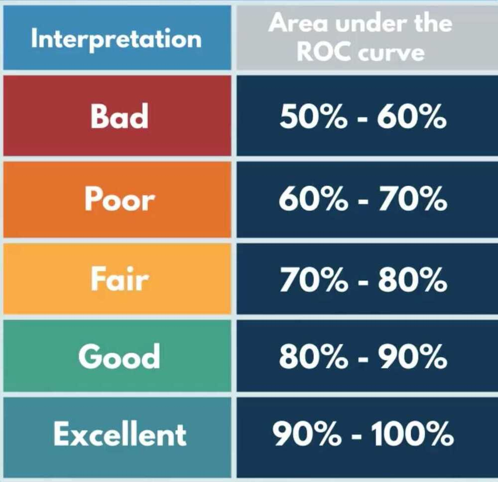
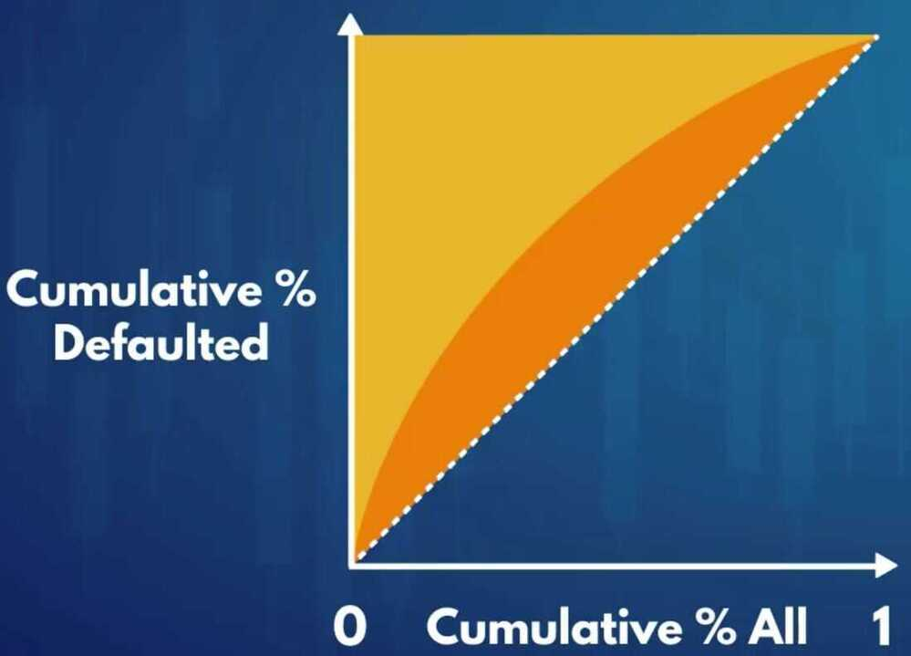
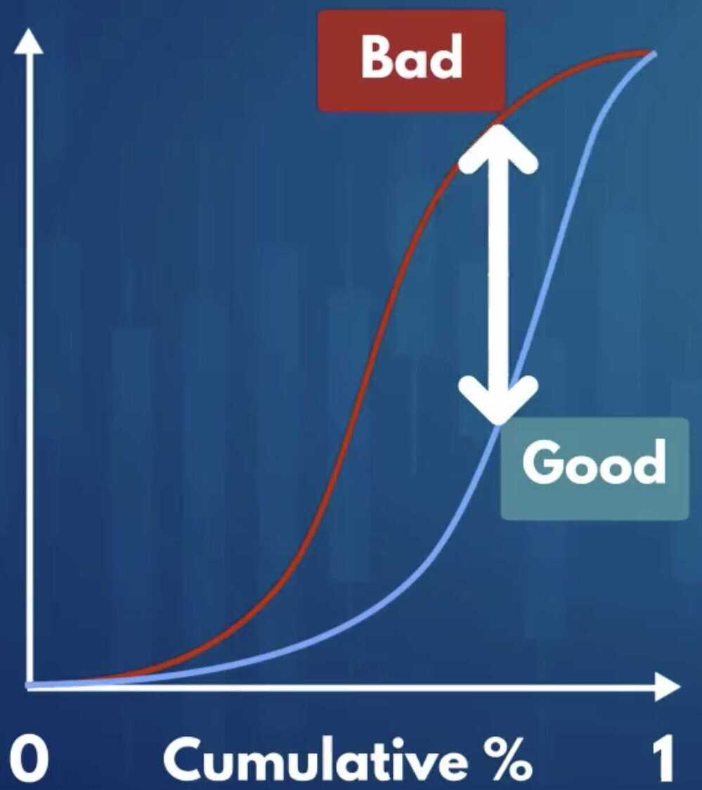
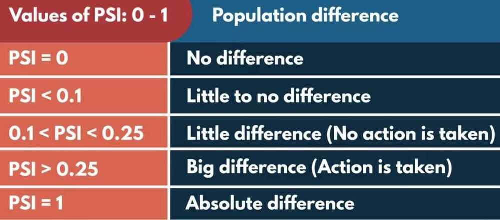
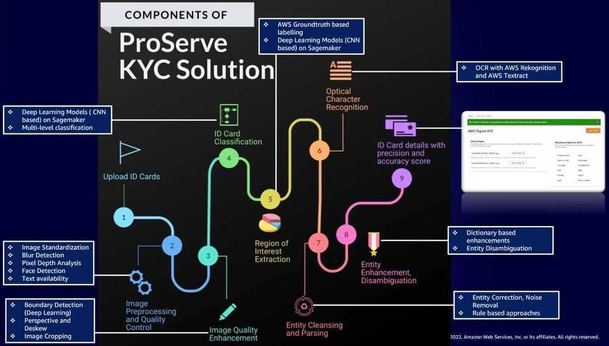

# Intro

- Credit Risk - The likelihood that a borrower would not repay their loan to the lender (not receive owed principal and interest)
- Collection costs
- Default - A borrower not being able to repay their debt
- Lenders must assess credit risk associated with each borrower
- Collaterals
- Increase the interest rate (Risk-based pricing)
- Expected loss (EL) - PG, LGD, EAD
    - UL - Unexpected losses - result of adverse economic circumstances
    - SL - Exceptional (stress) losses - result of severe economic downturn
    - There is certain amount of credit risk associated with every borrower
    - Estimating expected loss (expected credit loss) - The amount a lender might lose by lending to a borrower
- Probability of Default (PD) - The borrowers inability to repay their debt in full or on time
- Loss Given Default (LGD) - The proportion of the total exposure that cannot be recovered by the lender once a default has occurred
- Exposure At Default (EAD) - The total value that a lender is exposed to when a borrower defaults
- `EL = PD * LGD * EAD`
- Loan to value
- Capital Adequacy, Regulations and Basel II Accord
    - Capital requirement/capital adequacy/regulatory capital
    - Risk weighted assets
    - The greater the risk a bank is exposed to, the greater the amount of capital it needs to hold
    - Basel II accord
        - Minimum capital requirements
            - Credit risk
                - Standardized Approach (SA) (% of the total exposure)
                - Internal Ratings Based (IRB) Approaches
                    - Foundation Internal Ratings Based (F-IRB) Approach
                    - Advanced Internal Ratings Based (A-IRB) Approach
            - Operational risk
            - Market risk
        - Supervisory review
        - Market discipline
- Different facility types (asset classes) and credit risk modeling approaches
    - PD - Binomial Logistic regression
    - LGD/EAD - Beta regression

- Risk based pricing
- Dependent variables / Independent variables
- Discrete / Continuous
- Fine classing / Coarse classing

## Dummy Variables

Dummy variables are binary indicators, 1 if an observation belongs to a category, 0 if it does not.

In [statistics](https://en.wikipedia.org/wiki/Statistics) and [econometrics](https://en.wikipedia.org/wiki/Econometrics), particularly in [regression analysis](https://en.wikipedia.org/wiki/Regression_analysis), adummy variable is one that takes only the value 0 or 1 to indicate the absence or presence of some categorical effect that may be expected to shift the outcome.They can be thought of as numeric stand-ins for [qualitative](https://en.wikipedia.org/wiki/Qualitative_data) facts in a [regression model](https://en.wikipedia.org/wiki/Regression_analysis), sorting data into [mutually exclusive](https://en.wikipedia.org/wiki/Mutually_exclusive_events) categories (such as smoker and non-smoker).

A dummy [independent variable](https://en.wikipedia.org/wiki/Dependent_and_independent_variables)(also called a dummy explanatory variable) which for some observation has a value of 0 will cause that variable's [coefficient](https://en.wikipedia.org/wiki/Coefficient) to have no role in influencing the [dependent variable](https://en.wikipedia.org/wiki/Dependent_and_independent_variables), while when the dummy takes on a value 1 its coefficient acts to alter the [intercept](https://en.wikipedia.org/wiki/Regression_intercept). For example, suppose membership in a group is one of the qualitative variables relevant to a regression. If group membership is arbitrarily assigned the value of 1, then all others would get the value 0. Then the intercept would be the constant term for non-members but would be the constant term plus the coefficient of the membership dummy in the case of group members.

Dummy variables are used frequently in [time series analysis](https://en.wikipedia.org/wiki/Time_series_analysis) with regime switching, seasonal analysis and qualitative data applications.

https://en.wikipedia.org/wiki/Dummy_variable_(statistics)

We need only k-1 dummy variables to represent the information about k categories.

## Weight of Evidence

To what extent an independent variable would predict a dependent variable

https://www.listendata.com/2015/03/weight-of-evidence-woe-and-information.html

## Fine classing

## Coarse classing

The process of constructing new categories based on the initial ones

## Information value

How much information the original independent variable brings with respect to explaining the dependent variable

- Widely used in credit risk modeling

## Overfitting

Our statistical power has focused on a particular dataset so much that it has missed the point

## Underfitting

When the model fails to capture the underlying logic of the data

## Logistic Regression

- The logistic regression module of scikit learn does not have a built-in way to calculate p-values
- One of the cleanest ways is to alter .fit() from the LogisticRegression class
- Each original independent variable is represented by several dummy variables
- If the coefficients for all of these dummy variables are statistically significant, we should retain all of them, and if the coefficients for none of the dummy variables are statistically significant, we should remove all of them
- If one or few dummy variables representing one original independent variable are statistically significant, it would be best to retain all dummy variables that represent that original independent variable.
- Conventionally, if a p-value is lower than 0.05, we conclude that the coefficient of a variable is statistically significant

logistic_regression_model.predit

logistic_regression_model.predit_proba

AUC curve , RoC curve

## Gini - Measure of the inequality between rich and poor individuals in an economy

- Measure inequality between good (non-defaulted) and bad (defaulted) borrowers
- the cumulative proportion of defaulted borrowers as a function of the cumulative proportion of all borrowers.
- AUROC = (Gini -- 1) / 2.

## Kolmogorov-Smirnov

Shows to what extent the model seperate the actual good borrowers from the actual bad borrowers

## K-S coefficient

- The maximum difference between the cumulative distribution functions of good and bad borrowers
- The greater the difference the better the model (the further apart they are better the results, since model is able to clearly tell the difference between good and bad borrowers)
- Perfect model -> Maximum distance -> K-S = 1
- Predicting by chance -> Almost no distance -> K-S = 0

### ScoreCard

The scores in the scorecard we created are: transformations of the regression coefficients of the PD model.

If we want to calculate the credit score of an applicant, it is enough to: sum the scores of each variable's categories from the scorecard where the applicant belongs.

The way we created our scorecard, to obtain an estimate for the PD of an applicant, using score, we have to: raise an exponent to the power of total score and divide that by the same thing plus one.

### Cut off rate

1. Predetermines the total number of borrowers that will be approved and rejected
2. Impacts the quality of loans

Setting a higher cut-off score for approval of credit applications will result in decrease in disbursals

- Questions

    1. In the lecture we saw the approval and rejection rate if we set the cut-off at no less than 95% probability of being 'good'? What would be the closest equivalent cut-off in terms of credit score?
    2. What would be the approval and rejection rate if we set the cut-off at no less than 94% probability of being 'good'? What would be the closest equivalent cut-off in terms of credit score?
    3. What would be the approval and rejection rate if we set the cut-off at credit score 670 points? What is the corresponding probability of being 'good'?
    4. Where should we set the cut-off if we want our approval rate to be just below 14%? What credit score and what probability of being 'good'?

- Model maintenance
    - 6 months/1 year
    - Number of applicants as a benchmark
    - Example - Redevelop our model after 50,000/100,000 new data points

## PSI (Population Stability Index) / CSI (Characteristics Stability Index)

PSI and CSI, both of these metrics focus on the shift in thePOPULATION DISTRIBUTION.

These two monitoring metrics are based on the premise that a predictive model works best when the development and the validation/OOT (out of time) samples are not significantly different in terms of economic conditions, underlying assumptions, the campaign-style, and focus, etc.

For example: if we built a predictive model to predict attrition rate for credit card customers in normal economic circumstances and then if we proceed onto testing it against a sample from recession-hit times, the model might not be able to predict accurately as the population distribution in different income segments might have changed significantly which might drive the actual attrition rate really high but the model might not be able to capture it, thus, predicting erroneous results. But, as we understand this now and if we proceed onto checking the population distribution shifts between the DEV time and the current time, we can get a fair idea if the model results are reliable or not. And this is accomplished by PSI and CSI as important monitoring metrics.

**PSI tends to overall population shift whereas CSI tends to focus on the individual model variables used**

PSI can help us determine the overall population distribution comparison with the DEV sample and if it shows a significant shift then CSI can help us further narrow it down to a few variables which are causing the fluctuations.

A change in the population distribution can be due to:

- Changes in the economic environment like Recession, Covid-19 etc
- Changes in the sources of data
- Internal policy changes which impact the population distribution directly or indirectly
- Issues in data integration which might result in erroneous data
- Issues while programming/coding, such as model implementation or missing some crucial steps of the scoring code

https://www.listendata.com/2015/05/population-stability-index.html

https://towardsdatascience.com/psi-and-csi-top-2-model-monitoring-metrics-924a2540bed8

### Population Stability Index (PSI)

Shows whether two populations differ with respect to a feature using discrete categories of the feature.

**PSI can be used to assess whether the population of new loan applicants differ from the population of applicants on which the PD (Population Distribution) model was built**

Population Stability Index (PSI) compares the distribution of a scoring variable (predicted probability) in scoring data set to a training data set that was used to develop the model. The idea is to check "How the current scoring is compared to the predicted probability from training data set".

Is the new data too different from the original one?

Actual data vs Excepted data

#### INTERPRETATION RULES

1. PSI < 0.1: No change. You can continue using the existing model.
2. PSI >=0.1:but less than 0.2 - Slight change is required.
3. PSI >=0.2:Significant change is required. Ideally, we should not use this model anymore. It should be recalibrated/redeveloped.

### CSI

It answers which variable is causing a shift in population distribution. It compares the distribution of anindependent variablein the scoring data set to a development data set. It detects shifts in the distributions of input variables that are submitted for scoring over time.

It helps to determine which changing variable is responsible majorly for causing the model score shift.

When a model deteriorates in performance, checking distributional changes in the model variables can help with identifying possible causes. This is a step that is taken generally after one has checked PSI and it's not in the green zone (< 0.1 in general) to check that the overall population distribution can be attributed majorly to which variables.

At least one variable that has changed significantly or if several variables have moved to some extent, it might be time to recalibrate or to rebuild the model.

## LGD (Loss Given Default)

the percentage of the exposure that was lost after the borrower defaulted

## EAD (Exposure At Default)

the amount of the exposure at the moment the borrower defaulted

When building LGD and EAD models, it is a good practice to build models with data from borrowers that have had enough time to repay part of the remaining debt.

For the LGD and EAD models we need only data for: accounts that have been written-off and a sufficient amount of time has passed so there can be some recoveries.

Recovery rate = recoveries / funded amount

Recovery rate is the dependent variable for the LGD model

Recovery rate is the proportion of the total exposure that can be recovered by the lender once a default has occurred.

CCF - Credit Conversion Factor

CCF is the proportion of total exposure at the moment of default.

`EAD = total funded amount * credit conversion factor`

What regression model is used most often to model recovery rate and credit conversion factors, and what modeling approaches do we apply instead? - The one used most often is beta regression, we apply logistic regression and linear regression.

Interpretation of the coefficients: A coefficient shows the change in the dependent variable that is going to occur as a result of a unit change in the respective independent variable

residuals - difference between the actual and predicted values

How exactly do we combine the two models to calculate our final estimation for recovery rate?

For all accounts with predicted recovery rate 0 by the logistic regression model, we set estimated recovery rate to 0, and for all the rest, we use the recovery rate estimated by the linear regression model.

## EAD Model

The dependent variable for the EAD model is the credit conversion factor (CCF): the proportion from the original amount of the loan that is still outstanding at the moment when the borrower defaulted.

When performing regression analysis, a categorical variable with K categories is represented by only K-1 dummies.

So we have to leave one dummy variable for each categorical predictor to serve as a reference category, just like we did for LGD model

Positive coefficients = Increase in the CCF (higher risk)

Negative coefficients = Decrease in the CCF (lower risk)

Based on the coefficients of the model, how much greater is the credit conversion factor expected to be for someone whose purpose of the loan is 'educational' than for someone whose purpose of the loan is 'credit card' (which is the reference category for the variable)? - about 0.09

Based on the coefficients of the model, what would be the difference between the credit conversion factor for someone whose purpose of the loan 'educational' and for someone whose purpose of the loan 'moving'? - about 0.05 greater

We used the same criterion for model performance for the model from this lecture and the stage 2 model from the LGD models. If we had to compare the two models, based on this criterion, which one explains better the data it needs to explain? - The EAD model from this lecture

## Expected Loss

`EL = PD * LGD * EAD`

Assuming all accounts are one portfolio, to calculate the total expected loss amount for this portfolio, we must: Apply the PD, EAD, and LGD models on each account, multiply the three outputs for each account, and sum across all accounts.

## Fraud Types

|  |  |
|---|---|
| **Document Fraud (First party)** | This classifies under first party fraud where applicant commits fraud in his own name. Applicant provides an altered / fabricated document which does not match the real document at the time of verification with data source. Usually done for National IDs like PAN, Voter ID, etc. However it can be applicable to other types of documents as well which are submitted at the time of loan application. |
| **Identity Fraud (Third party)** | This classifies under third party fraud where applicant commits it in the name of another person (victim). Applicant deliberately uses personal information of another person without any approval, for the sole purpose of performing a fraud. Hence, the 3rd party here becomes the victim. |
| **Synthetic Identity Fraud** | It is created by using a combination of real and fabricated credentials leading to a fictitious entity that is not associated with an actual / real person. E.g., using A's PAN with B's address or a fictitious address altogether. |
| **Financial Fraud** | Cases where financial crimes have been committed like Cheque fraud, manipulation of bank statements, false financial statements, chargeback fraud, etc. |
| **Employment Related Fraud** | Instances of misrepresentation of information / documents on account of education, personal background or professional history. E.g., salary slip / employment letter tampering. This can be clubbed under Document Fraud if not a significant category. |
| **Non-starter fraud** | Cases where post loan disbursal the borrower does not repay starting from the first installment itself. It then clearly shows his fraudulent intention. Also known as never payment fraud, lenders can start tagging borrowers under this category once DPD has reached 90 days - as a uniform definition to classify. This is different from delinquency since it is linked to non-payment from inception of the loan and not midway in the lifecycle. |
| **First-party application fraud** | A consumer refuses to repay legitimate debts and/or falsely claims to be a victim of identity fraud to evade the obligation |
| **Account takeover** | Someone other than the owner uses an account without permission |

[Fortechester](https://fortechester.com/)

## SAAS

### LexisNexis Risk Solutions

Combines physical and digital identities - including device, behavioral biometric and credit seeking insights - to bring the world of identity together for a 360-degree view of your customers. Our suite of fraud management and identity solutions let you apply the appropriate level of security-related friction for every interaction across the customer lifecycle to prevent fraud before it happens.

### AWS KYC

## Links

[Under the hood: The secret science of predicting credit risk](https://finbox.in/blog/under-the-hood-the-secret-science-of-predicting-credit-risk-/)
