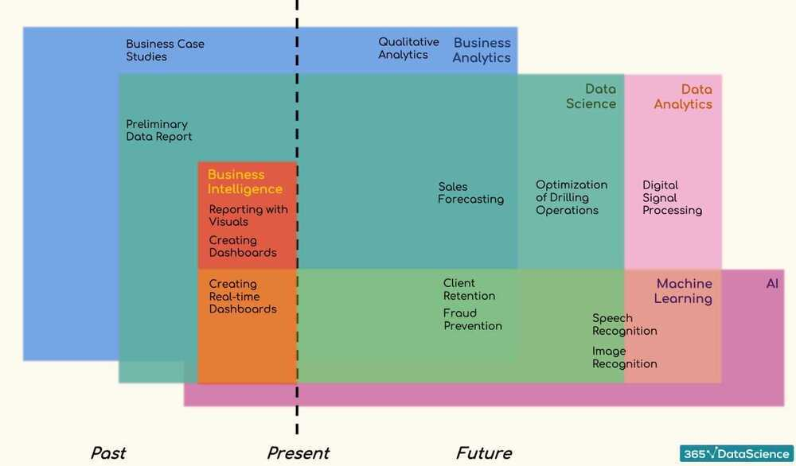
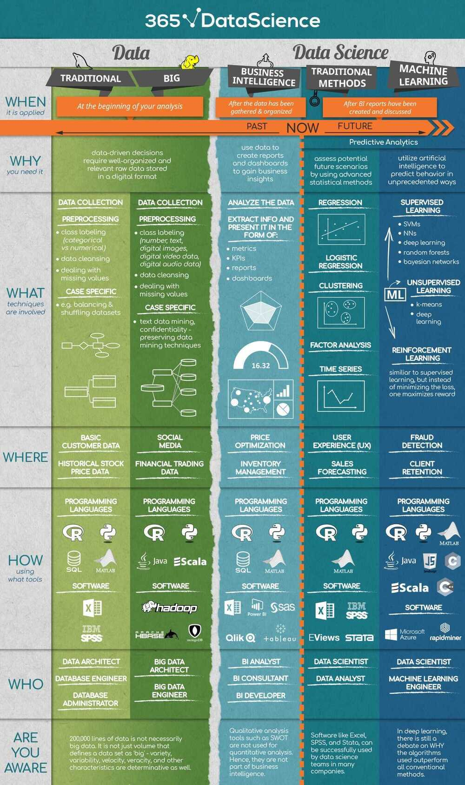

# Course - Intro to Data and Data Science

https://365datascience.com

https://365datascience.teachable.com/courses/enrolled/361452

https://github.com/deepaksood619/Data-Modeling

- Data
- Data team
- Big data team
- Business intelligence
- Data science
- Business analytics
- Data analytics
- Predictive analytics
- Data scientist

Analysis - Past

- Qualitative analysis
    - How? Why? for past
- Quantitative analysis
    - data + how sales decreased last summer

Analytics - Future (Explore potential future events)

- Is the application of logical and computational reasoning to the component parts obtained in an analysis
- Qualitative analytics
    - intuition + analysis
- Quantitative analytics
    - formulas + algorithms

Business Intelligence is the preliminary step of predictive analytics

- analyse past data and extract useful insights
- create appropriate models

Factor analysis

Dimensionality reduction
