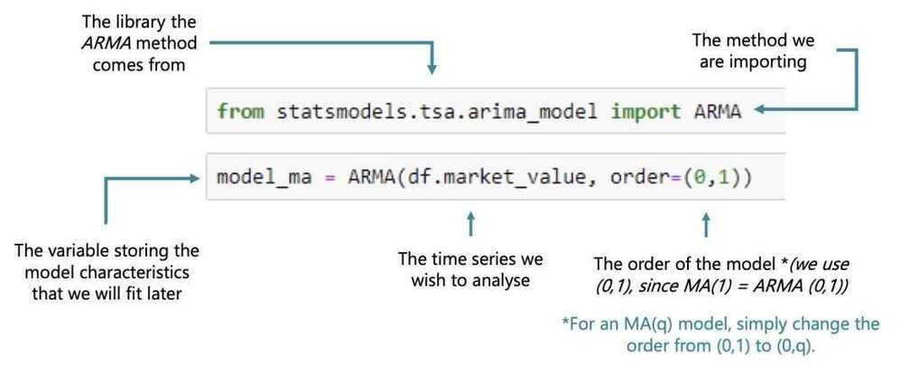
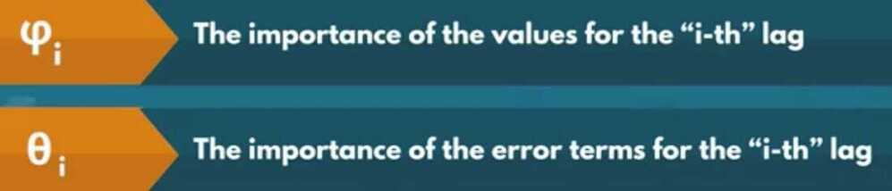
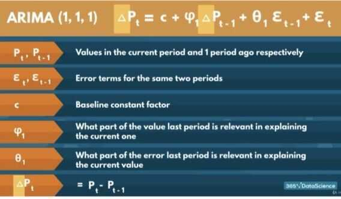
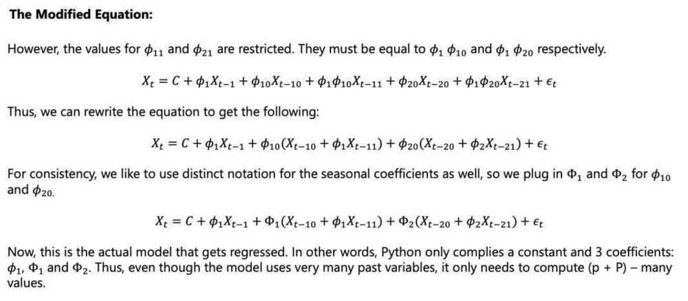
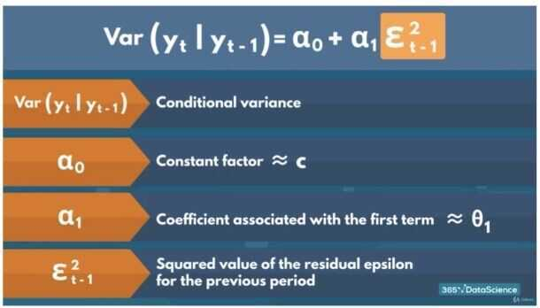
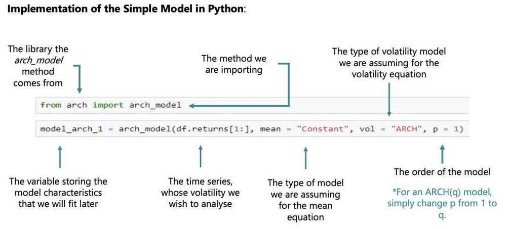
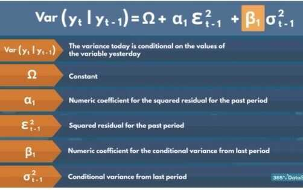
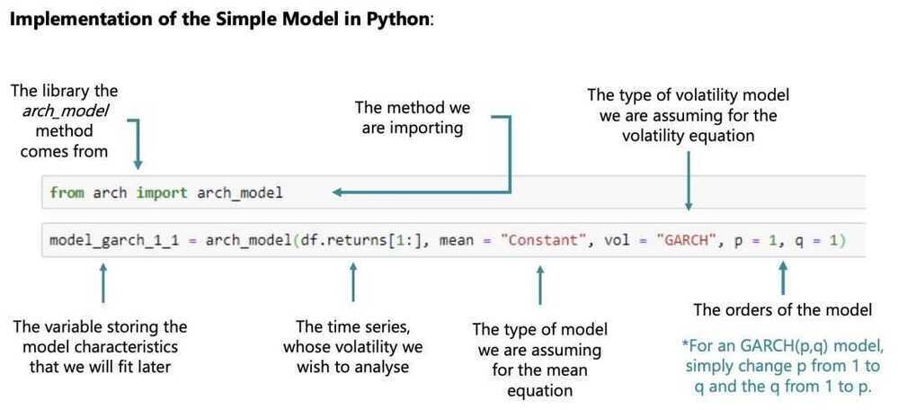

# Time-Series Modeling

## Endogenous variable - The variable we are estimating

Patterns in the past persist in the future

## Modeling

1. Significant coefficients


2. Parsimonious (as simple as possible)

    1. Generally: Simpler model > Complex model

    2. Significantly better predictions: Simpler model < Complex model

    3. Log-Likelihood Ratio test (LLR)

Can be used for Different degrees of freedom

Same total number of lags -> No LLR

Information criteria

- AIC
- BIC
- HQIC

If we're comparing two model and we want to choose the better fit, then we choose the one with **Higher Log-Likelihood and lower Information Criteria**

3. Residuals
    - Overtraining

## AutoRegressive (AR) Model

The name of the model comes from autoregression. This means that the model uses values of the same variable (auto) to estimate the current one (regression)

We rely on autoregressive models when there is clear autocorrelation within the data. The term (autocorrelation) suggest that the variable is correlated with itself. More precisely, values from consecutive periods are related

Since time series assumes that patterns found in the past translate to the future, if autocorrelation is present in the data, we need to us some form of AR model to capture this relationship if we wish to make good estimates


- A linear model, where current period values are a sum of past outcomes multiplied by a numeric factor
- phi is between -1 and +1

## Implementation of simple mode in Python


Which do we use to select the correct ARmodel and why: the ACFor the PACF? The PACF because it shows the individual effect each past value has on the current one.

```python
from statsmodels.tsa.arima_model import ARMA
model_ar = ARMA(df.market_value, order=(1,0))
results_ar = model_ar.fit()
results_ar.summary()
```

Why does the model estimate two values, when we're only using an AR(1)model?

The model always assumes there might be a constant in the model (even if it turns out to be non-significant).

## LLR Test

```python
def LLR_test(mod_1, mod_2, DF=1):
    L1 = mod_1.fit().llf
    L2 = mod_2.fit().llf
    LR = (2*(L2-L1))
    p = chi2.sf(LR, DF).round(3)
    return p
```

Why do we choose the AR(7)over the AR(8)?

- The AR(8) fails the LLR test
- The AR(8) does not provide significantly higher Log-likelihood
- The AR(8) has higher information criteria

AR models:

- Stationary (works)
- Non-stationary (not works)

## Returns

```python
# percentage change
df['returns'] = df.market_value.pct_change(1).mul(100)
df = df.iloc[1:]
```

#### Why did we conduct the Augmented Dickey-Fuller test on returns?

To make sure the newly generated data set is stationary

The more easily yesterday's price is affected by higher lags, the more inaccurate its coefficient becomes.

Why do we infer from this summary table, that the AR(1)model for returns holds no predictive power? - Neither of the coefficients is significant.

#### How do we interpret the result of the LLR test when comparing the AR(2)and the AR(3)?

The more complicated model provides significantly greater Log-likelihood to justify its greater complexity.

#### What conclusion do we draw when it comes to AR models and Normalizing?

Normalizing has no effect on the order of the optimal AR model regardless of the data set.

#### Why do we plot the ACF and/or PACFof the residuals from a fitted model?

If the residuals are non-random (not White Noise), then there is a pattern that needs to be accounted for.

## Moving Average (MA) Model

The name of the model comes from the moving averages of fixed period intervals as we cruise move through the data set

This implies that there are other factors apart from the previous values of the variable that need to be accounted for. Therefore, if we know how far off our predictions were last time, then we have a better chance of estimating the prices better this time

This is why, these models incorporate past residuals (also known as error terms) to help us improve our estimations. These make sure our model handles unexpected shocks well, which is why it's also known as a smoothing model


## Implementation of the Simple Model in Python



#### How is the MAmodel different from the ARmodel?

The MA model includes past residuals, while the ARmodel includes past values.

#### What is the most important change we make when switching from an AR(1) model to an MA(1) model?

We change the order parameter from (1,0) to (0,1)

#### What was the relationship between the ACFplot and the coefficients of the models as we gradually increased the order?

When fitting an MA(Q) model, if the Q-th lag isn't significant in the ACFplot, the Q-th coefficient of the summary table won't be significant as well.

#### Why do we like to estimate the standard deviation of the residuals?

So we can know how far off we can hypothetically be with our predictions.

#### What did we learn about normalized and non-normalized returns in this lecture?

They have the same optimal model

- MA models do not perform well for non-stationary data
- MA models are great in modeling Random Walks because they take into account our mistakes
- MA aspect does that, Also use the previous period's values
- Some combination of AR and MA models would be best

#### When the ACF coefficients don't seem to die off, we should use what kind of model?

A model with an AR component (e.g. AR(N))

## ARMA (Autoregressive Moving-Average model)

The name comes from combining the names of the two simpler models it incorporates - the AR and the MA

The ARMA incorporates both past values (like the AR) and past errors (like the MA). By including both, we should improve our estimates. This is because we are enabling our AR model to calibrate (by including how far off our predictions were) and also giving a benchmark (different from the constant) to the MA model, which should severely decrease the variation in the residuals

Picking the correct order for such a model could be tricky, since including or removing AR and MA orders can have widly different effects on the accuracy




#### Positive 0.7649 ar.L1.returns means that

- A coefficient above 75% suggest that there is a positive tendency between past and present values
- Returns move in trends of consecutive positive or negative values
- Periods of persistent increase or decreases when translated to prices

#### Negative -08141 ma.L1.returns

- Slightly harder to interpret
- We should be moving away from the past period (t-1) values
- These past error terms ensure we don't get a "Fool in the shower" type of error
- We want to prevent our targets from moving, before we've accounted for them

#### Why do we compare the ARMA(1,1)with the AR(1) and MA(1) models using the LLR test?

Because they are nested in the ARMA(1,1)

#### Why do we choose the ARMA(3,2) to be the best fit?

- All coefficients are significant
- Highest log-likelihood among the models with all coefficients significant.
- Lowest information criteria out of the models with all coefficients significant.

#### Why do we change our preferred model upon seeing the ACF/PACF of the model residuals?

We saw a pattern in the residuals time series, which meant there is a factor we hadn't accounted for in our regression.

- Even though we can model prices using ARMA models, they perform much worse compared to their ability to estimate stationary data

#### What did we learn when we compared the log-likelihoods of the preferred ARMA model for prices and the preferred ARMA model for returns?

The ARMA model yields a much higher log-likelihood for returns compared to prices.

## ARIMA (AutoRegressive Integrated Moving Average)

- Integrated - Accounts for the number of non-seasonal differences we need to examine to establish stationarity
- A single factor of integration is enough to reach stationarity

The ARIMA is just an integrated version of the ARMA model. What that means is, we simply integrate the data (however many times is needed) to get a stationary set

Then, we fit a normal ARMA model like we already learned to

An ARIMA model with 0 degrees of integration is simply an ARMA model, and so any ARIMA (p,0,1) model is equivalent to an ARMA (p,q)

The order of integration (d) tells us exactly how many times we need to compute the non-seasonal differences between the values to reach stationarity and including more is discouraged (due to data attrition and interpretability of the results)




p - AutoRegressive (AR) components

d - Integrated components

The number of times we need to integrate the time-series to ensure stationarity

q - Moving Average (MA) components

No Integration

- ARIMA (p, 0, q) = ARMA(p, q)
- ARIMA (0, 0, q) = MA(q)
- ARIMA (p, 0, 0) = AR(p)


- For any integration we lose a single observation

#### What are an ARIMA (1,0,2) and an ARIMA (0,0,1) equivalent to?

An ARMA(1,2) and an MA(1)

#### Why does an ARIMA(p,d,q) model estimate the same number of coefficients as an ARMA(p,q) model if the former has a higher total order?

Because the order of integration does not affect the number of coefficients we are trying to find.


ARIMA (5,1,1)

#### Why do we expect the best non-integrated ARMA models for returns would hold the best fits for the AR and MA orders of the ARIMA(p,d,q) for prices?

Because price returns are a form of weighted integration

#### Why do we NOT need higher levels of integration in this case?

The purpose of integration is to reach stationarity and we reach it after 1 integration.

#### Why don't we use integrated models on stationary data?

- The purpose of integration is to ensure stationarity.
- This will only needlessly complicate the model.
- The more we integrate without having to, the more difficult it is to comprehend the values and extract an insight.

## The ARMAX Model (Autogressive Integrated Moving Average eXogenous Model)

The ARMAX is an extension of the ARIMA model, which incorporates other exogenous variables

These variables can be pretty much anything that can have an affect on the values we are trying to estimate. The only requirement is that we have data available for every time period we are interested in. Thus we often rely on other time series as the exogenous components in the regression.

These models are great, when a big part of the change period to period cannot be explained by past values and past errors alone, so including other relevant values might be of great help (like the prices for an index of a market of a neighbouring country)


The ARIMA is just an integrated version of the ARMA model. What that means is, we simply integrate the data (however many times is needed) to get a stationary set

Then, we fit a normal ARMA model like we already learned to

An ARIMA model with 0 degrees of integration is simply an ARMA model, and so any ARIMA (p,0,q) model is equivalent to an ARMA (p,q)

The order of integration (d) tells us exactly how many times we need to compute the non-seasonal differences between the values to reach stationarity and including more is discouraged (due to data attrition and interpretability of the results)

X can be any variable we're interested in

- A time-varying measurement
- A categorical variable
- A boolean value (for some festive period)
- A combinations of several different external factors
- Any other variable(s) that can affect prices as long as we have the data available for every period
- X is called "eXogeneous" variables

#### Why are MAXmodels useful?

Because they allow us to incorporate outside factors into the model.

## SARIMAX Model (Seasonal ARIMAX)

The SARIMAX is the seasonal equivalent of the ARIMAX model. Of course, there exist seasonal versions of the other models as well (SARMA, SARIMA, SARMAX, etc)

Seasonal models help capture patterns which aren't ever-present but appear periodically. For example, the amount of flights leaving an international hub like JFK Airport in NYC are far larger in December compared to October

That is mainly due to the festive period for many countries in December. Thus, October is far less busy. Therefore, we need a way to account for this expected influx of demand in December and we can do so by checking the values in December of the previous year

The SARIMAX is among the most-complicated models we can have, since it can incorporate seasonality, integration and/or exogenous variables

However it doesn't have to

By setting the values of certain orders to 0, or by not providing certain information, the model can be simplified

For instance, by not including exogenous variables and having no integration, the model automatically becomes equivalent to a SARMA

The equation on the left is exactly that - a SARIMAX equivalent of a SARMA


Capital letters - Seasonal components

Lower letters - Non seasonal components

s = Length of cycle

- The number of periods needed to pass before the tendency reappears
- s = 1 -> No seasonality




## Volatility

- The magnitude of residuals
- Low variance -> Stability -> Low risk -> Safety
- Squaring values
    - Solves the positive-negative conundrum
    - Penalizes high differences between true values and predictions more
    - Increases the importance of big unpredicted shocks
- Numeric measurements of uncertainity
- For Volatility of returns we have models like **EGARCH**
- What does volatility clustering mean?

It means that low volatility is followed by low volatility and high is followed by high.

## The ARCH Model (Autoregressive Conditional Heteroskedasticity Model)

https://github.com/bashtage/arch

Heteroskedasticity - different dispersion

Conditional - A value that depends on others

Unlike the previous models, the ARCH measures volatility of the results, rather than the results themselves. Thus, the purpose of it is entirely different and focused on predicting turbulence increase or decrease in the values

As you can see on the left side of the equation, the endogenous variable is the variance, rather than the time series variable

Thus, this is only the variance equation of the model. The simplest ARCH model assumes a 0 or constant mean, so this is the only equation we are interested in





Why does the ARCHmodel require 2 equations?

Because we need some sort of benchmark to measure the volatility away from it.


How many coefficients does the simple ARCHmodel estimate? - 3

## GARCH (Generalized Autoregressive Conditional Heteroskedasticity Model)

As the name suggests, the GARCH is just the generalized version of the ARCH model

This generalization is expressed in including past variances as well as past squared residuals to estimate current (and subsequent) variances

The generalization comes from the fact that including a single past variance would (in theory) contain in itself the explanatory power of all other previous squared error terms

It serves as a sort of ARMA equivalent to the ARCH, where we're including both past values and past errors (albeit squared)





How is the GARCHdifferent from the ARCH?

Includes past conditional variances

Why is the GARCHsimilar to the ARMA?

Includes past values and past errors.(conditional variances and squared residuals)

How does the GARCH (1,1) compare to complex ARCH counterparts?

It outperforms even the ARCH(12) model we examined earlier.

- No higher order GARCH models outperform the GARCH(1,1) when it comes to variance of market returns
- All the effects of the conditional variacne 2 days ago will be contained in the conditional variance of yesterday
- No need to include more than 1 GARCH component

How do GARCH(p,q) models for the volatility of returns perform compared to the GARHC(1,1)?

Yield non-significant coefficients

## Auto ARIMA

- auto_arima by default only compares the model based on their AIC


http://alkaline-ml.com/pmdarima/modules/generated/pmdarima.arima.auto_arima.html#pmdarima.arima.auto_arima

## Forecasting

### Pitfalls/Peculiarities

- Picking an incorrect type of model (integrated vs non-integrated) depending on the data
- We can always forecast stationary returns and then create the prices based on these returns

AR

- It only depends on the past values and the constant coefficient
- The more past lags we include, wthe more time it takes to flatten out
- The monotonous nature of the predictions makes it unreasonable

MA

- We can't make long run predictions if we're relying on error terms
- We can't autogenerate future residuals since we don't have actual values anymore
- true value - estimate = residual
- Manually create white noise residual values for the entire time period we're forecasting
- We can recursively create a time series of predictions

ARMA

- Just a combination of the AR and MA models
- Prone to experiening both types of errors (for the AR and MA)
- By creating the artificial residuals, we get rid of both issues

MAX models (ARMAX and SARIMAX)

- If the exogenous variables are other time series as well, we'll run into some trouble

## Forecasting Volatility

### Multivariate Regression

- Regressions stacked on top of one another
- These are called vector model -> Every component contains a value for each of the time series
- VAR - Vector Autoregressive Model
- VARMA
- Vector SARIMAX

Business case - A look into the Automobile Industry
