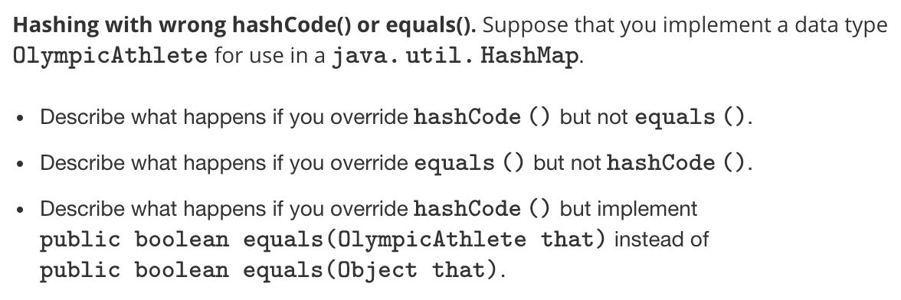

# Coursera - Algorithms Part - 1

https://www.coursera.org/learn/algorithms-part1

Final Grade - 97.8%

https://github.com/deepaksood619/Coursera-Algorithms-Part-1

## Syllabus

## Week - 1

## Union - Find

1. Dynamic Connectivity
2. Quick Find
3. Quick Union
4. Quick-Union Improvement

    Weighted Quick Union
    Weighted Quick Union with Path Compression

5. Quick-Find Applications

## Assignment

Percolation

## Analysis of Algorithms

1. Scientific Method of Analysis

   - Observe
   - Hypothesis
   - Predict
   - Verify
   - Validate

2. Empirical Analysis

Run the program for various input sizes and measure running time

3. Mathematical Models
4. Order-of-Growth Classifications
5. Theory of Algorithms

   - Best Case
   - Average Case
   - Worst Case

1. Memory

## Week - 2

## Stacks and Queues

1. Stacks
2. Resizing Arrays
3. Queues
4. Generics
5. Iterators
6. Stack and Queue Applications

## Assignment

Dequeues and Randomized Queues

## Elementary Sort

1. Introduction
2. Selection Sort
3. Insertion Sort
4. Shell Sort
5. Shuffling

   - Shuffle Sort
   - Knuth Shuffle

1. Convex Hull

## Week - 3

## Mergesort

1. Mergesort
2. Bottom-up Mergesort
3. Sorting Complexity
4. Comparators
5. Stability

## Assignment

Collinear Points

## Quicksort

1. Quicksort
2. Selection (Quick Select)
3. Duplicate keys (3-way partition quick sort)
4. System sorts

## Week - 4

## Priority Queues

1. APIs and Elementary Implementation
2. Binary Heaps
3. Heapsort
4. Event-Driven Simulations

## Assignment

8-Puzzle

## Elementary Symbol Tables

1. Symbol Table API
2. Elementary Implementations
   - Sorted array (Binary Search)
   - Unordered List (Sequential Search)
3. Ordered Operations
4. Binary Search Trees
5. Ordered Operations in BSTs
6. Deletion in BSTs

## Week - 5

## Balanced Search Trees

1. 2-3 Search Trees
2. Red-Black BSTs
3. B-Trees

## Geometric Application of BSTs

1. 1d Range Search
2. Line Segment Intersection
3. Kd-Trees
4. Interval Search Trees
5. Rectangle Intersection

## Assignment

Kd-Trees

## Week - 6

## Hash Tables

1. Hash Tables
   - Uniform Hashing Assumption
2. Separate Chaining
3. Linear Probing
4. Hash Table Context

## Symbol Table Applications

1. Sets
2. Dictionary Clients
3. Indexing Clients
4. Sparse Vectors

## Interview Questions

## 1.1. Union Find

1. **Social network connectivity.** Given a social network containingnmembers and a log file containingmtimestamps at which times pairs of members formed friendships, design an algorithm to determine the earliest time at which all members are connected (i.e., every member is a friend of a friend of a friend ... of a friend). Assume that the log file is sorted by timestamp and that friendship is an equivalence relation. The running time of your algorithm should bemlognor better and use extra space proportional ton.

2. **Union-find with specific canonical element.** Add a method𝚏𝚒𝚗𝚍()to the union-find data type so that𝚏𝚒𝚗𝚍(𝚒)returns the largest element in the connected component containingi. The operations,𝚞𝚗𝚒𝚘𝚗(),𝚌𝚘𝚗𝚗𝚎𝚌𝚝𝚎𝚍(), and𝚏𝚒𝚗𝚍()should all take logarithmic time or better. For example, if one of the connected components is `{1,2,6,9}`, then the𝚏𝚒𝚗𝚍()method should return9for each of the four elements in the connected components.

3. **Successor with delete.** Given a set of n integers `S={0,1,...,n−1}` and a sequence of requests of the following form:

`Remove x from S`

`Find the successor of x: the smallest y in S such that y≥x .`

design a data type so that all operations (except construction) take logarithmic time or better in the worst case.

## 1.2. Analysis of Algorithms

1. **3-SUM in quadratic time.** Design an algorithm for the 3-SUM problem that takes time proportional ton2in the worst case. You may assume that you can sort thenintegers in time proportional ton2or better.

2. **Search in a bitonic array.** An array isbitonicif it is comprised of an increasing sequence of integers followed immediately by a decreasing sequence of integers. Write a program that, given a bitonic array ofndistinct integer values, determines whether a given integer is in the array.
    - Standard version: Use∼3lgncompares in the worst case.
        - Signing bonus: Use∼2lgncompares in the worst case (and prove that no algorithm can guarantee to perform fewer than∼2lgncompares in the worst case).

3. **Egg drop.** Suppose that you have ann-story building (with floors 1 throughn) and plenty of eggs. An egg breaks if it is dropped from floorTor higher and does not break otherwise. Your goal is to devise a strategy to determine the value ofTgiven the following limitations on the number of eggs and tosses:
    - Version 0: 1 egg,≤Ttosses.
    - Version 1:∼1lgneggs and∼1lgntosses.
    - Version 2:∼lgTeggs and∼2lgTtosses.
    - Version 3:2eggs and∼2√ntosses.
    - Version 4:2eggs and≤c√T tosses for some fixed constantc.

## 2.1 Stack and Queues

1. **Queue with two stacks.** Implement a queue with two stacks so that each queue operations takes a constant amortized number of stack operations.
2. **Stack with max.** Create a data structure that efficiently supports the stack operations (push and pop) and also a return-the-maximum operation. Assume the elements are reals numbers so that you can compare them.
3. **Java generics.** Explain why Java prohibits generic array creation.

## 2.2 Elementary Sorts

1. **Intersection of two sets.** Given two arrays𝚊[]and𝚋[], each containingndistinct 2D points in the plane, design a subquadratic algorithm to count the number of points that are contained both in array𝚊[]and array𝚋[].

2. **Permutation.** Given two integer arrays of sizen, design a subquadratic algorithm to determine whether one is a permutation of the other. That is, do they contain exactly the same entries but, possibly, in a different order.3. **Dutch national flag (3-way partitioning).**Given an array ofnbuckets, each containing a red, white, or blue pebble, sort them by color. The allowed operations are:
    - **swap(i,j): swap the pebble in bucketiwith the pebble in bucketj.**
    - **color(i): determine the color of the pebble in bucketi.**

The performance requirements are as follows:

- At most n calls tocolor().
- At most n calls toswap().
- Constant extra space.

## 3.1 Merge Sort

1. **Merging with smaller auxiliary array.** Suppose that the subarray𝚊[𝟶]to𝚊[𝚗−𝟷]is sorted and the subarray𝚊[𝚗]to𝚊[𝟸∗𝚗−𝟷]is sorted. How can you merge the two subarrays so that𝚊[𝟶]to𝚊[𝟸∗𝚗−𝟷]is sorted using an auxiliary array of lengthn(instead of2n)?

2. **Counting inversions**
    An *inversion* in an arraya[] is a pair of entries a[i] and a[j] such that i < j but a[i] > a[j]. Given an array, design a linearithmic algorithm to count the number of inversions.

    https://www.geeksforgeeks.org/counting-inversions

3. **Shuffling a linked list.**
    Given a singly-linked list containingnitems, rearrange the items uniformly at random. Your algorithm should consume a logarithmic (or constant) amount of extra memory and run in time proportional tonlognin the worst case.

## 3.2. Quick Sort

1. **Nuts and bolts.** A disorganized carpenter has a mixed pile ofnnuts andnbolts. The goal is to find the corresponding pairs of nuts and bolts. Each nut fits exactly one bolt and each bolt fits exactly one nut. By fitting a nut and a bolt together, the carpenter can see which one is bigger (but the carpenter cannot compare two nuts or two bolts directly). Design an algorithm for the problem that usesnlogncompares (probabilistically).

Solution -

Suppose we choose a nut and partition all bolts in `{1...n}`, by comparing with this nut, into three intervals : `{1...i-1}`, `{i}`, `{i+1, n}` such that each bolt in `{1, i-1}` is smaller, bolt i matches and each bolt in `{i+1, n}` is larger than the chosen nut. This procedure is similar to the partition procedure used in quicksort and can be implemented in `O(n)`. Now, we can use the matching bolt to partition all nuts in three intervals in a similar manner so that the nut i and bolt i match. We have reduced the problem of finding matchings in the interval `{1...n}` into two smaller subproblems: finding matchings in the intervals `{1...i-1}` and `{i+1...n}`.

If at each step, we choose the nut (to partition the bolts) randomly, we will get similar performance guarantees as quicksort i.e., randomized**O(n log n)**time.

2. **Selection in two sorted arrays.** Given two sorted arraysa[]andb[], of sizesn1andn2, respectively, design an algorithm to find thekthlargest key. The order of growth of the worst case running time of your algorithm should belogn, wheren=n1+n2.
    - **Version 1: n1=n2 and k=n/2**
    - **Version 2: k=n/2**
    - **Version 3: no restrictions**

3. **Decimal dominants.** Given an array withnkeys, design an algorithm to find all values that occur more thann/10times. The expected running time of your algorithm should be linear.

## 4.1. Priority Queues

1. **Dynamic median.** Design a data type that supports insert in logarithmic time, find-the-median in constant time, and remove-the-median in logarithmic time.
2. **Randomized priority queue.** Describe how to add the methods𝚜𝚊𝚖𝚙𝚕𝚎()and𝚍𝚎𝚕𝚁𝚊𝚗𝚍𝚘𝚖()to our binary heap implementation. The two methods return a key that is chosen uniformly at random among the remaining keys, with the latter method also removing that key. The𝚜𝚊𝚖𝚙𝚕𝚎()method should take constant time; the𝚍𝚎𝚕𝚁𝚊𝚗𝚍𝚘𝚖()method should take logarithmic time. Do not worry about resizing the underlying array.
3. **Taxicab numbers.** A *taxicab* number is an integer that can be expressed as the sum of two cubes of positive integers in two different ways:a3+b3=c3+d3. For example,1729is the smallest taxicab number:93+103=13+123. Design an algorithm to find all taxicab numbers less thann.
    - **Version 1: Use time proportional to n2logn and space proportional to n2.**
    - **Version 2: Use time proportional to n2logn and space proportional to n.**

## 4.2. Elementary Symbol Table

1. **Java autoboxing and equals()**. Consider two𝚍𝚘𝚞𝚋𝚕𝚎values𝚊and𝚋and their corresponding Double values 𝚡 and 𝚢.

    - Find values such that (𝚊==𝚋) is 𝚝𝚛𝚞𝚎 but 𝚡.𝚎𝚚𝚞𝚊𝚕𝚜(𝚢) is 𝚏𝚊𝚕𝚜𝚎.
    - Find values such that (𝚊==𝚋) is 𝚏𝚊𝚕𝚜𝚎 but 𝚡.𝚎𝚚𝚞𝚊𝚕𝚜(𝚢) is 𝚝𝚛𝚞𝚎.

2. **Check if a binary tree is a BST.** Given a binary tree where each𝙽𝚘𝚍𝚎contains a key, determine whether it is a binary search tree. Use extra space proportional to the height of the tree.
3. **Inorder traversal with constant extra space**. Design an algorithm to perform an inorder traversal of a binary search tree using only a constant amount of extra space.
4. **Web tracking.** Suppose that you are trackingnweb sites andmusers and you want to support the following API:

- User visits a website.
- How many times has a given user visited a given site?

What data structure or data structures would you use?

## 5.1. Balanced Search Trees

1. **Red--black BST with no extra memory.** Describe how to save the memory for storing the color information when implementing a red--black BST.

2. **Document search.** Design an algorithm that takes a sequence of n document words and a sequence of m query words and find the shortest interval in which the m query words appear in the document in the order given. The length of an interval is the number of words in that interval.

3. **Generalized queue.** Design a generalized queue data type that supports all of the following operations in logarithmic time (or better) in the worst case.
    - Create an empty data structure.
    - Append an item to the end of the queue.
    - Remove an item from the front of the queue.
    - Return the ith item in the queue.
    - Remove the ith item from the queue.

## 6.1. Hash Tables

1. **4-SUM.** Given an array `a[]` of integers, the 4-SUM problem is to determine if there exist distinct indices i, j, k, and l such that `a[i] + a[j] = a[k] + a[l]`. Design an algorithm for the 4-SUM problem that takes time proportional ton^2(under suitable technical assumptions).
2. 

## Assignments

## 1.1. Union Find

## Percolation

- N-by-N grid of sites
- Each site is open by probability p (or blocked with probability 1-p)
- System percolates iff top and bottom are connected by open sites
- **Percolation phase transition**
- **Monte Carlo simulation**
- **Dynamic connectivity solution to estimate percolation threshold**
    - Create an object for each site and name them 0 to N^2 - 1
    - Sites are in same component if connected by open sites
    - Trick - Introduce 2 virtual sites (and connections to top and bottom)
        - Percolates iff virtual top site is connected to virtual bottom site

## 3.1 Merge Sort

## Collinear Points

Given a set of points in the plane, design an algorithm to find all line segments that contain 4 or more points.

## 4.1 Priority Queues

8-Puzzle .Your programming assignment is to implement the famous A* search algorithm to solve a combinatorial problem, and to substantially speed it up with an efficient priority queue implementation

## 5.2 Geometric Applications of BSTs

Kd-Trees. Your programming assignment is to implement kd-trees, which can form the basis for fast search/insert in geometric applications and in multidimensional databases

1. Range Search in a query rectangle
2. Nearest neighbor search (find a closest point to a query point)
