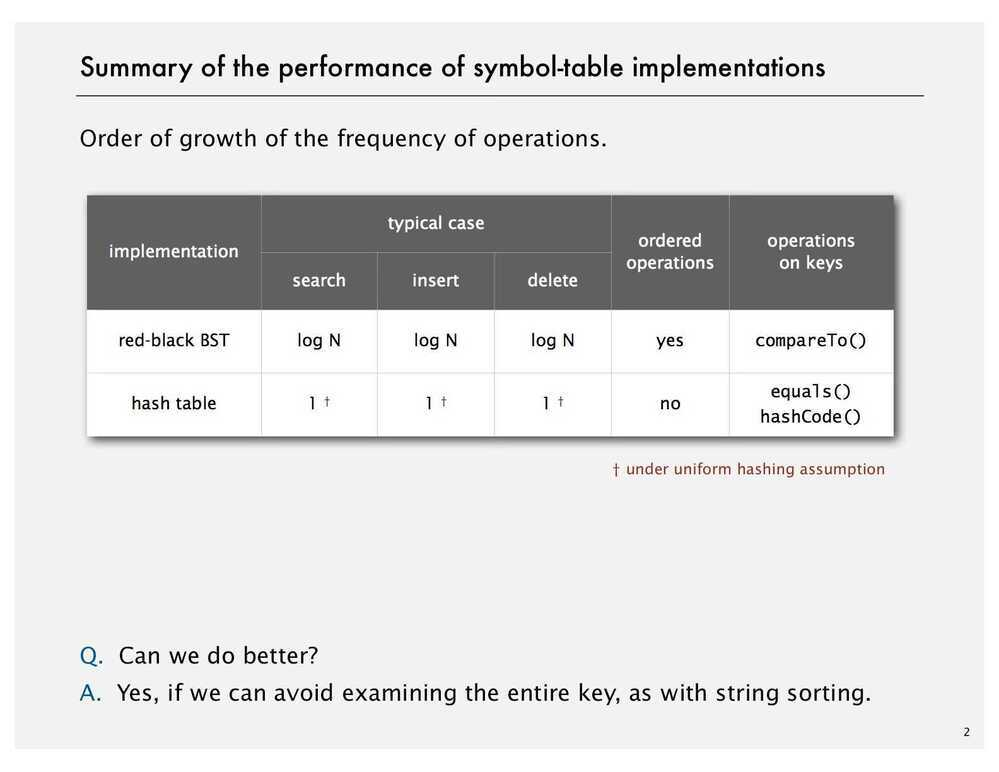
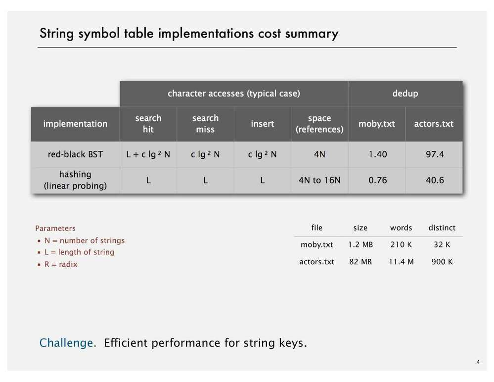
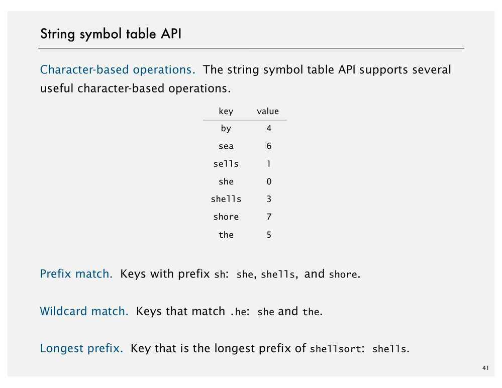
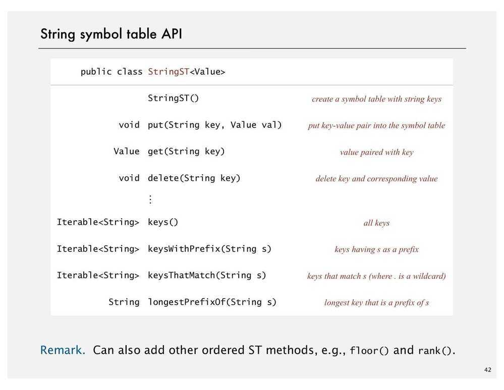
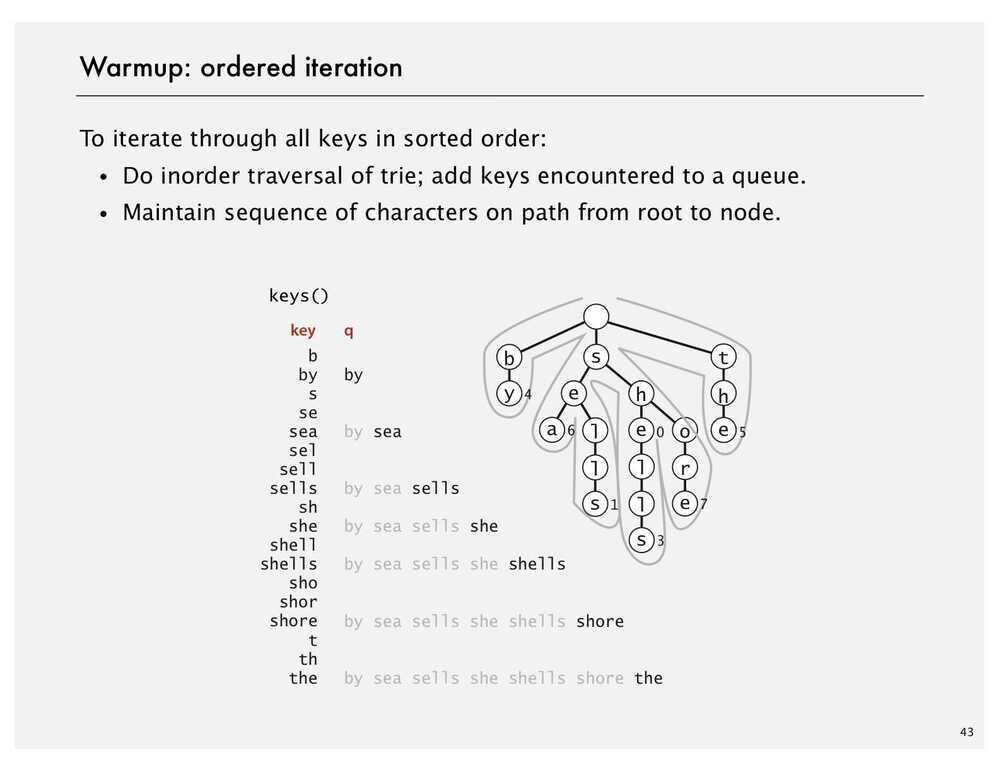
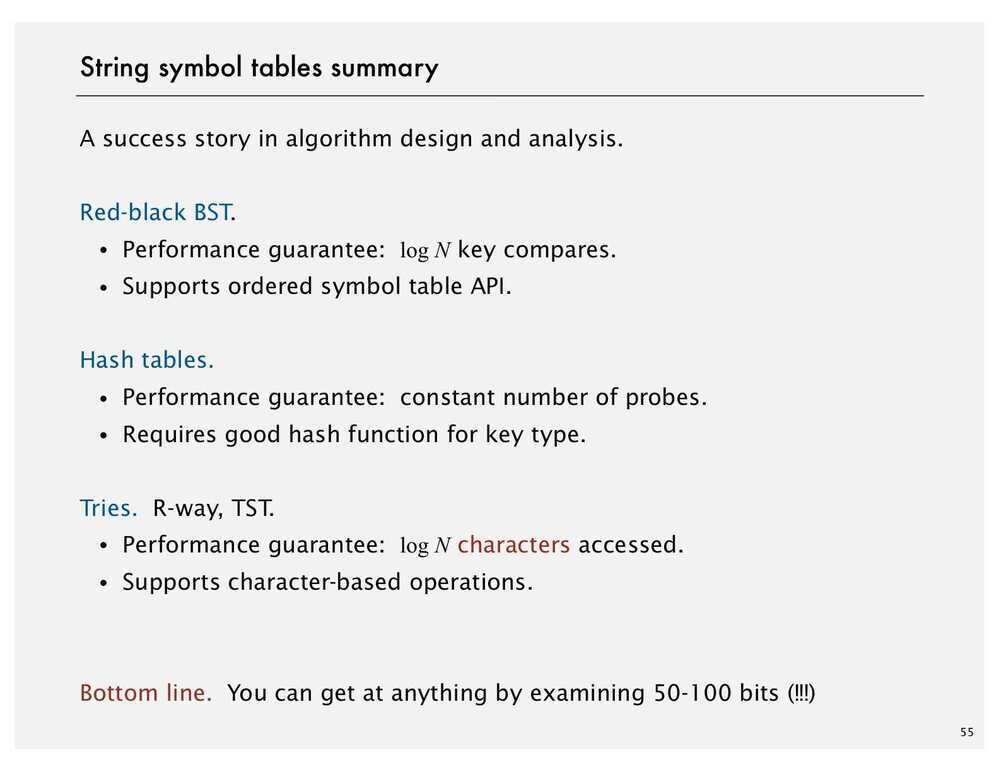

# Elementary Symbol Tables

## Symbol Tables (Associative Arrays, Maps and Dictionaries)

Key-value pair abstraction -

- Insert a value with specified key
- Given a key, search for the corresponding value

## Applications

- DNS lookup
  - Insert domain name with specified IP address
  - Give domain name, find corresponding IP address
- Reverse DNS lookup
- Dictionary
- Web search
- Compiler
- Routing table
- Genomics
- File system
- Symbol tables first used in compilers, for doing fast lookups for symbols

## Associative array abstraction

Associate one value with each key

## Keys and values

Value type: Any generic type

Key type:

- Assume keys are Comparable, use compareTo()
- Assume keys are any generic type, use equals() to test equality; use hashCode() to scramble key.
- Use immutable types for symbol table keys
  - Immutable in java - Integer, Double, String, java.io.File
  - Mutable in java - StringBuilder, java.net.URL, arrays

## Implementation

- Using Linked List (Unordered)b. Using Ordered Array

- Using Binary Search

Keep two array, one for keys and other for values (order by keys)

- Using Binary Search Tree

A BST is a binary tree in symmetric order

Each node has a key, and every node's key is:

- Larger than all keys in its left subtree
- Smaller than all keys in its right subtree
| implementation                     | worst-case cost (after N inserts) |       |       | average case (after N random inserts) |             |             | ordered iteration? | key interface       |
|-------------|--------|------|-------|--------|------|-------|---------|-----------|
|                                   | search                            | insert | delete | search hit                            | insert       | delete       |                   |                    |
| sequential search (unordered list) | N                                 | N      | N      | N/2                                   | N            | N/2          | no                 | equals()            |
| binary search (ordered array)      | lg N                              | N      | N      | lg N                                  | N/2          | N/2          | yes                | compareTo()         |
| BST                                | N                                 | N      | N      | 1.39 lg N                             | 1.39 lg N    | ?            | yes                | compareTo()         |
| 2-3 tree                           | c lg N                            | c lg N | c lg N | c lg N                                | c lg N       | c lg N       | yes                | compareTo()         |
| red-black BST                      | 2 lg N                            | 2 lg N | 2 lg N | 1.00 lg N *| 1.00 lg N* | 1.00 lg N *| yes                | compareTo()         |
| separate chaining                  | lg N*                            | lg N*| lg N* | 3.5*| 3.5*        | 3.5*| no                 | equals() hashCode() |
| linear probing                     | lg N*                            | lg N*| lg N* | 3.5*| 3.5*        | 3.5*        | no                 | equals() hashCode() |

## Symbol Table Applications -

1. **Sets**

A collection of distinct keys

Application - Exception filter

- Read in a list of words from one file
- Print out all words from standard input that are `{in, not in}` the list
  - Whitelist a set of strings or objects
  - Blacklist a set of strings or objects

Application of Exception filter -

- Spell checker
- Browser
- Parental controls
- Chess
- Spam filter
- Credit cards

2. **Dictionary Clients**

Applications -

- DNA sequence - CODON
- IP - URL
- Email- Username

3. **Indexing Clients**
    - **File Indexing**

Index a PC (or the web)

Goal: Given a list of files specified, create an index so that you can efficiently find all files containing a given query string

Solution: Key = query string; value = set of files containing that string

- Book index
- Concordance (with the search result give context of the word, like few texts before the search word and few texts after)

Goal: Preprocess a text corpus to support concordance queries: given a word, find all occurrences with their immediate contexts.
4. **Sparse Vectors**

Sparse Matrix-vector multiplication

Using symbol table, we can have space proportional to number of nonzero values. We can use hash table because the order is also not important. Keys will be the position of the nonzero element in each row and value will be the actual value.

## Character Based Operations

