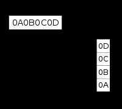

# Endianness

## endian

#### adjective

denoting or relating to a system of ordering bytes in a word, or bits in a byte, in which the most significant (or least significant) item is put first.
"big-endian vs. little-endian representation of data"

## Endianness

- **Little Endian Format - LSB is stored first**

In little endian machines, last byte of binary representation of the multibyte data-type is stored first.- **Big Endian Format - MSB is stored first**

In big endian machines, first byte of binary representation of the multibyte data-type is stored first.- **Middle Endian Format**

- **Bi-endianness**

The word*bi-endian*, when said of hardware, denotes the capability of the machine to compute or pass data in either endian format.

## Example

Suppose integer is stored as 4 bytes (For those who are using DOS based compilers such as C++ 3.0 , integer is 2 bytes) then a variable x with value 0x01234567 will be stored as following.

<https://www.geeksforgeeks.org/little-and-big-endian-mystery>
Historically, various methods of endianness have been used in computing, including exotic forms such as middle-endianness. Today, however, big-endianness is the dominant ordering in networking protocols ([IP](https://en.wikipedia.org/wiki/Internet_Protocol), [TCP](https://en.wikipedia.org/wiki/Transmission_Control_Protocol), [UDP](https://en.wikipedia.org/wiki/User_Datagram_Protocol)). Conversely, little-endianness is the dominant ordering for processor architectures ([x86](https://en.wikipedia.org/wiki/X86), most [ARM](https://en.wikipedia.org/wiki/ARM_architecture) implementations) and their associated [memory](https://en.wikipedia.org/wiki/Computer_memory).[File formats](https://en.wikipedia.org/wiki/File_format) can use either ordering; some formats use a mixture of both.
In [left-to-right scripts](https://en.wikipedia.org/wiki/Writing_system#Directionality), numbers are written with their digits in big-endian order. Similarly, programming languages use big-endian digit ordering for numeric [literals](https://en.wikipedia.org/wiki/Literal_(computer_programming)) as well as big-endian language ("left" and "right") for [bit-shift](https://en.wikipedia.org/wiki/Bitwise_operation#Logical_shift) operations, regardless of the endianness of the target architecture. This can lead to confusion when interacting with little-endian numbers.

<https://en.wikipedia.org/wiki/Endianness>
