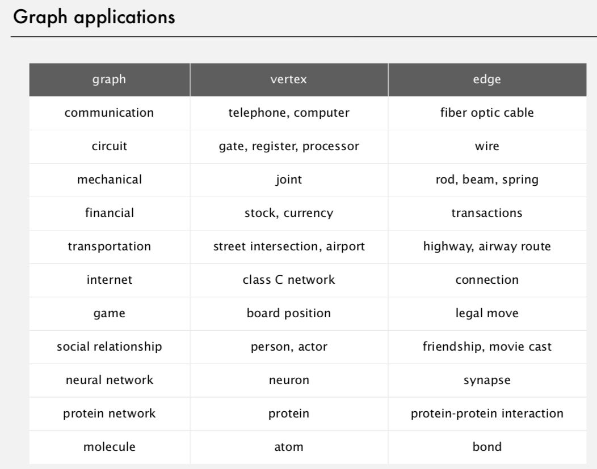
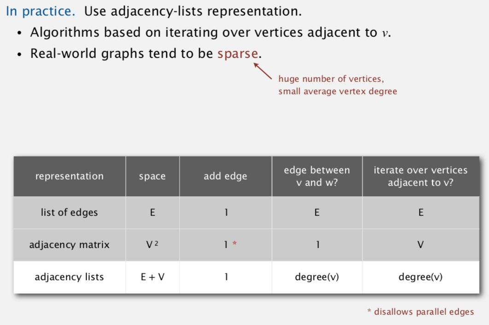

# Intro

## Representation

1. Adjacency Matrix
2. Adjacency List

## Graph types

1. Sparse graph
2. Dense graph

## Links

- [The evolution of graph learning](https://research.google/blog/the-evolution-of-graph-learning/)
