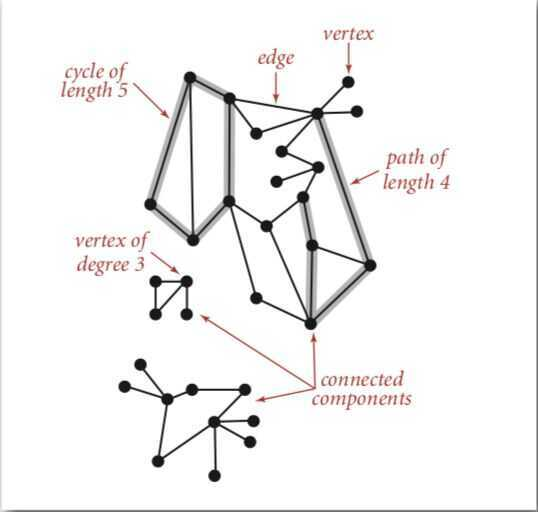
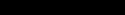

# Undirected Graph

## Undirected Graphs

Path: Sequence of vertices connected by edges

Cycle: Path whose first and last vertices are the same
Two vertices are connected if there is a path between them

## Handshaking Lemma

In every finite undirected graph number of vertices with odd degree is always even.The handshaking lemma is a consequence of the degree sum formula (also sometimes called the handshaking lemma)

## Properties

1. **In a k-ary tree where every node has either 0 or k children, following property is always true.**

L = (k - 1)*I + 1
Where L = Number of leaf nodes
I = Number of internal nodes
2. **In Binary tree, number of leaf nodes is always one more than nodes with two children.**

L = T + 1
Where L = Number of leaf nodes
T = Number of internal nodes with two children
