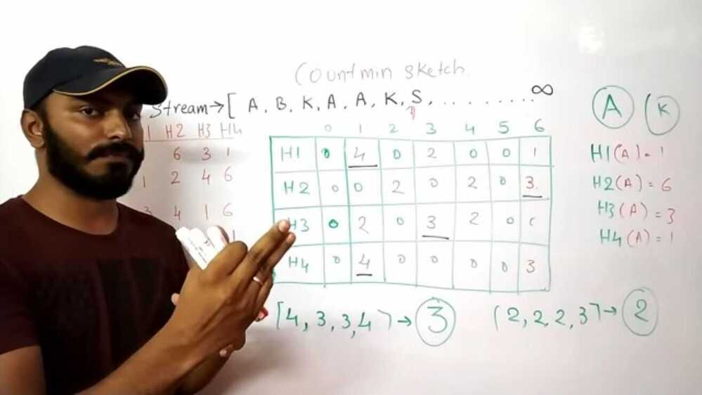

# Count-min Sketch

Space efficient probabilistic based data structure.
Count-min sketch is a probabilitstic data strucure that is used to count the frequency of events. Consider we have millions of events and we want to count top k events, then we can use count-min sketch instead of keeping the count of all the events. So for fraction of space it will give answer which will be close enough answer to the actual answer with some error rate.
Count-Min sketch is a probabilistic sub-linear space streaming algorithm. It is somewhat similar to bloom filter. The main difference is that bloom filter represents a set as a bitmap, while Count-Min sketch represents a multi-set which keeps a frequency distribution summary.

<https://youtu.be/ibxXO-b14j4>
