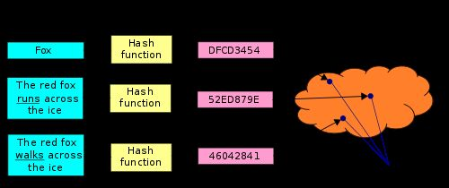

# DHT - Distributed Hash Tables

A distributed hash table(DHT) is a class of a decentralized [distributed system](https://en.wikipedia.org/wiki/Distributed_computing) that provides a lookup service similar to a [hash table](https://en.wikipedia.org/wiki/Hash_table): (key, value) pairs are stored in a DHT, and any participating [node](https://en.wikipedia.org/wiki/Node_(networking)) can efficiently retrieve the value associated with a given key.Keysare unique identifiers which map to particularvalues, which in turn can be anything from addresses, to [documents](https://en.wikipedia.org/wiki/Electronic_document), to arbitrary [data](https://en.wikipedia.org/wiki/Data_(computing)). Responsibility for maintaining the mapping from keys to values is distributed among the nodes, in such a way that a change in the set of participants causes a minimal amount of disruption. This allows a DHT to [scale](https://en.wikipedia.org/wiki/Scale_(computing)) to extremely large numbers of nodes and to handle continual node arrivals, departures, and failures.

DHTs form an infrastructure that can be used to build more complex services, such as [anycast](https://en.wikipedia.org/wiki/Anycast), cooperative [Web caching](https://en.wikipedia.org/wiki/Web_cache), [distributed file systems](https://en.wikipedia.org/wiki/Distributed_file_system), [domain name services](https://en.wikipedia.org/wiki/Domain_name_system), [instant messaging](https://en.wikipedia.org/wiki/Instant_messaging), [multicast](https://en.wikipedia.org/wiki/Multicast), and also [peer-to-peer](https://en.wikipedia.org/wiki/Peer-to-peer)[file sharing](https://en.wikipedia.org/wiki/File_sharing) and [content distribution](https://en.wikipedia.org/wiki/Content_distribution) systems. Notable distributed networks that use DHTs include [BitTorrent](https://en.wikipedia.org/wiki/BitTorrent_(protocol))'s distributed tracker, the [Coral Content Distribution Network](https://en.wikipedia.org/wiki/Coral_Content_Distribution_Network), the [Kad network](https://en.wikipedia.org/wiki/Kad_network), the [Storm botnet](https://en.wikipedia.org/wiki/Storm_botnet), the [Tox instant messenger](https://en.wikipedia.org/wiki/Tox_(protocol)), [Freenet](https://en.wikipedia.org/wiki/Freenet), the [YaCy](https://en.wikipedia.org/wiki/YaCy) search engine, and the [InterPlanetary File System](https://en.wikipedia.org/wiki/InterPlanetary_File_System).

## Properties

DHTs characteristically emphasize the following properties:

- [Autonomy and decentralization](https://en.wikipedia.org/wiki/Decentralized_computing): the nodes collectively form the system without any central coordination.
- [Fault tolerance](https://en.wikipedia.org/wiki/Fault_tolerance): the system should be reliable (in some sense) even with nodes continuously joining, leaving, and failing.
- [Scalability](https://en.wikipedia.org/wiki/Scale_(computing)): the system should function efficiently even with thousands or millions of nodes.

A key technique used to achieve these goals is that any one node needs to coordinate with only a few other nodes in the system -- most commonly, `O(logn)` of then participants -- so that only a limited amount of work needs to be done for each change in membership.

## Structure

The structure of a DHT can be decomposed into several main components.The foundation is an abstract keyspace, such as the set of 160-bit [strings](https://en.wikipedia.org/wiki/String_(computer_science)). A keyspace partitioning scheme splits ownership of this keyspace among the participating nodes. An overlay network then connects the nodes, allowing them to find the owner of any given key in the keyspace.

## Keyspace partitioning

Most DHTs use some variant of [consistent hashing](https://en.wikipedia.org/wiki/Consistent_hashing) or [rendezvous hashing](https://en.wikipedia.org/wiki/Rendezvous_hashing) to map keys to nodes. The two algorithms appear to have been devised independently and simultaneously to solve the distributed hash table problem.

Both consistent hashing and rendezvous hashing have the essential property that removal or addition of one node changes only the set of keys owned by the nodes with adjacent IDs, and leaves all other nodes unaffected. Contrast this with a traditional [hash table](https://en.wikipedia.org/wiki/Hash_table) in which addition or removal of one bucket causes nearly the entire keyspace to be remapped. Since any change in ownership typically corresponds to [bandwidth](https://en.wikipedia.org/wiki/Bandwidth_(computing))-intensive movement of objects stored in the DHT from one node to another, minimizing such reorganization is required to efficiently support high rates of churn (node arrival and failure).

- Consistent Hashing
- Rendezvous Hashing
- Locality-preserving Hashing

## Overlay network

Each node maintains a set of [links](https://en.wikipedia.org/wiki/Data_link) to other nodes (itsneighborsor [routing table](https://en.wikipedia.org/wiki/Routing_table)). Together, these links form the [overlay network](https://en.wikipedia.org/wiki/Overlay_network). A node picks its neighbors according to a certain structure, called the [network's topology](https://en.wikipedia.org/wiki/Network_topology).

All DHT topologies share some variant of the most essential property: for any keyk, each node either has a node ID that ownskor has a link to a node whose node ID isclosertok, in terms of the keyspace distance defined above. It is then easy to route a message to the owner of any keykusing the following [greedy algorithm](https://en.wikipedia.org/wiki/Greedy_algorithm)(that is not necessarily globally optimal): at each step, forward the message to the neighbor whose ID is closest tok. When there is no such neighbor, then we must have arrived at the closest node, which is the owner ofkas defined above. This style of routing is sometimes called [key-based routing](https://en.wikipedia.org/wiki/Key-based_routing).

Beyond basic routing correctness, two important constraints on the topology are to guarantee that the maximum number of [hops](https://en.wikipedia.org/wiki/Hop_(networking)) in any route (route length) is low, so that requests complete quickly; and that the maximum number of neighbors of any node (maximum node [degree](https://en.wikipedia.org/wiki/Degree_(graph_theory))) is low, so that maintenance overhead is not excessive. Of course, having shorter routes requires higher [maximum degree](https://en.wikipedia.org/wiki/Maximum_degree). Some common choices for maximum degree and route length are as follows, wherenis the number of nodes in the DHT, using [Big O notation](https://en.wikipedia.org/wiki/Big_O_notation):

| **Max. degree** | **Max route length**  | **Used in**                                                                                                                                                                                                                     | **Note**                                                                                                                                                                            |
| --------------- | --------------------- | ------------------------------------------------------------------------------------------------------------------------------------------------------------------------------------------------------------------------------- | ----------------------------------------------------------------------------------------------------------------------------------------------------------------------------------- |
| O(1)            | `O(n)`                  | Worst lookup lengths, with likely much slower lookups times                                                                                                                                                                     |                                                                                                                                                                                     |
| O(log n)        | `O(log n)`             | [Chord](https://en.wikipedia.org/wiki/Chord_(peer-to-peer)), [Kademlia](https://en.wikipedia.org/wiki/Kademlia), [Pastry](https://en.wikipedia.org/wiki/Pastry_(DHT)), [Tapestry](https://en.wikipedia.org/wiki/Tapestry_(DHT)) | Most common, but not optimal (degree/route length). Chord is the most basic version, with Kademlia seeming the most popular optimized variant (should have improved average lookup) |
| O(log n)        | `O(log n / log(log(n))` | [Koorde](https://en.wikipedia.org/wiki/Koorde)                                                                                                                                                                                  | Likely would be more complex to implement, but lookups might be faster (have a lower worst case bound)                                                                              |
| O(sqrt(x))      | `O(1)`                  | Worst local storage needs, with lots of communication after any node connects or disconnects                                                                                                                                    |                                                                                                                                                                                     |

## References

https://en.wikipedia.org/wiki/Distributed_hash_table

[Kademlia](data-structures/hashtable/kademlia.md)
