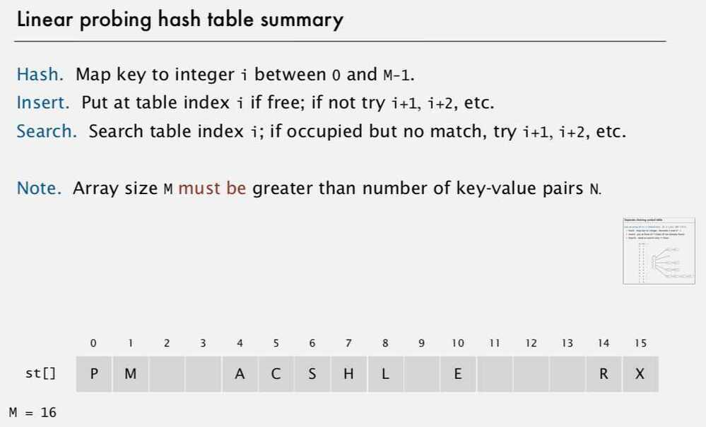

# Hash Tables

hash tables, a data structure that achieves constant-time performance for core symbol table operations, provided that search keys are standard data types or simply defined.

Hash tables utilize hashing to form a data structure.

Hash tables use an associative method to store data by using what is known as a key-value lookup system. All that means is that, in a hash table, keys are mapped to unique values.

This system of organizing data results in a very fast way to find data efficiently. This is because since each key is mapped to a unique value -- once we know a key then we can find the associated value instantly.

Hash tables are extremely fast, having a time complexity that is in the order of O(1).
A function that takes a key and reduces it to an integer (array index) to be mapped to an array.

## Issues

- Computing the hash function
- Equality test
- Collision resolution: Algorithm and data structure to handle two keys that hash to the same array index

## Classic space-time tradeoff

- No space limitation: trivial has function with key as index
- No time limitation: trivial collision resolution with sequential search

## Computing the hash function

Scramble the keys uniformly to produce a table index

- Efficiently computable
- Each table index equally likely for each key

**NOTE: Always try to use all the data for calculating hash (try to involve all the bits for computing the hash function)**

## Modular Hashing

Hash code - An int between -2^31 and 2^31 - 1

Hash function - An int between 0 to M-1 (for use as array index)

- First convert from negative to positive and then use modulus to get it to the size.

## Uniform hashing assumption

Each key is equally likely to hash to an integer between 0 to M - 1.

1. Bins and balls Model: Throw balls uniformly at random into M bins
2. Birthday problem: Expect two balls in the same bin after ~ sqrt(pie M / 2) tosses.
3. Coupon collector problem: Expect every bin has >= 1 ball after ~ M ln M tosses.
4. Load balancing: After M tosses, expect most loaded bin has theta(log M / log log M) balls.

## Collisions - Two distinct keys hashing to same index

- Birthday problem: can't avoid collisions unless you have a ridiculous (quadratic) amount of memory.
- Coupon collector + load balancing: collisions are evenly distributed

## Collision Resolution methods

### 1. Separate Chaining symbol table

Use linked list for storing the values that hash to the same value.

- Easier to implement delete
- Performance degrades gracefully
- Clustering less sensitive to poorly-designed hash function

### 2. Linear Probing (Open addressing)

When a new key collides, find next empty slot, and put it there

- Less wasted space
- Better cache performance

## Problems

- Clustering
- Hash functions are often publically available (like java) so if some client has implemented back-end in java, then an adversary can send some data that can make the Hashing perform poorly and can make the system crash

## Optimization

1. Create a bigger hash table when older hash table gets full and rehash all old values to new hash table
2. Can use Consistent Hashing Functions -

Consistent Hashing is a special kind of hashing such that when a hash table is resized, only K/n keys need to be remapped on average, where K is the number of the keys, and n is the number of slots. In contrast, in most traditional hash tables, a change in the number of array slots causes nearly all keys to be remapped because the mapping between the keys and slots are defined by a modular operation.

## Hash Table Context

One-way hash function - "Hard" to find a key that will hash to a desired value (or two keys that hash to same value)

Ex - MD4, MD5, SHA-0, SHA-1, SHA-2, WHIRLPOOL, RIPEMD-160

Applications - Digital fingerprint, message digest, storing passwords.
Hash tables vs. balanced search trees

Hash tables

・Simpler to code.
・No effective alternative for unordered keys.
・Faster for simple keys (a few arithmetic ops versus log *N* compares).
・Better system support in Java for strings (e.g., cached hash code).

Balanced search trees

・Stronger performance guarantee.
・Support for ordered ST operations.
・Easier to implement compareTo() correctly than equals() and hashCode().

Java system includes both

・Red-black BSTs: java.util.TreeMap, java.util.TreeSet.
・Hash tables: java.util.HashMap, java.util.IdentityHashMap.

## Implementation

All java classes inherit a method hashCode(), which returns a 32 bit int

Integer - return value

Double - convert 64 bit to 32 bit by XOR(^) MSB 32 bot LSB 32

Boolean - return fixed numbers

Strings - Use Horner's method to hash string and cache the hash value in an instance variable for better performance, since strings are immutable

User-defined types - Include all method variables in the hash code evaluation. Use hashCode implementation for each data type with some small prime number and multiply by 31

・Combine each significant field using the 31*x* + *y* rule.
・If field is a primitive type, use wrapper type hashCode().
・If field is null, return 0.
・If field is a reference type, use hashCode().
・If field is an array, apply to each entry. or use Arrays.deepHashCode()

http://blog.chapagain.com.np/hash-table-implementation-in-python-data-structures-algorithms

[Faster than Rust and C++ : the PERFECT Hash Table - YouTube](https://www.youtube.com/watch?v=kuxBOGB_FlM)
