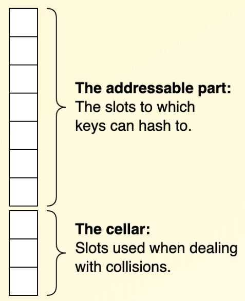

# Hashing Techniques

1. **Separate chaining (open hashing)**

   - Chained hash table (Using linked list if collision)

Chainingis where each item in the hash table array is a list. When an item is added to the array at an index, it's added to corresponding list.

## Variants

- Two-probe hashing
  - Hash to two positions, insert key in shorter of the two chains
  - Reduces expected length of the longest chain to log log N

2. **Open Addressing (closed hashing)**

Open addressinghandles collisions by searching for an empty slot in the array by following a deterministic sequence. This checking is known asprobing, and the sequence is known as a probing sequence. A simple probing sequence is to check each slot one after the other.

The benefits of this approach are:

- **Predictable memory usage
    **No allocation of new nodes when keys are inserted
- **Less memory overhead
    **No next pointers
- **Memory locality
    **A linear memory layout provides better cache characteristics
Probing techniques / Searching techniques / Search sequences

- **Linear Probing -** Find next empty slot and put the key there

- **Double Hashing -** Use two hash functions, if there is collision on first hash, use second hash function to get the bucket address.

- **Quadratic probing -** Quadratic probing operates by taking the original hash index and adding successive values of an arbitrary [quadratic polynomial](https://en.wikipedia.org/wiki/Quadratic_polynomial) until an open slot is found.
  - Use linear probing, but skip a variable amount, not just 1 each time.
  - Effectively eliminates clustering
  - Can allow table to become nearly full
  - More difficult to implement delete

## Removal

- Tombstones (Can create contamination)

## Variants

- Coalesced Hashing
- Cuckoo Hashing
- Robin Hood Hashing
- Hopscotch Hashing

<https://programming.guide/hash-tables-open-addressing.html>

1. **Coalesced Hashing**

Coalesced hashing is a technique for implementing a hash table. It's an [open addressing](https://programming.guide/hash-tables-open-addressing.html) technique which means that all keys are**stored in the array itself**(e.g. it doesn't use for example linked lists to handle collisions). As opposed to other open addressing techniques however, it also uses**nodes with next-poiners**to form collision chains.

Example:Coalesced hash table holding five keys in two collision chains. (Keys of the same color hash to the same bucket.)

**Removal**

- clearing out a slot might break a chain, and cause future lookups to fail. To avoid this problem, one could instead use 'deleted' markings but this is subject to so called **contamination**.- The approach commonly used in practice is to clear the slot holding the key, and then **reinsert** all following keys in the chain.
- This maintains the invariants, avoids contamination and potentially even breaks apart previously coalesced chains.

**Cellar**

A common optimization (so common in fact, that it is almost to be considered a part of the standard implementation) is to reserve part of the hash table array to be used only for storing colliding keys. This part is called**the cellar**.

Example:A coalescing hash table array with *M* = 10 and *N* = 3

<https://programming.guide/coalesced-hashing.html>

4. **Robin hood hashing**
5. **Cuckoo Hashing**

Cuckoo Hashing is a technique for implementing a hash table. As opposed to most other hash tables, it achieves **constant time worst-case complexity for lookups**.

Collisions are handled by evicting existing keys and moving them from one array to the other. This resembles the way a cuckoo chick [pushes out an egg from the nest](https://www.youtube.com/watch?v=SO1WccH2_YM) to make room for itself, hence the name Cuckoo Hashing.

## Representation

It is implemented using **two arrays of equal size** and **two hash functions**:

## Insertion

A new element is always inserted in the first hash table. Should a collision occur, the existing element is kicked out and inserted in the second hash table. Should that in turn cause a collision, the second existing element will be kicked out and inserted in the first hash table, and so on. This continues until an empty bucket is found.
If the number of displacements reaches a certain threshold (for instance due to a cycle among the inserted keys) rehashing takes place.
Rehashing is a linear operation, so **worst-case complexity is*O*(*n*)**. Just as with other hashing techniques however, **the ammortized run time can be shown to be *O*(1)**.

## Stashing

There's a small probability that a cycle is formed among the first few elements inserted. This may trigger a rehash even at a low load factor. To mitigate this, a constant-sized array called the **stash** can be used.
When a key is to be inserted, and a free bucket can't be found, the key is stored in the stash instead. The lookup algorithm is modified to search in the stash in addition to the two arrays. Rehashing is performed when a key can't be inserted and the stash is full.
Even with a stash of just three or four cells, rehashing can be postponed significantly and allow the hash table to function with higher load factors.

## D-Cuckoo Hashing

Cuckoo hashing can be generalized to use an arbitrary but fixed number of internal hash tables.
<https://programming.guide/cuckoo-hashing.html>

## Separate chaining vs. linear probing

## Separate chaining

- Easier to implement delete.
- Performance degrades gracefully.
- Clustering less sensitive to poorly-designed hash function.

## Linear probing

- Less wasted space.
- Better cache performance.
