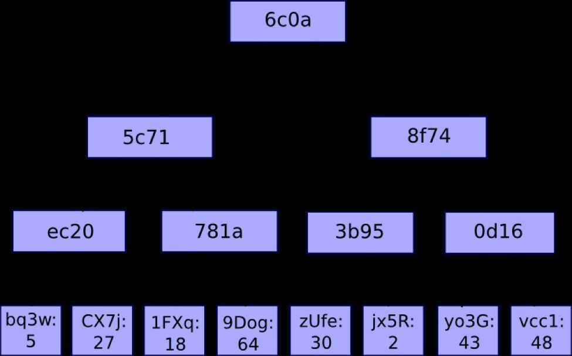
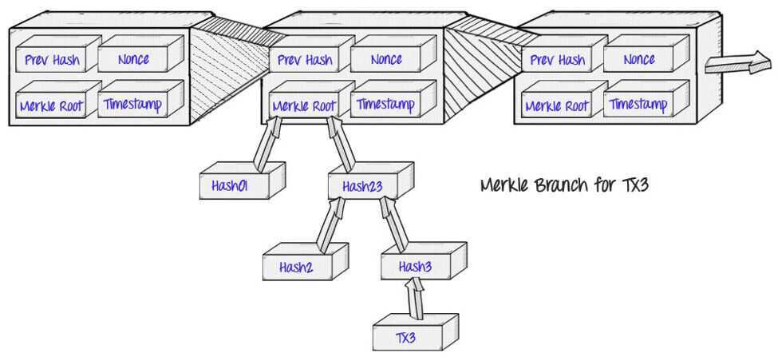

# Merkle Trees

A merkle tree, also known as a binary hash tree, is a data structure used for efficiently summarizing and verifying the integrity of large sets of data.

A Merkle tree is a [hash-based data structure](https://brilliant.org/wiki/hash-based-data-structure/) that is a generalization of the [hash list](https://brilliant.org/wiki/hash-list/). It is a [tree](https://brilliant.org/wiki/trees-basic/) structure in which each leaf node is a hash of a block of data, and each non-leaf node is a hash of its children. Typically, Merkle trees have a branching factor of 2, meaning that each node has up to 2 children.

Merkle trees are used in distributed systems for efficient data verification. They are efficient because they use hashes instead of full files. Hashes are ways of encoding files that are much smaller than the actual file itself. Currently, their main uses are in [peer-to-peer networks](https://brilliant.org/wiki/peer-to-peer-networks/?wiki_title=peer-to-peer%20networks) such as Tor, [Bitcoin](https://brilliant.org/wiki/bitcoin/), and Git.

Image - A basic Merkle Tree. I've abbreviated the middle nodes as H(cd) and H(ab) respectively, but without this shorthand the root hash could also be called H(H(H(a) + H(b)) + H(H(c) +H(d)))

<https://brilliant.org/wiki/merkle-tree>

<https://hackernoon.com/merkle-tree-introduction-4c44250e2da7>

A Merkle tree is a type of binary tree composed of a set of nodes with lots of leaf nodes at the bottom of the tree that contains data. Intermediate nodes in a Merkle tree consist of nodes that have a hash of its two child nodes, and the root node is made up of the hash of its two child nodes, representing the top of the tree.

Data at the bottom of the Merkle tree is generated by splitting it into chunks, splitting chunks into buckets, and repeating the process using bucket hashes until there is only a single hash remaining (the root hash).

Each node of the tree has a key with an associated value; the key tells us which child node to follow to get to the corresponding value, which is stored in the leaf nodes. In the case of ethereum, the key/value mapping for the state tree is between the addresses and their accounts.

Every blocks header stores the hash of the root node of what are essentially three different Merkle tree structures for the state, transactions, and receipts.

Merkle trees are supremely useful because its a very efficient way to store all this information, especially for light nodes. Ethereum uses light nodes and full nodes; full nodes must download the full blockchain, executing all the transactions contained in it. Light nodes must download only the chain of headers, without needing to execute any transactions or retrieving any associated state. This allows them to easily generate and receive verifiable answers about balances, events, etc.

Merkle trees serve to help secure the blockchain because hashes in the Merkle tree propagate upward. If a bad actor tries to swap a fraudulent transaction into the bottom of the Merkle tree, it will cause a chain reaction in all the hashes in all the nodes above it.

A node that wants to verify some data can use whats called a 'Merkle proof". This contains some data to be verified, the root hash of the tree, and the tree branch (partner hashes going up along the path from the data chunk to the root hash). People who read the proof can verify that branch hashing is consistent throughout the tree.

[CakeDefi | Youtube | Why Merkle trees are the best way to verify your crypto accounts](https://www.youtube.com/watch?v=gcpW7cfmFeE)

## Links

[Verkle Trees](data-structures/hashtable/verkle-trees.md)

[Introduction to Merkle Tree - GeeksforGeeks](https://www.geeksforgeeks.org/introduction-to-merkle-tree/)

[Merkle tree - Wikipedia](https://en.wikipedia.org/wiki/Merkle_tree)
