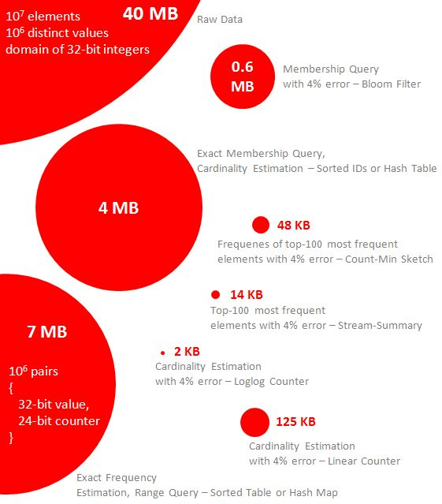

# Probabilistic Data Structure

Probabilistic data structures are a group of data structures that are extremely useful for big data and streaming applications. Generally speaking, these data structures use hash functions to randomize and compactly represent a set of items. Collisions are ignored but errors can be well-controlled under certain threshold. Comparing with error-free approaches, these algorithms use much less memory and have constant query time. They usually support union and intersection operations and therefore can be easily parallelized.

1. **Membership Query - Bloom filter**

2. **Cardinality - HyperLogLog**

3. **Frequency - Count-Min Sketch**

4. **Frequency Estimation: Count-Mean-Min Sketch**

5. **Locality-sensitive hashing**(**LSH**)

## Ribbon Filter (practically smaller than Bloom and Xor)

https://engineering.fb.com/2021/07/09/data-infrastructure/ribbon-filter

https://arxiv.org/abs/2103.02515

## Others

## Frugal Streaming

It uses only one unit of memory per group to compute a quantile for each group.

## Use case: Find the nth percentile of the data stream

https://link.springer.com/chapter/10.1007/978-3-642-40273-9_7

https://agkn.wordpress.com/2013/09/16/sketch-of-the-day-frugal-streaming
𝗚𝗘𝗢𝗛𝗔𝗦𝗛/ 𝗦𝟮 𝗚𝗘𝗢𝗠𝗘𝗧𝗥𝗬

A collection of efficient yet exact mathematical predicates for testing relationships among geometric primitives.

𝙐𝙨𝙚 𝙘𝙖𝙨𝙚:Location-based search results with DynamoDb and Geohash.**References**

https://dzone.com/articles/introduction-probabilistic-0

https://highlyscalable.wordpress.com/2012/05/01/probabilistic-structures-web-analytics-data-mining

https://www.kdnuggets.com/2019/08/count-big-data-probabilistic-data-structures-algorithms.html
