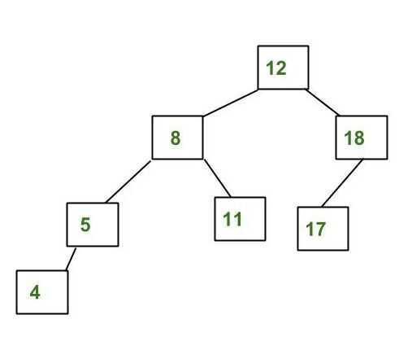

# AVL Tree

AVL tree (named after inventors **A** delson-**V** elsky and **L** andis) is a self-balancing Binary Search Tree (BST) where the difference between heights of left and right subtrees cannot be more than one for all nodes.

The above tree is AVL because differences between heights of left and right subtrees for every node is less than or equal to 1.

## Why AVL Trees?

Most of the BST operations (e.g., search, max, min, insert, delete.. etc) take O(h) time where h is the height of the BST. The cost of these operations may become O(n) for a skewed Binary tree. If we make sure that height of the tree remains O(Logn) after every insertion and deletion, then we can guarantee an upper bound of O(Logn) for all these operations. The height of an AVL tree is always O(Logn) where n is the number of nodes in the tree.

## References

<https://www.geeksforgeeks.org/avl-tree-set-1-insertion>

<https://en.wikipedia.org/wiki/AVL_tree>
