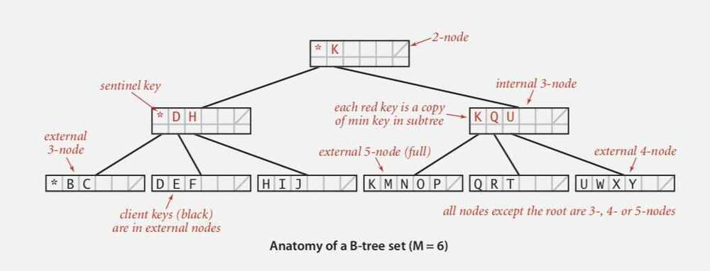
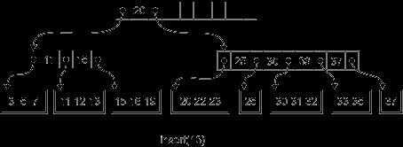
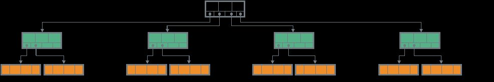
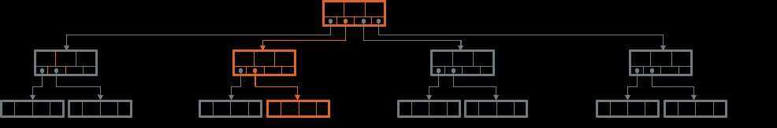
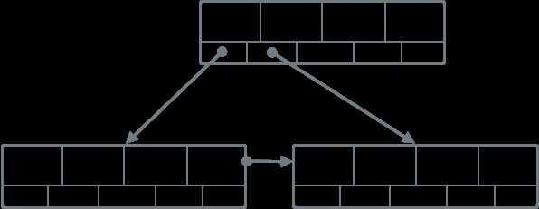
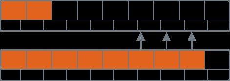

# B-Tree

## Points

- A generalization of 2-3 tees
- n-generalization of a binary search tree

In computer science, a B-tree is a tree data structure that keeps data sorted and allows searches, sequential access, insertions, and deletions in logarithmic amortized time. The B-tree is a n-generalization of a binary search tree in that more than two paths diverge from a single node. Unlike self-balancing binary search trees, the B-tree is optimized for systems that read and write large blocks of data. It is commonly used in databases and filesystems.
B-Trees are a popular index data structure, coming in many variations and used in many databases, including [MySQL InnoDB](https://dev.mysql.com/doc/refman/5.7/en/innodb-physical-structure.html) and [PostgreSQL](https://www.postgresql.org/docs/9.2/static/indexes-types.html). B-Trees areself-balancing, so there's no rotation step required during insertion and deletion, only merges and splits. The reason to use them for indexes, where lookup time is important, is their logarithmic lookup time guarantee.

B-Tree is a self-balancing search tree. In most of the other self-balancing search trees (like [AVL](https://www.geeksforgeeks.org/avl-tree-set-1-insertion/) and Red Black Trees), it is assumed that everything is in main memory. To understand use of B-Trees, we must think of huge amount of data that cannot fit in main memory.When the number of keys is high, the data is read from disk in the form of blocks. Disk access time is very high compared to main memory access time. The main idea of using B-Trees is to reduce the number of disk accesses. Most of the tree operations (search, insert, delete, max, min, ..etc ) require O(h) disk accesses where h is height of the tree. B-tree is a fat tree. Height of B-Trees is kept low by putting maximum possible keys in a B-Tree node. Generally, a B-Tree node size is kept equal to the disk block size. Since h is low for B-Tree, total disk accesses for most of the operations are reduced significantly compared to balanced Binary Search Trees like AVL Tree, Red Black Tree, ..etc.

Page - Contiguous block of data

Probe - First access to a page

B-tree - Generalize 2-3 trees by allowing up to M - 1 key-link pairs per node

- At least 2 key-link pairs at root
- At least M/2 key-link pairs in other nodes
- External nodes contain client keys
- Internal nodes contain copies of keys to guide search

Complexity - A search or an insertion in a B-tree of order M with N keys requires between log ~M-1~ N and log ~M/2~ N probes.

Optimization -

1. Always keep root page in memory.

## B-trees (and variants) are widely used for file systems and databases

- Windows: NTFS
- Mac: HFS, HFS+
- Linux: ReiserFS, XFS, Ext3FS, JFS
- Databases: ORACLE, DB2, INGRES, SQL, PostgreSQL

## Applications

- Implement File Systems

## Anatomy

B-Tree have several node types:Root, InternalandLeafnodes.Rootis the node that has no "parents" (e.g. is not a child for any other node).Leafnodes are the ones that have no child nodes and carry the data.Internalnodes are ones that have both a parent and children, they're connecting a root node with leaf nodes. Some B-Tree variants allow storing data on internal nodes. B-Trees are characterised by theirbranching factor: the amount (N) of pointers to the child nodes. Root and Internal nodes hold up to N-1 keys.

B-Tree consists of Root Node (top), Internal Nodes (middle) and Leaf Nodes (bottom). Leaf nodes usually hold the values and internal nodes are connecting Root to Leaves. This depicts a B-Tree with a branching factor of 4 (4 pointers, 3 keys in Internal nodes and 4 key/value pairs stores onleaves).

Every non-leaf node in the tree holdsNkeys (index entries), separating the tree into the subtrees andN+1pointers to the children. Pointerifrom an entryKipoints to a subtree in which all the index entries are such thatKi <= K < K+1(whereKis a set of keys). First and the last pointers are the special cases, pointing to subtrees in which all the entries are less than (or equal), and greater thanK, correspondingly. Logically, internal nodes hold keys, representing aminimumkey of the child node they point to. Both Internal and leaf nodes also hold a pointer to the next and previous nodes on the same level, forming a doubly-linked list of sibling nodes.

It's usually good to keep the size of B-Tree node to one or two page sizes (4--8K). Considering this and knowing your key size, you can approximate the branching factor and tree height (number of levels). Height should not be too large, as skipping an entire level requires a random seek and performing too many seeks might cause performance degradation. Branching factor is typically in hundreds; it can, however, be lower when keys are large. Setting branching factor too high might also cause performance problems. A good rule of thumb for B-Tree tuning and picking the branching factor is that the the leaf nodes should occupy the vast majority of tree space.

## Lookups

Root and Internal nodes of the B-Trees can often be cached in RAM to facilitate faster lookups. Since on every level, the amount of child nodes grows by branching factor, the amount of space taken by the leaf nodes will be much larger. Searching the leaf node will be done in memory and search and retrieval of the final value from the leaf node will be served from the disk.

When performing lookups, the search starts at the root node and proceeds down to the leaf level. On each level, the algorithm finds the two keys, one of which is smaller and the other one is larger the searched term (so the term is between them), following the child pointer between the keys.

Lookups in B-Tree makes a single Root-to-Leaf pass, following the pointers "between" the two keys, one of which is larger than (or equal) to the searched term and the other one is less than the searched term.

Searches within the node are usually performed using binary search. It's clear how to perform binary search with a fixed-size keys: knowing the amount of the items in the sorted array, jump to the middle, perform a comparison making a decision whether to traverse left or right and repeat until the item is found.

Searches in the B-Trees have logarithmic complexity, since on the node level, keys are stored in order, and the binary search is performed in order to find a match. This is also why it's important to keep the occupancy high and uniform across the tree.

With a variable-lengths data, an indirection vector can be prepended to data, holding offsets to the actual records. Pointers in indirection vector have to be sorted by the search key (actual variable-size data doesn't have to follow the sort). The binary search is performed by picking a middle pointer of indirection vector, performing a comparison in order pick the traversal direction and repeating the operation until the searched key is located.

In order to allow binary searches and logarithmic time accesses on variable-size data, an indirection vector is used: an indirection vector holds offsets to the actual data. Binary search starts in the middle of the indirection vector, the key at the offset in the middle is compared to the searched term, binary search continues in the direction shown by comparison.

In case with point queries, the search is complete after locating a node. When the range scan is performed, keys and values in the current node and then sibling leaf nodes' keys and values are traversed, until the end of the range is reached.

## Modifications

When performing insertions, first the target leaf has to be located. For that, the aforementioned search algorithm is used. After the target leaf is located, a key and value are appended to it. If the leaf does not have enough free space, the situation is calledoverflow, and the leaf has to be split in two leaves. This is done by allocating a new leaf, moving half the elements to it and appending a pointer to the newly allocated leaf to the parent. If parent doesn't have enough space either, another split is performed. The operation continues until the root is reached. Usually, when the root is split, it's contents are split between the newly allocated nodes and the root node itself is overwritten in order to avoid relocation. This also implies that the tree height is always growing "from" the root, by splitting it.

When the node gets full (left), it gets split. When the root is split, usually two nodes are created and root keys get distributed between new nodes. When the internal node is split, a sibling is created and it's key and pointer get added to theparent.

Updates are similar to insertions, except for the existing record is usually overwritten or appended to the write buffer for a delayed write. Deletes can be thought of as a reverse operation: when the leaf occupancy drops below a threshold, the case is consideredunderflow, and either load-balancing (transferring keys from a more-occupied node to less-occupied one) occurs or two sibling nodes are merged, triggering a removal of the key and a pointer from the parent node, which in turn may trigger a cascade of re-balancing and merges upstream.

We won't go into deep semantics of B-Tree splits and merges (at what thresholds they occur), since they depend on the concrete B-Tree flavor. What's important here is to mention that the full nodes split and their contents have to be relocated and pointers have to get updated. The node splits and merges may also propagate one or several levels up, since during splits and merges the child pointers are updated on the parent node; tree height grows during the split and shrinks when merging.

While splits and merges are done, a portion of the tree has to be locked: updating all the nodes which will be split during a single operation should look atomic for the readers and writers. There was some research in the field of concurrency control in B-Trees, one of such endeavors is Blink-Trees, promising less locking, an algorithm better suited for high concurrency.

Fanout of tree has direct influence on how much IO operations will be done: smaller nodes may not only cause the tree to have higher depth, but also trigger splits more often.
Heap files are lists of unordered records of variable size. Since they're often used for mutable storage, file is split into page-sized blocks (4KB or it's multiple). Blocks are numbered sequentially and are referenced from index files.

## B-Tree variants

One of the ways people use B-Trees is ISAM (Indexed Sequential Access Method), a method for creating, maintaining and manipulating trees that allows amortising some of the costs of B-Trees. The ISAM structure is completely static and pre-allocated. Just like with the B+Trees, the data resides only on the leaf pages, which helps to keep the non-leaf nodes static. One of the features of ISAM is the presence overflow pages: the writes will first go into the leaf nodes. When there's not enough space in the leaf nodes, the data will go into the overflow areas, so during search leaf pages are traversed first and overflow pages afterwards. The idea behind it is that there will be be just a few overflow pages and it won't impact the performance.

Another example is B+Trees. There are many ways to implement them, but many modern implementations feature a mutable dynamic B+Tree. They're special in the way that the data is stored only on leaves. This may simplify the updates to the tree structure, since the keys are smaller in size and can fit into internal node pages nicely. The leaf pages can grow and even get relocated when necessarily, which will only require an update of a single pointer on an internal node.

There many other examples, each one covering a special special case: Cache-Oblivious B-Trees optimizing the memory management, already mentioned Blink-Trees improving the concurrency, Partitioned B-Trees that improve the write performance and many more.

## B-tree variants - B+ tree, B* tree, B# tree

## B+ Tree

B+Trees are different from the original B-Tree paper in that have an additional level of linked Leaf nodes, which are storing the values.

[Why do databases store data in B+ trees? - YouTube](https://www.youtube.com/watch?v=09E-tVAUqQw)

## B-Tree Maintenance

Many modern databases are using B-Tree indexes: they're fast, efficient and there are many optimizations for them that are widely known and used. Most of the implementations are mutable. This means that the data structure is dynamic and is changing on disk: when new nodes are allocated, internal structure is changing. In order to facilitate this, there has to be a certain amount of overhead maintained for the table, so called occupancy factor, that allows some wiggle room for the new writes.

Rebalancing is a way to compensate for the occupancy factor. The pointers from a more-occupied node are moved to the less-occupied node. This leads to quicker binary searches because of the logarithmic factor of larger numbers. Immutable B-Trees have a hundred percent occupancy factor and require no rebalancing.

Compaction and load-balancing help with the B-Tree space management. During compaction (the term is really overloaded, and in the context of B-Trees has a different meaning from LSM-Trees one), free space is reclaimed by wiping out the outdated or removed records and re-writing the node contiguously (which may have bigger effect when the tree stores variable length records). Load balancing takes keys from the sibling nodes and moves them from nodes holding more records to ones holding less. Keeping the nodes balanced can also help to reduce an amount of splits. Unfortunately, this technique seems to be somewhat overlooked. Page splits also have some potential for performance optimizations: in order to facilitate key range scans, the nodes can be placed near one another on disk.

Index can be formed by bulk-loading (similarly to how SSTable index is created in LSM Trees). When bulk-loading, data can be pre-sorted and the overall algorithm is much simpler: all the appends will be done to the rightmost child in order to avoid traversal. The right-most index page will get split when full which, again, might trigger a cascade of splits on the upper levels. Using an immutable variant of B-Tree with bulk-loading can guarantee a full occupancy, which both saves space and improves read performance, since less nodes are required when occupancy factor is higher.

<https://medium.com/databasss/on-disk-storage-part-4-b-trees-30791060741>
