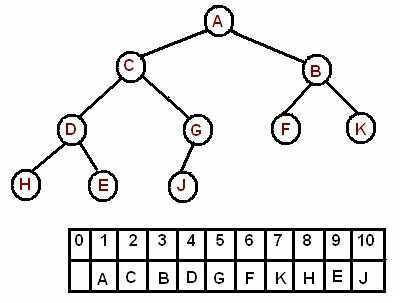
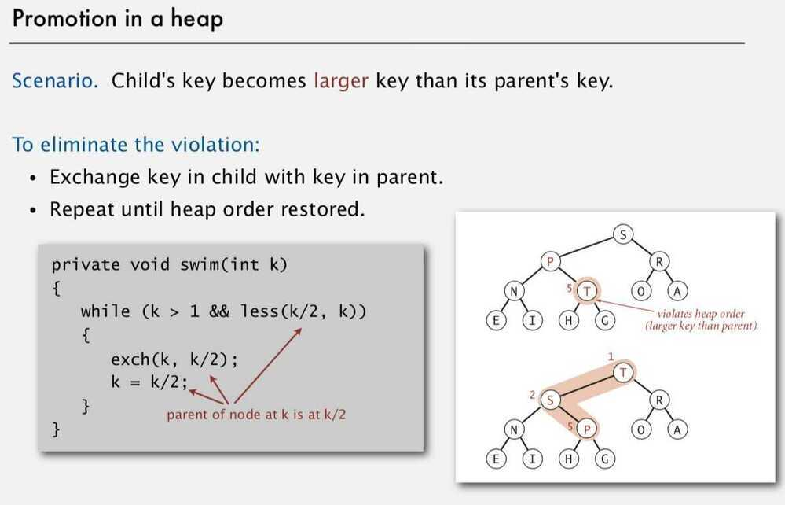
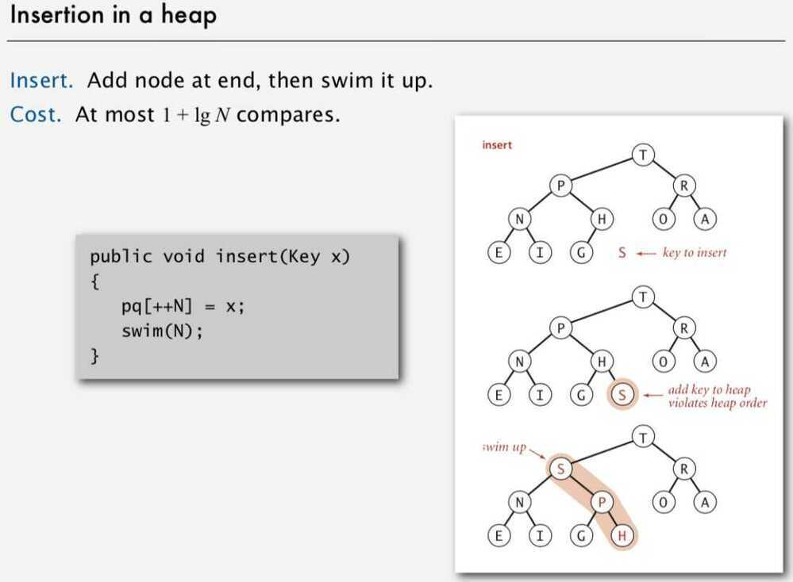
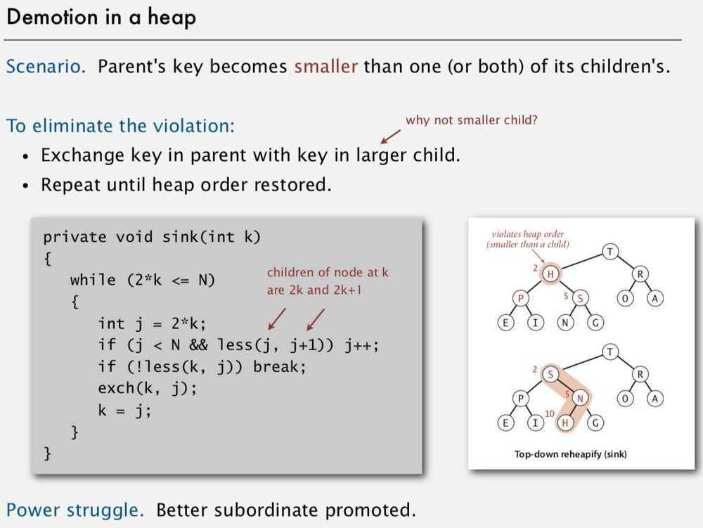

# Binary Heap

## Points to remember

1. Common way of implementing priority queues.
2. Implicit Data Structure (storing keys in an array and using their relative positions within that array to represent child-parent relationships.)
3. Commonly applied in heapsort sorting algorithms

## Binary Heap

A binary heap is defined as a binary tree with two additional constraints:

- Shape property: a binary heap is a [*complete binary tree*](https://en.wikipedia.org/wiki/Complete_Binary_Tree); that is, all levels of the tree, except possibly the last one (deepest) are fully filled, and, if the last level of the tree is not complete, the nodes of that level are filled from left to right.
- Heap property: the key stored in each node is either greater than or equal to (≥) or less than or equal to (≤) the keys in the node's children, according to some [total order](https://en.wikipedia.org/wiki/Total_order).
A binary heap is a complete binary tree which satisfies the heap ordering property. The ordering can be one of two types:
- the*min-heap property*: the value of each node is greater than or equal to the value of its parent, with the minimum-value element at the root.
- the*max-heap property*: the value of each node is less than or equal to the value of its parent, with the maximum-value element at the root.

Throughout this chapter the word "heap" will always refer to a min-heap.


In a heap the highest (or lowest) priority element is always stored at the root, hence the name "heap". A heap is not a sorted structure and can be regarded as partially ordered. As you see from the picture, there is no particular relationship among nodes on any given level, even among the siblings.

Since a heap is a complete binary tree, it has a smallest possible height - a heap with N nodes always has O(log N) height.

A heap is useful data structure when you need to remove the object with the highest (or lowest) priority. A common use of a heap is to implement a priority queue.

## Array Implementation

A complete binary tree can be uniquely represented by storing its level order traversal in an array.



The root is the second item in the array. We skip the index zero cell of the array for the convenience of implementation. Consider k-th element of the array, the

its left child is located at 2*k index

its right child is located at 2*k+1. index

its parent is located at k/2 index

For 0th indexing of the arr, where k is an element of the array,

parent = (k-1)//2

left_child = (2*k) + 1

right_child = (2*k) + 2

Array representation of a heap-ordered complete binary tree

## Heap ordered binary tree

- Keys in nodes
- Parent's key no smaller than children's keys

## Properties

- Largest key is a [1], which is root of binary tree
- Parent of node at k is at k/2
- Children of node at k are at 2k and 2k+1

## Promotion in a heap (swim operation / shift-up / unheap / percolate up / bubble-up)

Child's key becomes larger key than its parent's key

Eliminate the violation -

- Exchange key in child with key in parent
- Repeat until heap order restored



## For 0th index array

```python
def perc_up(self, k):
    while(k > 0 and self.arr [k] < self.arr [(k-1)//2]):
        self.arr [k], self.arr [(k-1)//2] = self.arr [(k-1)//2], self.arr [k]
        k = (k-1)//2
```

## Insertion in a heap

- Add node at end, then swim it up
- At most 1 + lg N compares



## Demotion in a heap (sink / shift-down / downheap / percolate down / bubble-down)

Parent's key becomes smaller than one (or both) of its children's.

Eliminate the violation -

- Exchange key in parent with key in larger child
- Repeat until heap order restored



## Delete the maximum in a heap

- Exchange root with node at end, then sink it down
- At most 2 lg N compares


## Bottom-up heap construction

Goal: Build max heap using bottom-up method

## Binary Heap considerations

- Immutability of keys (can't change the data type value once created, final keyword is used to make a datatype immutable)
- Underflow and overflow

| **Operation** | [**Binary**](https://en.wikipedia.org/wiki/Binary_heap) | [**Leftist**](https://en.wikipedia.org/wiki/Leftist_tree) | [**Binomial**](https://en.wikipedia.org/wiki/Binomial_heap) | **Fibonacci** | [**Pairing**](https://en.wikipedia.org/wiki/Pairing_heap) | [**Brodal**](https://en.wikipedia.org/wiki/Brodal_queue) | [**Rank-pairing**](https://en.wikipedia.org/w/index.php?title=Rank-pairing_heap&action=edit&redlink=1) | **Strict Fibonacci** |
|---|---|---|---|---|---|---|---|---|
| **find-min** | *Θ*(1) | *Θ*(1) | *Θ*(log*n*) | *Θ*(1) | *Θ*(1) | *Θ*(1) | *Θ*(1) | *Θ*(1) |
| **delete-min** | *Θ*(log*n*) | *Θ*(log*n*) | *Θ*(log*n*) | *O*(log*n*) | *O*(log*n*) | *O*(log*n*) | *O*(log*n*) | *O*(log*n*) |
| **insert** | *O*(log*n*) | *Θ*(log*n*) | *Θ*(1) | *Θ*(1) | *Θ*(1) | *Θ*(1) | *Θ*(1) | *Θ*(1) |
| **decrease-key** | *Θ*(log*n*) | *Θ*(*n*) | *Θ*(log*n*) | *Θ*(1) | *o*(log*n*) | *Θ*(1) | *Θ*(1) | *Θ*(1) |
| **merge** | *Θ*(*n*) | *Θ*(log*n*) | *O*(log*n*) | *Θ*(1) | *Θ*(1) | *Θ*(1) | *Θ*(1) | *Θ*(1) |

## Python 3

## Python > Documentation > Concurrent Execution

## Python > Documentation > Data Types
