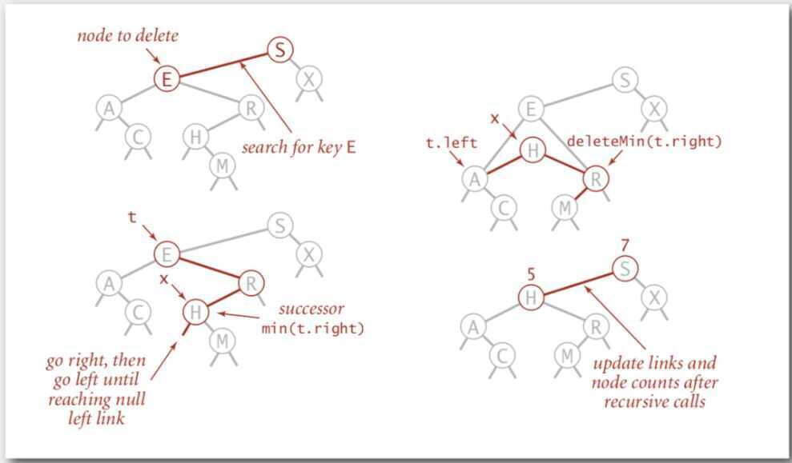

# Binary Search Tree

Properties -

- Explicit Data Structure
- Can be used to store key value pairs for a symbol table implementation
"A Binary Search Tree is sometimes called ordered or sorted binary trees, and it keeps its values in sorted order, so that lookup and other operations can use the principle of binary search"---[Wikipedia](https://en.wikipedia.org/wiki/Binary_search_tree)

A BST is a binary tree in symmetric order

Each node has a key, and every node's key is:

- Larger than all keys in its left subtree
- Smaller than all keys in its right subtree

A BST is a reference to a root Node.

A Node is comprised of four fields:

- A Key and a Value
- A reference to the left and right subtree


Search: If less, go left; if greater, go right; if equal, search hit.

Insert: If less, go left; if greater, go right; if null, insert.

Get: Return value corresponding to given key, or null if no such key

Cost: Number of compares is equal to 1 + depth of node


Put: Associate value with key

Search for key, then two cases:

- Key in tree -> reset value
- Key not in tree -> add new node


Cost: Number of compares is equal to 1 + depth of node

A BST is a binary tree in symmetric order

Each node has a key, and every node's key is:

- Larger than all keys in its left subtree
- Smaller than all keys in its right subtree

## Operations in BST

- Get
- Put
- Min
- Max
- Floor
- Ceil
- Rank (how many keys are less than a given key)
- Select (give as the kth largest key)
- Subtree count
- Inorder traversal
- Level order traversal
- Deletion in BST
- Lazy Approach (Mark the node as Tombstone)

Leave the key in tree to guide search (but don't consider it equal in search)

- **Hibbard deletion**

To delete a node with key k: search for node t containing key k

1. Case 0 (0 children of the search node)

Delete t by setting parent link to null

2. Case 1 (1 child of the search node)

Delete t by replacing parent link

3. Case 2 (2 children of the search node)

Find successor x of t

Delete the minimum in t's right subtree

Put x in t's spot

Unsatisfactory solution - Not symmetric

After a long random sequence of insert and delete operation, the height of tree becomes sqrt(N)

The main defect of Hibbard deletion is that it unbalances the tree leading to sqrt(N) height

If instead of replacing the node to delete with its successor, we flip a coin and choose to replace it with either the successor or predecessor, then in practice the height becomes logarithmic (But nobody has been able to prove this fact mathematically)### Binary Searchtree

An important property of a Binary Search Tree is that the value of a Binary Search Tree nodeis larger than the value of the offspring of its left child, but smaller than the value of the offspring of its right child."


Here is a breakdown of the above illustration:

- **A** is inverted. The subtree 7--5--8--6 needs to be on the right side, and the subtree 2--1--3 needs to be on the left.
- **B** is the only correct option. It satisfies the Binary Search Tree property.
- **C** has one problem: the node with the value 4. It needs to be on the left side of the root because it is smaller than 5.

### Let's code a Binary SearchTree

Now it's time to code!

What will we see here? We will insert new nodes, search for a value, delete nodes, and the balance of the tree.

Let's start.

#### Insertion: adding new nodes to ourtree

Imagine that we have an empty tree and we want to add new nodes with the following values in this order: 50, 76, 21, 4, 32, 100, 64, 52.

The first thing we need to know is if 50 is the root of our tree.


We can now start inserting node by node.

- 76 is greater than 50, so insert 76 on the right side.
- 21 is smaller than 50, so insert 21 on the left side.
- 4 is smaller than 50. Node with value 50 has a left child 21. Since 4 is smaller than 21, insert it on the left side of this node.
- 32 is smaller than 50. Node with value 50 has a left child 21. Since 32 is greater than 21, insert 32 on the right side of this node.
- 100 is greater than 50. Node with value 50 has a right child 76. Since 100 is greater than 76, insert 100 on the right side of this node.
- 64 is greater than 50. Node with value 50 has a right child 76. Since 64 is smaller than 76, insert 64 on the left side of this node.
- 52 is greater than 50. Node with value 50 has a right child 76. Since 52 is smaller than 76, node with value 76 has a left child 64. 52 is smaller than 64, so insert 54 on the left side of this node.


Do you notice a pattern here?

Let's break it down.

1. Is the new node value greater or smaller than the current node?

2. If the value of the new node is greater than the current node, go to the right subtree. If the current node doesn't have a right child, insert it there, or else backtrack to step #1.

3. If the value of the new node is smaller than the current node, go to the left subtree. If the current node doesn't have a left child, insert it there, or else backtrack to step #1.

4. We did not handle special cases here. When the value of a new node is equal to the current value of the node, use rule number 3. Consider inserting equal values to the left side of the subtree.

Now let's code it.

```python
class BinarySearchTree:
    def __init__(self, value):
        self.value = value
        self.left_child = None
        self.right_child = None

    def insert_node(self, value):
        if value <= self.value and self.left_child:
            self.left_child.insert_node(value)
        elif value <= self.value:
            self.left_child = BinarySearchTree(value)
        elif value > self.value and self.right_child:
            self.right_child.insert_node(value)
        else:
            self.right_child = BinarySearchTree(value)
```

It seems very simple.

The powerful part of this algorithm is the recursion part, which is on line 9 and line 13. Both lines of code call the insert_node method, and use it for its left and right children, respectively. Lines 11 and 15 are the ones that do the insertion for each child.

#### Let's search for the node value... Ornot

The algorithm that we will build now is about doing searches. For a given value (integer number), we will say if our Binary Search Tree does or does not have that value.

An important item to note is how we defined the tree **insertion algorithm**. First we have our root node. All the left subtree nodes will have smaller values than the root node. And all the right subtree nodes will have values greater than the root node.

Let's take a look at an example.

Imagine that we have this tree.


Now we want to know if we have a node based on value 52.


Let's break it down.

1. We start with the root node as our current node. Is the given value smaller than the current node value? If yes, then we will search for it on the left subtree.

2. Is the given value greater than the current node value? If yes, then we will search for it on the right subtree.

3. If rules #1 and #2 are both false, we can compare the current node value and the given value if they are equal. If the comparison returns true, then we can say, "Yeah! Our tree has the given value," otherwise, we say, "Nooo, it hasn't."

Now let's code it.

```python
class BinarySearchTree:
 def __init__(self, value):
        self.value = value
        self.left_child = None
        self.right_child = None

    def find_node(self, value):
        if value < self.value and self.left_child:
            return self.left_child.find_node(value)
        if value > self.value and self.right_child:
            return self.right_child.find_node(value)

        return value == self.value
```

Let's beak down the code:

- Lines 8 and 9 fall under rule #1.
- Lines 10 and 11 fall under rule #2.
- Line 13 falls under rule #3.

How do we test it?

Let's create our Binary Search Tree by initializing the root node with the value 15.

bst = BinarySearchTree(15)

And now we will insert many new nodes.

```python
bst.insert_node(10)
bst.insert_node(8)
bst.insert_node(12)
bst.insert_node(20)
bst.insert_node(17)
bst.insert_node(25)
bst.insert_node(19)
```

For each inserted node, we will test if our find_node method really works.

```python
print(bst.find_node(15)) # True
print(bst.find_node(10)) # True
print(bst.find_node(8)) # True
print(bst.find_node(12)) # True
print(bst.find_node(20)) # True
print(bst.find_node(17)) # True
print(bst.find_node(25)) # True
print(bst.find_node(19)) # True
```

Yeah, it works for these given values! Let's test for a value that doesn't exist in our Binary Search Tree.

`print(bst.find_node(0)) # False`

Oh yeah.

Our search is done.

#### Deletion: removing and organizing

Deletion is a more complex algorithm because we need to handle different cases. For a given value, we need to remove the node with this value. Imagine the following scenarios for this node: it has no children, has a single child, or has two children.

- **Scenario #1**: A node with no children (leaf node).

```python
# |50| |50|
 # / \ / \
 # |30| |70| (DELETE 20) ---> |30| |70|
 # / \ \
 # |20| |40| |40|
```

If the node we want to delete has no children, we simply delete it. The algorithm doesn't need to reorganize the tree.

- **Scenario #2**: A node with just one child (left or right child).

```python
# |50| |50|
 # / \ / \
 # |30| |70| (DELETE 30) ---> |20| |70|
 # /
 # |20|
```

In this case, our algorithm needs to make the parent of the node point to the child node. If the node is the left child, we make the parent of the left child point to the child. If the node is the right child of its parent, we make the parent of the right child point to the child.

- **Scenario #3**: A node with two children.

```python
# |50| |50|
 # / \ / \
 # |30| |70| (DELETE 30) ---> |40| |70|
 # / \ /
 # |20| |40| |20|
```

When the node has 2 children, we need to find the node with the minimum value, starting from the node'sright child. We will put this node with minimum value in the place of the node we want to remove.

It's time to code.

```python
def remove_node(self, value, parent):
    if value < self.value and self.left_child:
        return self.left_child.remove_node(value, self)
    elif value < self.value:
        return False
    elif value > self.value and self.right_child:
        return self.right_child.remove_node(value, self)
    elif value > self.value:
        return False
    else:
        if self.left_child is None and self.right_child is None and self == parent.left_child:
            parent.left_child = None
            self.clear_node()
        elif self.left_child is None and self.right_child is None and self == parent.right_child:
            parent.right_child = None
            self.clear_node()
        elif self.left_child and self.right_child is None and self == parent.left_child:
            parent.left_child = self.left_child
            self.clear_node()
        elif self.left_child and self.right_child is None and self == parent.right_child:
            parent.right_child = self.left_child
            self.clear_node()
        elif self.right_child and self.left_child is None and self == parent.left_child:
            parent.left_child = self.right_child
            self.clear_node()
        elif self.right_child and self.left_child is None and self == parent.right_child:
            parent.right_child = self.right_child
            self.clear_node()
        else:
            self.value = self.right_child.find_minimum_value()
            self.right_child.remove_node(self.value, self)

    return True
```

1. **First**: Note the parameters value and parent. We want to find the nodethat has this value, and the node's parent is important to the removal of the node.

2. **Second**: Note the returning value. Our algorithm will return a boolean value. It returns True if it finds the node and removes it. Otherwise it will return False.

3. **From line 2 to line 9**: We start searching for the node that has the valuethat we are looking for. If the value is smaller than the current nodevalue, we go to the left subtree, recursively (if, and only if, the current node has a left child). If the value is greater, go to the right subtree, recursively.

4. **Line 10**: We start to think about the remove algorithm.

5. **From line 11 to line 13**: We cover the node with no children, and it is the left child from its parent. We remove the node by setting the parent's left child to None.

6. **Lines 14 and 15**: We cover the node with no children, and it is the right child from it's parent. We remove the node by setting the parent's right child to None.

7. **Clear node method**: I will show the clear_node code below. It sets the nodes left child, right child, and its value to None.

8. **From line 16 to line 18**: We cover the node with just one child (left child), and it is the left child from it's parent. We set the parent's left child to the node's left child (the only child it has).

9. **From line 19 to line 21**: We cover the node with just one child (left child), and it is the right child from its parent. We set the parent's right child to the node's left child (the only child it has).

10. **From line 22 to line 24**: We cover the node with just one child (right child), and it is the left child from its parent. We set the parent's left child to the node's right child (the only child it has).

11. **From line 25 to line 27**: We cover the node with just one child (right child), and it is the right child from its parent. We set the parent's right child to the node's right child (the only child it has).

12. **From line 28 to line 30**: We cover the node with both left and rightchildren. We get the node with the smallest value (the code is shown below) and set it to the value of the current node. Finish it by removing the smallest node.

13. **Line 32**: If we find the node we are looking for, it needs to return True. From line 11 to line 31, we handle this case. So just return True and that's it.- To use the clear_node method: set the None value to all three attributes---(value, left_child, and right_child)

```python
def clear_node(self):
 self.value = None
 self.left_child = None
 self.right_child = None
```

- To use the find_minimum_value method: go way down to the left. If we can't find anymore nodes, we found the smallest one.

```python
def find_minimum_value(self):
 if self.left_child:
 return self.left_child.find_minimum_value()
 else:
 return self.value
```

Now let's test it.

We will use this tree to test our remove_node algorithm.

```python
# |15|
 # / \
 # |10| |20|
 # / \ / \
 # |8| |12| |17| |25|
 # \
 # |19|
```

Let's remove the node with the value 8. It's a node with no child.

```python
print(bst.remove_node(8, None)) # True
 bst.pre_order_traversal()
 # |15|
 # / \
 # |10| |20|
 # \ / \
 # |12| |17| |25|
 # \
 # |19|
```

Now let's remove the node with the value 17. It's a node with just one child.

```python
print(bst.remove_node(17, None)) # True
 bst.pre_order_traversal()
 # |15|
 # / \
 # |10| |20|
 # \ / \
 # |12| |19| |25|
```

Finally, we will remove a node with two children. This is the root of our tree.

```python
print(bst.remove_node(15, None)) # True
 bst.pre_order_traversal()
 # |19|
 # / \
 # |10| |20|
 # \ \
 # |12| |25|
```

## Geometric applications of BSTs

Problem - Intersections among geometric objects (find among a group of rectangles, how many rectangles intersect) - Binary search trees

Applications - CAD, games, movies, virtual reality, databases, GIS (Geographic Information System)


## Further Reading

- 2-3 Trees
- Red-Black binary search trees
- B-trees
