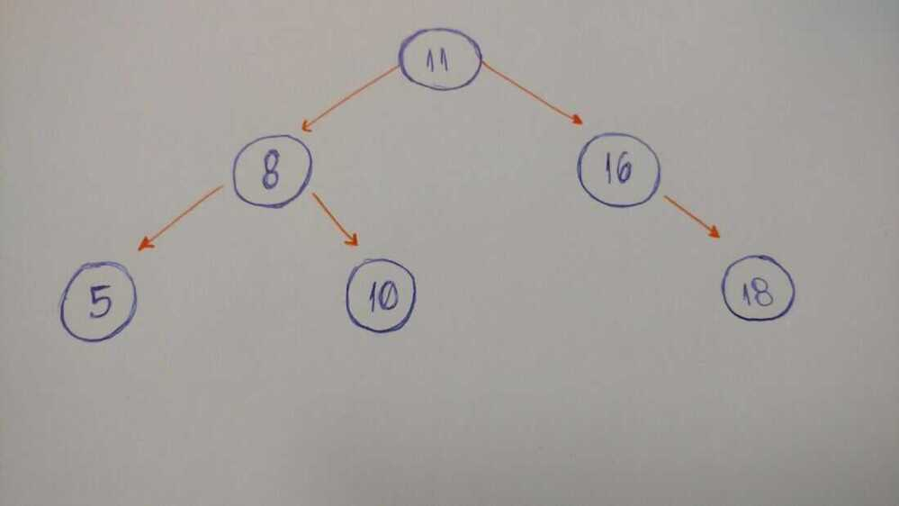

# Binary Tree

## Properties

- In Binary tree, number of leaf nodes is always one more than nodes with two children.

L = T + 1
Where L = Number of leaf nodes
T = Number of internal nodes with two children

## Types of Binary Tree

- A **rooted** binary [tree](https://en.wikipedia.org/wiki/Tree_data_structure) has a [root node](https://en.wikipedia.org/wiki/Root_node) and every node has at most two children.
- A **full** binary tree (sometimes referred to as a **proper** or **plane** binary tree)is a tree in which every node has either 0 or 2 children. Another way of defining a full binary tree is a [recursive definition](https://en.wikipedia.org/wiki/Recursive_definition). A full binary tree is either:
    - A single vertex.
    - A tree whose root node has two subtrees, both of which are full binary trees.
- In a **complete** binary tree every level, except possibly the last, is completely filled, and all nodes in the last level are as far left as possible. It can have between 1 and 2hnodes at the last levelh.An alternative definition is a perfect tree whose rightmost leaves (perhaps all) have been removed. Some authors use the termcompleteto refer instead to a perfect binary tree as defined below, in which case they call this type of tree (with a possibly not filled last level) analmost completebinary tree ornearly completebinary tree.A complete binary tree can be efficiently represented using an array.
- A **perfect** binary tree is a binary tree in which all interior nodes have two childrenandall leaves have the samedepthor samelevel.An example of a perfect binary tree is the (non-incestuous)[ancestry chart](https://en.wikipedia.org/wiki/Ancestry_chart) of a person to a given depth, as each person has exactly two biological parents (one mother and one father). Provided the ancestry chart always displays the mother and the father on the same side for a given node, their sex can be seen as an analogy of left and right children, childrenbeing understood here as an algorithmic term. A perfect tree is therefore always complete but a complete tree is not necessarily perfect.
- In the **infinite complete** binary tree, every node has two children (and so the set of levels is [countably infinite](https://en.wikipedia.org/wiki/Countably_infinite)). The set of all nodes is countably infinite, but the set of all infinite paths from the root is uncountable, having the [cardinality of the continuum](https://en.wikipedia.org/wiki/Cardinality_of_the_continuum). These paths correspond by an order-preserving [bijection](https://en.wikipedia.org/wiki/Bijection) to the points of the [Cantor set](https://en.wikipedia.org/wiki/Cantor_set), or (using the example of a [Stern--Brocot tree](https://en.wikipedia.org/wiki/Stern%E2%80%93Brocot_tree)) to the set of positive [irrational numbers](https://en.wikipedia.org/wiki/Irrational_number).
- A **balanced** binary tree is a binary tree structure in which the left and right subtrees of every node differ in height by no more than 1.One may also consider binary trees where no leaf is much farther away from the root than any other leaf. (Different balancing schemes allow different definitions of "much farther".)
- A **degenerate**(or **pathological**) tree is where each parent node has only one associated child node.This means that the tree will behave like a [linked list](https://en.wikipedia.org/wiki/Linked_list) data structure.

https://en.wikipedia.org/wiki/Binary_tree#Types_of_binary_trees

## Binary Tree

Empty or node with links to left and right binary trees.


This is neither full nor complete


This is both full and complete

## Full Binary tree / proper binary tree / 2-tree / strictly binary tree

Tree in which every node other than the leaves has two children.


This is full but not complete

## Complete tree

Perfectly balanced, except for bottom level, and all nodes are as far left as possible.

- Height of complete tree with N nodes is floor(lg N)
- Height only increases when N is a power of 2


This is complete but not full

## Binary trees

In computer science, a binary tree is a tree data structure in which each node has at the most two children, which are referred to as the left child and the right child."---[Wikipedia](https://en.wikipedia.org/wiki/Binary_tree)



The first thing we need to keep in mind when we implement a binary tree is that it is a collection of nodes. Each node has three attributes: value, left_child, and right_child.
How do we implement a simple binary tree that initializes with these three properties?

```python
class BinaryTree:
  def __init__(self, value):
    self.value = value
    self.left_child = None
    self.right_child = None
```

When we instantiate an object, we pass the value (the data of the node) as a parameter. Look at the left_child and the right_child. Both are set to None.
Because when we create our node, it doesn't have any children. We just have the node data.
We can pass the string 'a' as the value to our Binary Tree node. If we print the value, left_child, and right_child, we can see the values.
We will implement a method to insert a new node to the right and to the left.
Here are the rules:

- If the current node doesn't have a left child, we just create a new nodeand set it to the current node's left_child.
- If it does have the left child, we create a new node and put it in the current left child's place. Allocate this left child node to the new node's left child.

```python
def insert_left(self, value):
  if self.left_child == None:
    self.left_child = BinaryTree(value)
  else:
    new_node = BinaryTree(value)
    new_node.left_child = self.left_child
    self.left_child = new_node
```

Again, if the current node doesn't have a left child, we just create a new node and set it to the current node's left_child. Or else we create a new node and put it in the current left child's place. Allocate this left child node to the new node's left child.
And we do the same thing to insert a right child node.

```python
def insert_right(self, value):
  if self.right_child == None:
    self.right_child = BinaryTree(value)
  else:
    new_node = BinaryTree(value)
    new_node.right_child = self.right_child
    self.right_child = new_node
```

https://www.geeksforgeeks.org/handshaking-lemma-and-interesting-tree-properties

https://www.freecodecamp.org/news/how-to-implement-binary-tree-algorithms-in-technical-interviews
