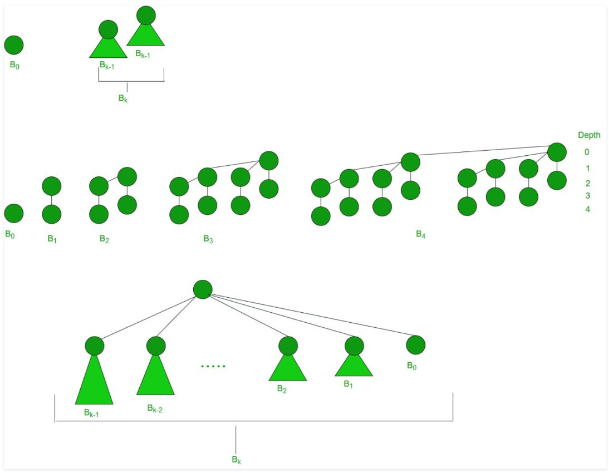
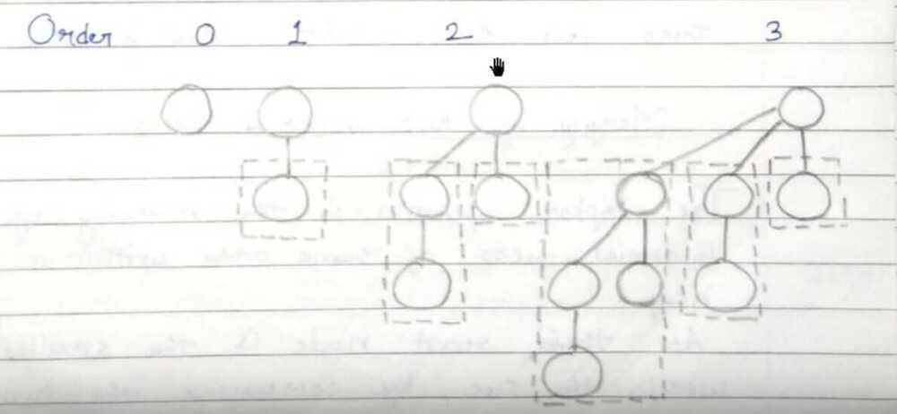

# Binomial Heap

## Key Points

- Faster union or merge operation of two binary heaps
- Implementation of mergeable heap abstract data type
Binomial Heap is to extension of [Binary Heap](http://geeksquiz.com/binary-heap/) that provides faster union or merge operation together with other operations provided by Binary Heap.
*A Binomial Heap is a collection of Binomial Trees*

## What is a Binomial Tree?

A Binomial Tree of order 0 has 1 node. A Binomial Tree of order k can be constructed by taking two binomial trees of order k-1, and making one as leftmost child of other.

A Binomial Tree of order k has following properties.

a) It has exactly 2^k^nodes.

b) It has depth as k.

c) There are exactly ^k^Cinodes at depth i for i = 0, 1, . . . , k.

d) The root has degree k and children of root are themselves Binomial Trees with order k-1, k-2,.. 0 from left to right.

## Structure of a Binomial Heap

- A Binomial Heap is a set of Binomial Trees where each Binomial Tree follows Min Heap property.
- And there can be at-most one Binomial Tree of any degree.

## Examples Binomial Heap

12------------10--------------------20
/  / |
15 50 70 50 40
| / | |
30 80 85 65
|
100
A Binomial Heap with 13 nodes. It is a collection of 3
Binomial Trees of orders 0, 2 and 3 from left to right.

10--------------------20
/  / |
15 50 70 50 40
| / | |
30 80 85 65
|
100

A Binomial Heap with 12 nodes. It is a collection of 2
Binomial Trees of orders 2 and 3 from left to right.

## Binary Representation of a number and Binomial Heaps

A Binomial Heap with n nodes has number of Binomial Trees equal to the number of set bits in Binary representation of n. For example let n be 13, there 3 set bits in binary representation of n (00001101), hence 3 Binomial Trees. We can also relate degree of these Binomial Trees with positions of set bits. With this relation we can conclude that there are O(Logn) Binomial Trees in a Binomial Heap with 'n' nodes.

## Operations of Binomial Heap

The main operation in Binomial Heap is union(), all other operations mainly use this operation. The union() operation is to combine two Binomial Heaps into one.

## Union operation in Binomial Heap

Given two Binomial Heaps H1 and H2, union(H1, H2) creates a single Binomial Heap.

1. The first step is to simply merge the two Heaps in non-decreasing order of degrees

2. After the simple merge, we need to make sure that there is at-most one Binomial Tree of any order. To do this, we need to combine Binomial Trees of same order. We traverse the list of merged roots, we keep track of three pointers, prev, x and next-x. There can be following 4 cases when we traverse the list of roots

-----Case 1: Orders of x and next-x are not same, we simply move ahead.

In following 3 cases orders of x and next-x are same.

-----Case 2: If order of next-next-x is also same, move ahead.

-----Case 3: If key of x is smaller than or equal to key of next-x, then make next-x as a child of x by linking it with x.

-----Case 4: If key of x is greater, then make x as child of next.

1. insert(H, k): Inserts a key 'k' to Binomial Heap 'H'. This operation first creates a Binomial Heap with single key 'k', then calls union on H and the new Binomial heap

2. getMin(H): A simple way to getMin() is to traverse the list of root of Binomial Trees and return the minimum key. This implementation requires O(Logn) time. It can be optimized to O(1) by maintaining a pointer to minimum key root

3. extractMin(H): This operation also uses union(). We first call getMin() to find the minimum key Binomial Tree, then we remove the node and create a new Binomial Heap by connecting all subtrees of the removed minimum node. Finally we call union() on H and the newly created Binomial Heap. This operation requires O(Logn) time

4. delete(H): Like Binary Heap, delete operation first reduces the key to minus infinite, then calls extractMin()

5. decreaseKey(H): decreaseKey() is also similar to Binary Heap. We compare the decreases key with it parent and if parent's key is more, we swap keys and recur for parent. We stop when we either reach a node whose parent has smaller key or we hit the root node. Time complexity of decreaseKey() is O(Logn)
