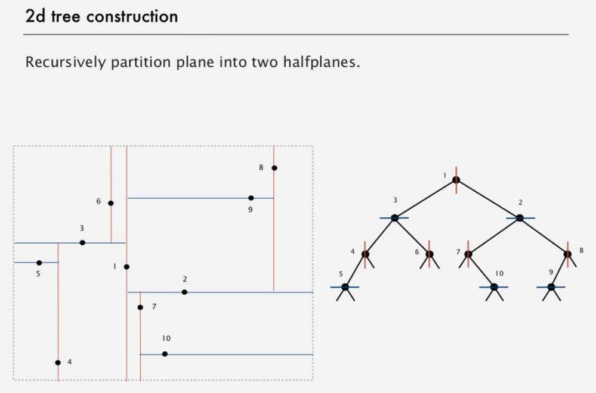

# Kd-trees

In [computer science](https://en.wikipedia.org/wiki/Computer_science), a***k*-d tree**(short for*k-dimensional [tree](https://en.wikipedia.org/wiki/Tree_data_structure)*) is a [space-partitioning](https://en.wikipedia.org/wiki/Space_partitioning)[data structure](https://en.wikipedia.org/wiki/Data_structure) for organizing [points](https://en.wikipedia.org/wiki/Point_(geometry)) in a*k*-dimensional [space](https://en.wikipedia.org/wiki/Euclidean_space).*k*-d trees are a useful data structure for several applications, such as searches involving a multidimensional search key (e.g.[range searches](https://en.wikipedia.org/wiki/Range_search) and [nearest neighbor searches](https://en.wikipedia.org/wiki/Nearest_neighbor_search)).*k*-d trees are a special case of [binary space partitioning](https://en.wikipedia.org/wiki/Binary_space_partitioning) trees.
A non-leaf node in K-D tree divides the space into two parts, called as half-spaces.

Points to the left of this space are represented by the left subtree of that node and points to the right of the space are represented by the right subtree.
Extension of BSTs that allow us to do efficient processing of sets of points in space.

Problem with Grid implementation - **Clustering**

- Lists are too long, even though average length is short.

## Operations

- Range search in a 2d tree

- Nearest neighbor search in a 2d tree

## Applications of 2d trees

- Classifying astronomical objects
- Computer animation
- Speeding up neural networks
- Mining data
- Image retrieval

## Flocking Boids Algorithm

Boids: Three simple rules lead to complex emergent flocking behavior in birds:

- Collision avoidance: point away from k nearest boids
- Flock centering: point towards the center of mass of k nearest boids
- Velocity matching: update velocity to the average of k nearest boids

## Appel's algorithm for N-body simulation

Key idea: suppose particle is far, far away from cluster of particles:

- Treat cluster of particles as a single aggregate particle
- Compute force between particle and center of mass of aggregate

Algorithm

- Build 3-d tree with N particles as nodes
- Store center-of-mass of subtree in each node
- To compute total force acting on a particle, traverse tree, but stop as soon as distance from particle to subdivision is sufficiently large

Running time per step is N log N
