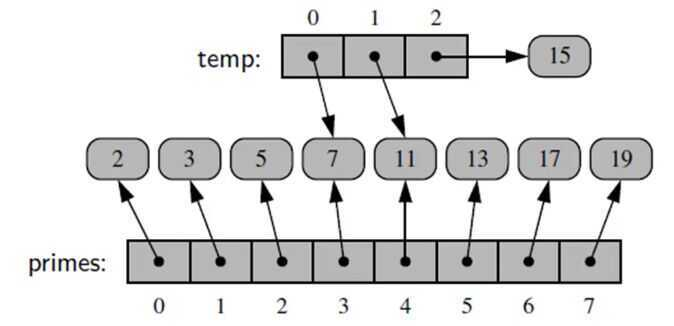
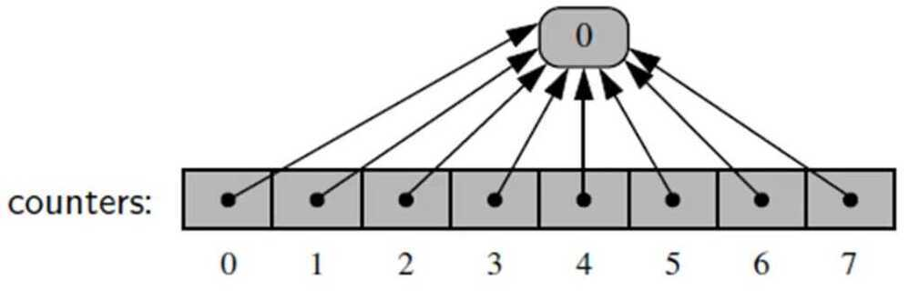

# Array

## Points to remember

1. Implicit Data Structure

2. Linear Data Structure
An array is collection of items stored at continuous memory locations. The idea is to store multiple items of same type together. This makes it easier to calculate the position of each element by simply adding an offset to a base value, i.e., the memory location of the first element of the array (generally denoted by the name of the array).

## Types of indexing in array

- 0 (zero-based indexing): The first element of the array is indexed by subscript of 0
- 1 (one-based indexing): The first element of the array is indexed by subscript of 1
- n (n-based indexing): The base index of an array can be freely chosen. Usually programming languages allowing n-based indexing also allow negative index values and other scalar data types like enumerations, or characters may be used as an array index.

## Advantages of using arrays

- Arrays allow random access of elements. This makes accessing elements by position faster. Constant time access of elements
- Arrays have better [cache locality](https://en.wikipedia.org/wiki/Locality_of_reference) that can make a pretty big difference in performance.

## Cons of arrays

- Arrays take O(n) time for insertion and deletion
- Array size must be specified at time of creation

## Referential Arrays (Each element is a reference to an object)

- When computing the slice of a list, the result is a new list instance.
- New list has references to the same elements that are in the original list.
- temp = primes [3:6]

**Copying Arrays**

- Shallow copy
  - Create a new list that has the references to the same elements as in first list.
- Deep copy
  - If elements are mutable, then changing something in first list can change items from the copied list that is copied using shallow copy, to stop that deep copy should be used. Where every element in the list is copied and then new list references the copied elements. (Can use deepcopy function from the copy module)
counters = [0]*8
All eight cells references the same object.

But since integers are immutable, therefore changing an item doesn't change values of all the elements in the array

Extending a list only copy references of the elements from second list to first list.**Introduction to Arrays**

Python has 3 main sequence classes:

- List [1,2,3]
- Tuple (1,2,3)
- String '123'

All support indexing (eg. T [0] = 1)

## Low Level Arrays

- Focus on computer memory
- Memory address
- Units of memory (bits and bytes)
- Memory retrieval
Python stores each unicode character in 2 bytes of memory. (i.e. 16 bits)

Appropriate memory address can be computed using the calculation, **start + (cellsize)(index)**

## Dynamic Arrays

Don't need to specify how large an array is beforehand.

- A list instance often has greater capacity than current length.
- If elements keep getting appended, eventually this extra space runs out.
- When dynamic array is full then it doubles in size.
An ArrayList, or a dynamically resizing array, is an array that resizes itself as needed while still providing 0(1) access. A typical implementation is that when the array is full, the array doubles in size. Each doubling takes0(n) time, but happens so rarely that its amortized time is still O(1).
