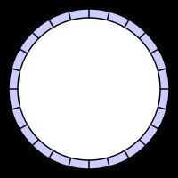

# Circular Buffer

Acircular buffer, circular queue, cyclic bufferorring bufferis a [data structure](https://en.wikipedia.org/wiki/Data_structure) that uses a single, fixed-size [buffer](https://en.wikipedia.org/wiki/Buffer_(computer_science)) as if it were connected end-to-end. This structure lends itself easily to buffering [data streams](https://en.wikipedia.org/wiki/Data_stream).

## Uses

The useful property of a circular buffer is that it does not need to have its elements shuffled around when one is consumed. (If a non-circular buffer were used then it would be necessary to shift all elements when one is consumed.) In other words, the circular buffer is well-suited as a [FIFO](https://en.wikipedia.org/wiki/FIFO_(computing_and_electronics)) buffer while a standard, non-circular buffer is well suited as a [LIFO](https://en.wikipedia.org/wiki/LIFO_(computing)) buffer.

Circular buffering makes a good implementation strategy for a [queue](https://en.wikipedia.org/wiki/Queue_(data_structure)) that has fixed maximum size. Should a maximum size be adopted for a queue, then a circular buffer is a completely ideal implementation; all queue operations are constant time. However, expanding a circular buffer requires shifting memory, which is comparatively costly. For arbitrarily expanding queues, a [linked list](https://en.wikipedia.org/wiki/Linked_list) approach may be preferred instead.

In some situations, overwriting circular buffer can be used, e.g. in multimedia. If the buffer is used as the bounded buffer in the [producer-consumer problem](https://en.wikipedia.org/wiki/Producer-consumer_problem) then it is probably desired for the producer (e.g., an audio generator) to overwrite old data if the consumer (e.g., the [sound card](https://en.wikipedia.org/wiki/Sound_card)) is unable to momentarily keep up. Also, the [LZ77](https://en.wikipedia.org/wiki/LZ77) family of lossless data compression algorithms operates on the assumption that strings seen more recently in a data stream are more likely to occur soon in the stream. Implementations store the most recent data in a circular buffer.

https://en.wikipedia.org/wiki/Circular_buffer
