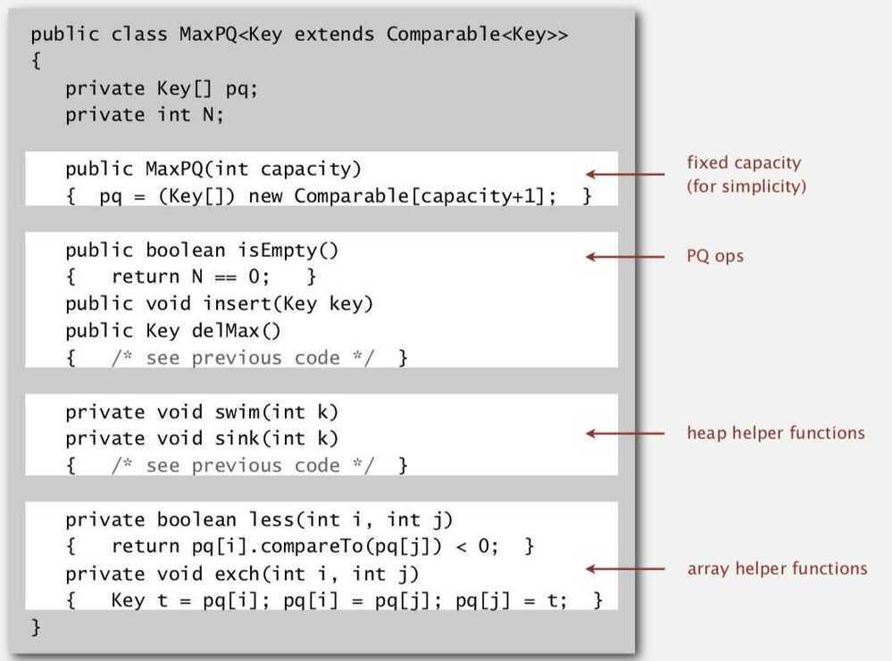

# Priority Queue

A **priority queue** is an [abstract data type](https://en.wikipedia.org/wiki/Abstract_data_type) which is like a regular [queue](https://en.wikipedia.org/wiki/Queue_(abstract_data_type)) or [stack](https://en.wikipedia.org/wiki/Stack_(abstract_data_type)) data structure, but where additionally each element has a "priority" associated with it. In a priority queue, an element with high priority is served before an element with low priority. If two elements have the same priority, they are served according to their order in the queue.
While priority queues are often implemented with [heaps](https://en.wikipedia.org/wiki/Heap_(data_structure)), they are conceptually distinct from heaps. A priority queue is an abstract concept like "a [list](https://en.wikipedia.org/wiki/List_(abstract_data_type))" or "a [map](https://en.wikipedia.org/wiki/Associative_array)"; just as a list can be implemented with a [linked list](https://en.wikipedia.org/wiki/Linked_list) or an [array](https://en.wikipedia.org/wiki/Array_data_structure), a priority queue can be implemented with a heap or a variety of other methods such as an unordered array.
Many applications require that we process items having keys in order, but not necessarily in full sorted order and not necessarily all at once. Often, we collect a set of items, then process the one with the largest key, then perhaps collect more items, then process the one with the current largest key, and so forth. An appropriate data type in such an environment supports two operations: *remove the maximum* and *insert*. Such a data type is called a *priority queue*.

**Goal: Remove the largest (or smallest) item**

## Implementation of Priority Queue

## Python 3

- Python > Documentation > Concurrent Execution
- Python > Documentation > Data Types

## Applications

- Event-driven simulation (customers in a line)
  - Simulate the motion of N moving particles that behave according to the laws of elastic collision.
  - Collision prediction
  - Resolution to calculate velocity
  - Particle-wall collision
  - Particle-particle collision
- Numerical computation (reducing roundoff error)
- Data compression (Huffman codes)
- Graph searching (Dijkstra's algorithm, Prim's algorithm)
- Number theory (sum of powers)
- AI (A* search)
- Statistics (maintain largest M values in a sequence)

Challenge - Find the largest M items in a stream of N items

Constraint - Not enough memory to store N items

- Operating systems (load balancing, interrupt handling)
- Discrete optimizations (bin packing, scheduling)
- Spam filtering (Bayesian spam filter)
- Median Maintanence (Have two heaps and keep invariant that ~i/2 smallest elements in one heap and other ~i/2 elements in another heap)

## Further Reading

- Heap Sort
<https://engineering.fb.com/2021/02/22/production-engineering/foqs-scaling-a-distributed-priority-queue>
