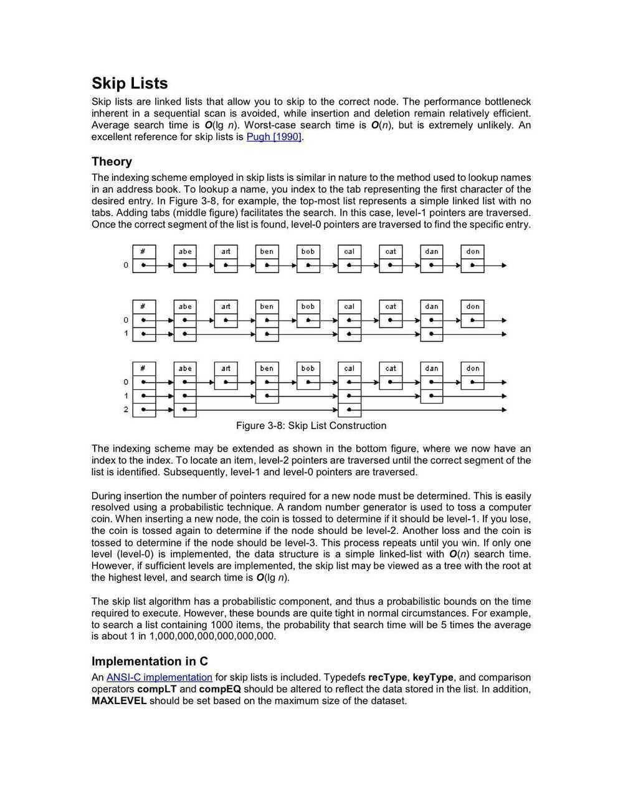
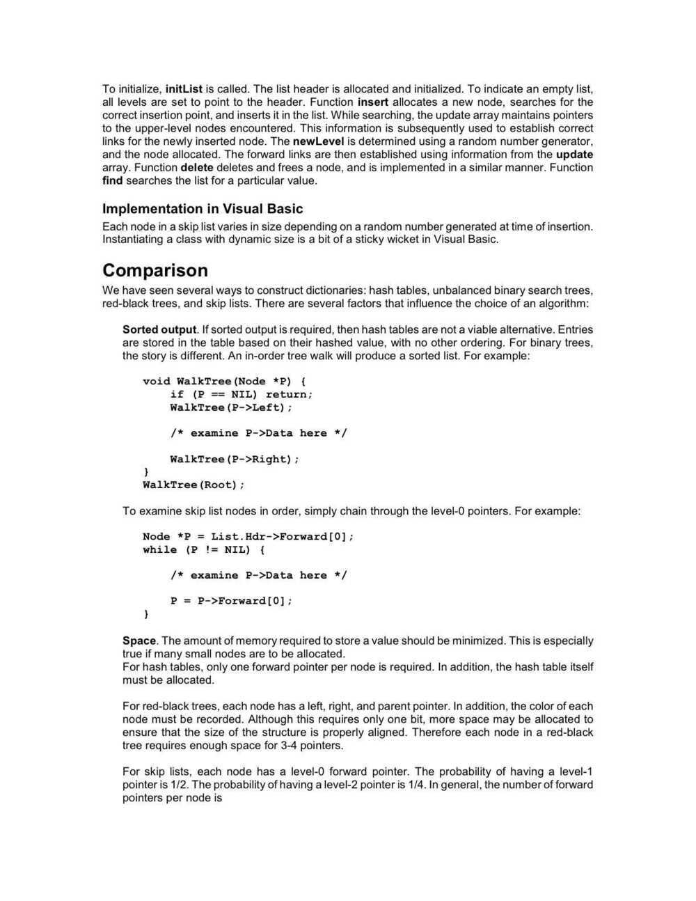

# Skip Lists

In [computer science](https://en.wikipedia.org/wiki/Computer_science), a**skip list** is a [data structure](https://en.wikipedia.org/wiki/Data_structure) that allows fast searchwithin an [ordered sequence](https://en.wikipedia.org/wiki/Ordered_sequence) of elements. Fast search is made possible by maintaining a [linked](https://en.wikipedia.org/wiki/Linked_list) hierarchy of subsequences, with each successive subsequence skipping over fewer elements than the previous one (see the picture below on the right). Searching starts in the sparsest subsequence until two consecutive elements have been found, one smaller and one larger than or equal to the element searched for. Via the linked hierarchy, these two elements link to elements of the next sparsest subsequence, where searching is continued until finally we are searching in the full sequence. The elements that are skipped over may be chosen probabilisticallyor deterministically, with the former being more common.

