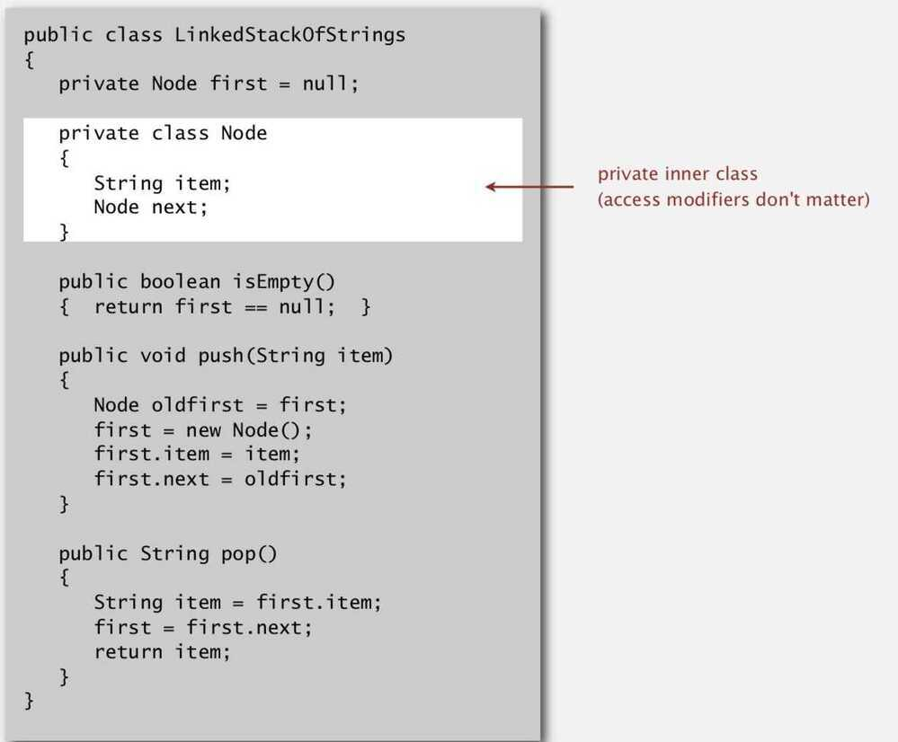

# Stack LIFO

## Points to remember

1. Linear Data Structure
Stack is an abstract data type with a bounded(predefined) capacity. It is a simple data structure that allows adding and removing elements in a particular order. Every time an element is added, it goes on the top of the stack, the only element that can be removed is the element that was at the top of the stack, just like a pile of objects.

## Basic features of Stack

1. Stack is an ordered list of similar data type.

2. Stack is a **LIFO** structure. (Last in First out).3. **push()**function is used to insert new elements into the Stack and**pop()**function is used to delete an element from the stack. Both insertion and deletion are allowed at only one end of Stack called **Top**.4. Stack is said to be in **Overflow** state when it is completely full and is said to be in **Underflow** state if it is completely empty.

5. Loitering (don't keep the reference of the object when an element is popped)

## Applications

1. Parsing

2. Expression Conversion (Infix to Postfix, Postfix to Prefix)

3. JVM

4. Back button in a browser

5. Undo

6. Implementing function calls in a compiler (ex - gcd of two numbers)

7. PostScript languages for printer

8. Arithmetic expression evaluation

Dijkstra's Two-stack algorithm (Use - Interpreter)

## Operations

1. Push (O(1))

2. Pop (O(1))

3. Top (O(1))

4. Search (O(1))

5. Iterate

6. Overflow

7. Underflow

## Implementation

1. Using Linked List

2. Using Array (resizing array)

## Code

1. **Linked List Implementation**

## Loitering

Holding the reference to an object, when it is no longer needed.

## Resizing Arrays

1. Repeated Doubling

When an array fills up, create a new array twice the size of the previous array and copy of the elements in the new array.

2. Thrashing

If the client happens to do push-pop-push-pop alternating when the array is full, then it's going to be doubling, halving, doubling, halving, doubling, halving. Creating new arrays on every operation. Take time proportional to N for every operation, and therefore quadratic time for everything.
2. **Array Implementation (With resizing array)**

- Push: Double the size of array when array is full (Repeated doubling)

- Pop: halve size of array when array is one-quarter full

- Trashing: Problem if we half the array on pop operation. It can be repeated doubling, halving, doubling, halving

- Invariant: Array is between 25% and 100% full

- Every operation takes constant amortized time.
public ResizingArrayStackOfStrings()
{ s = new String [1]; }

public void push(String item)
{

if (N == s.length) resize(2 * s.length);

s [N++] = item;
}

private void resize(int capacity)
{

String [] copy = new String [capacity];
for (int i = 0; i < N; i++)

copy [i] = s [i];
s = copy;

}
public String pop()
{

String item = s [--N];
s [N] = null;
if (N > 0 && N == s.length/4) resize(s.length/2);
return item;

}Linked List vs Array - Stack Implementation -

1. If we need perfect constant time operation for every operation, then we should use stack, ex in an airplane or time critical situation

2. But for ex in a packet router we want very fast operations, so dealing with references will be slow in linked list so we must use array

## Interview Questions

- Evaluate postfix expression using a stack
- Sort values in a stack
- Check balanced parentheses in an expression
