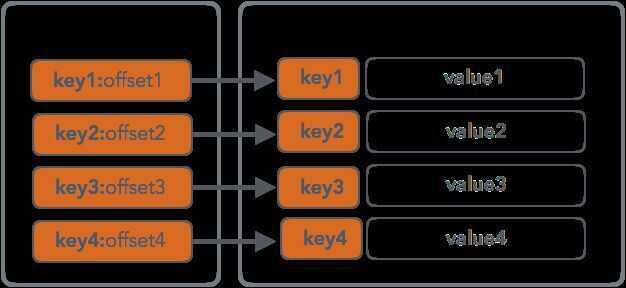

# SSTables, Sorted String Tables

The advantage of the [Sorted String Tables](https://static.googleusercontent.com/media/research.google.com/en/archive/bigtable-osdi06.pdf) is their simplicity: they are easy to write, search and read. SSTables are a persistent ordered immutable map from keys to values, where both keys and values are arbitrary byte strings. They have some nice properties like, for example, the random point-queries (i.e. finding a value by key) can be done quickly by looking up the primary index sequential scans (i.e. iterating over all key/value pairs in a specified key range) can be done efficiently by just reading the records one after the other.
Usually the SSTable has two parts: index and data blocks. Data block consists from the key/value pairs concatenated one after another. The index block contains primary keys and offsets, pointing to the offset in the data block where the actual record can be found. Primary index can be implemented using a format optimised for quick searches, like a B-Tree, for example.

SSTable is a persistent ordered immutable data structures. It usually consist of Index and Data blocks, where index block can be represented by a quick lookup data structure, holding offsets to the values in the Data block; the Data block holds concatenated key/value pairs, enabling fast sequential rangescans.
Since SSTable is immutable, insert, update or delete operations would require rewriting the whole file, since it's optimised for reads, written sequentially and has no reserved empty space that would allow any in-place modifications.
Many databases use SSTables:[RocksDB](https://github.com/facebook/rocksdb/wiki/Terminology) and [Cassandra](https://docs.datastax.com/en/cassandra/3.0/cassandra/dml/dmlManageOndisk.html), just to name a few, but there are plenty other examples. Cassandra, starting with version 3.4, incorporated [SSTable Attached Secondary Indexes](https://github.com/apache/cassandra/blob/trunk/doc/SASI), a concept built on top SSTables and LSM Trees, that simplifies the secondary index maintenance by coupling the index building to memory-resident table flush and SSTable merge process.
<https://medium.com/databasss/on-disk-io-part-3-lsm-trees-8b2da218496f>
