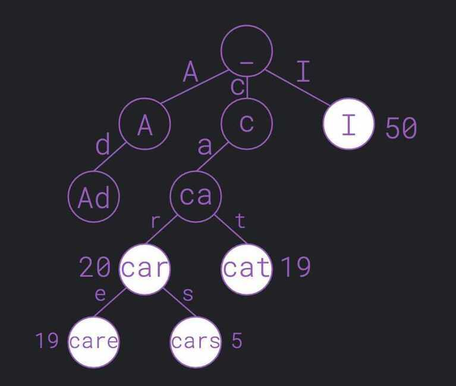
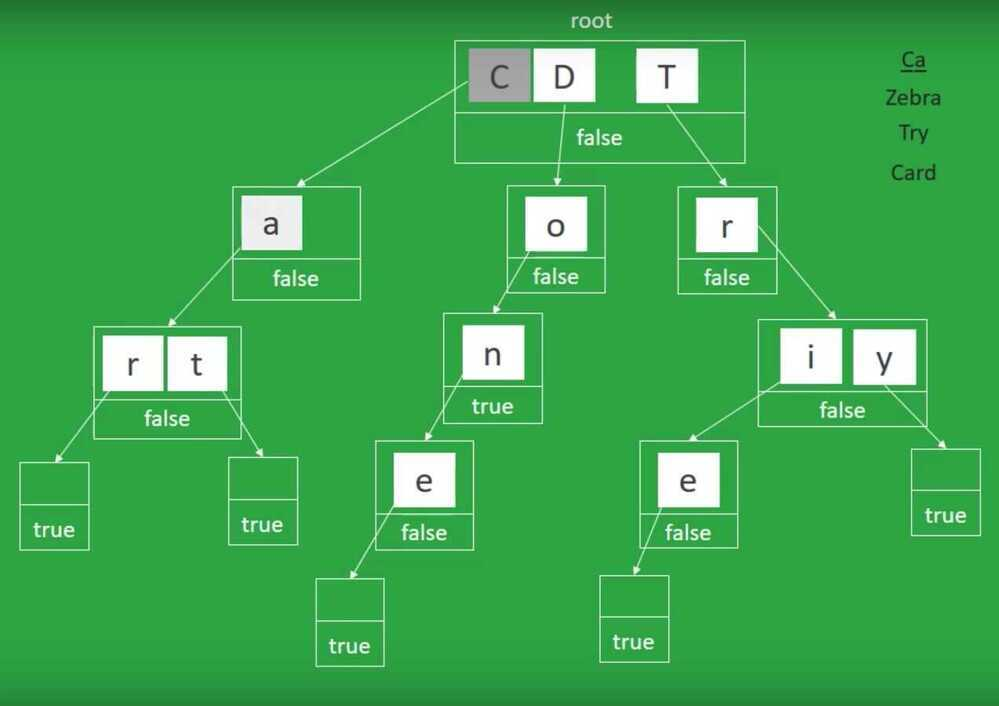

# Standard Trie

Radix Tree / Prefix Tree (Because pre-order traversal would give the nodes in lexicographical order)

- Autocomplete function
- Ordered tree structure having one or more relations between the elements

## Pros

- M - length of the string
- No worry about collision

## Cons

- Lots of space
A trie also known as radix tree or prefix tree, is an ordered tree structure that stores sets or arrays having one or more relations between the elements.
Unlike a binary search tree, an element of a trie isn't an independent entity, but more of a sequence of states following one another.
The best example that uses the trie data structure is the autocomplete function of smartphones: the entry node represents the empty character as you press space, then it gives suggestions of words (represented as leaves) that can be obtained extending the current character sequence (path between the current node and a leaf).

A node that has avalue associatedrepresents a word with a higher or lower chance to be picked by the autocomplete function.
Looking up data in atrieis fast; the worst case takesO(m), wheremis the length of the string, and you don't have to worry about two different words ending up in the same location(collision).
The drawback is thattriescan take up a lot of space because they save each intermediate step. It is also hard to prevent adding long, meaningless sequences of characters to the trie.
They are also calledprefix treesbecause apre-order traversalwould visit the nodes inlexicographical order.

