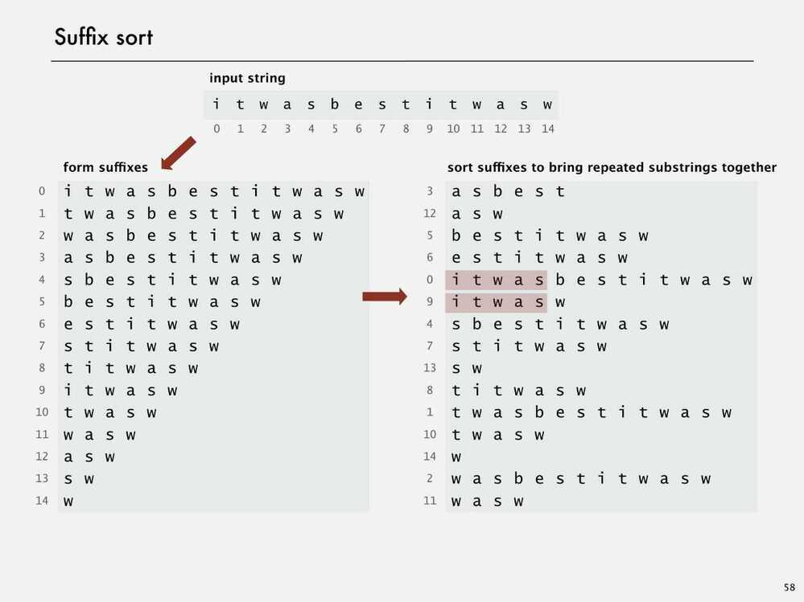
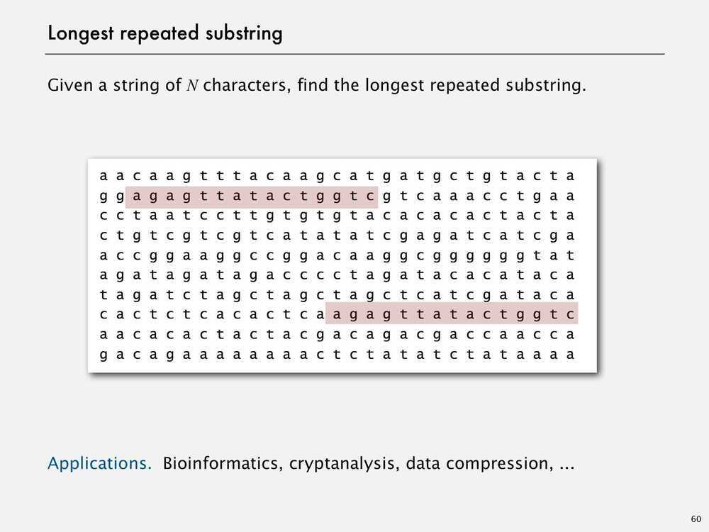
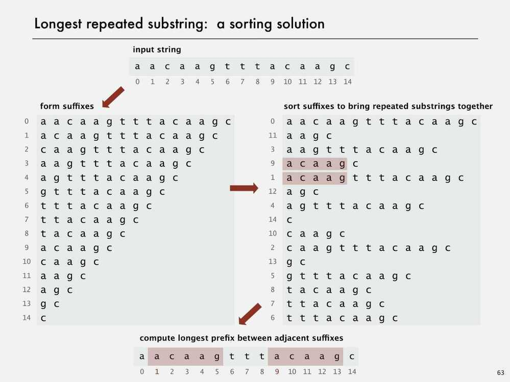
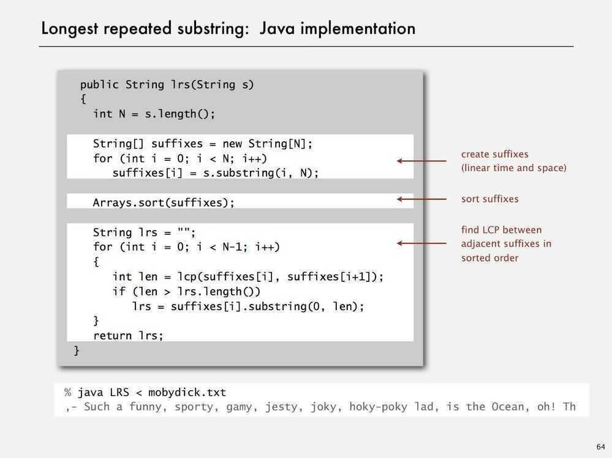
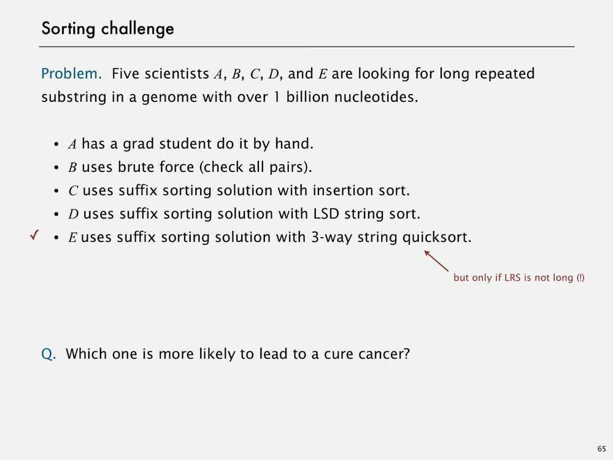
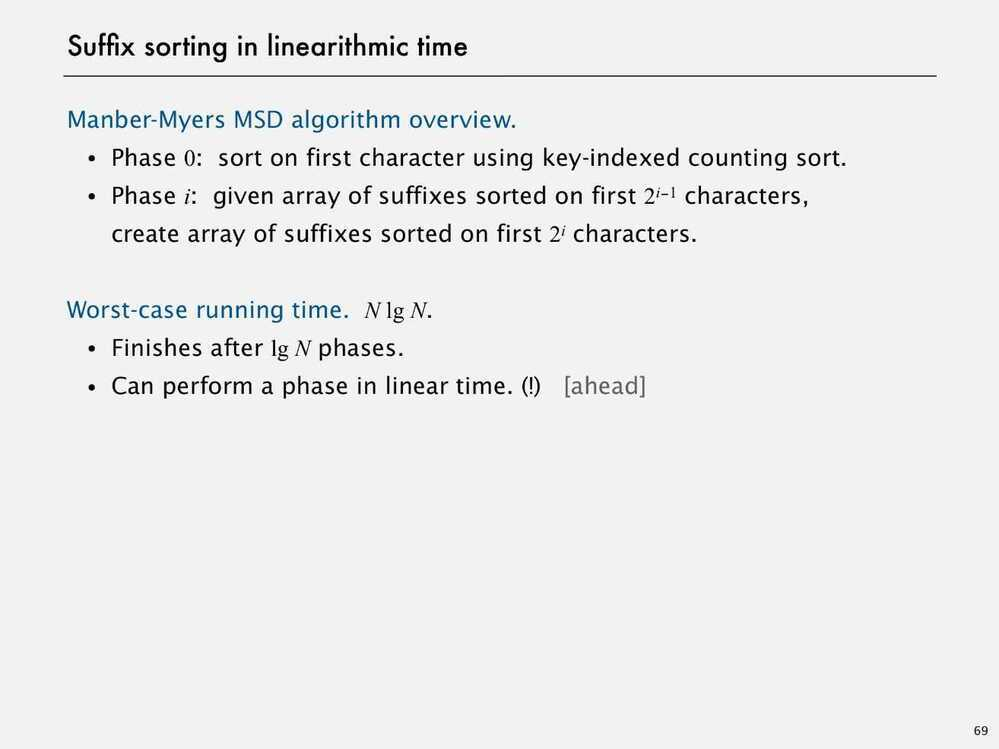
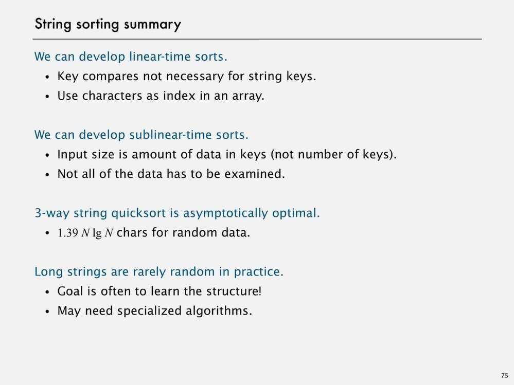
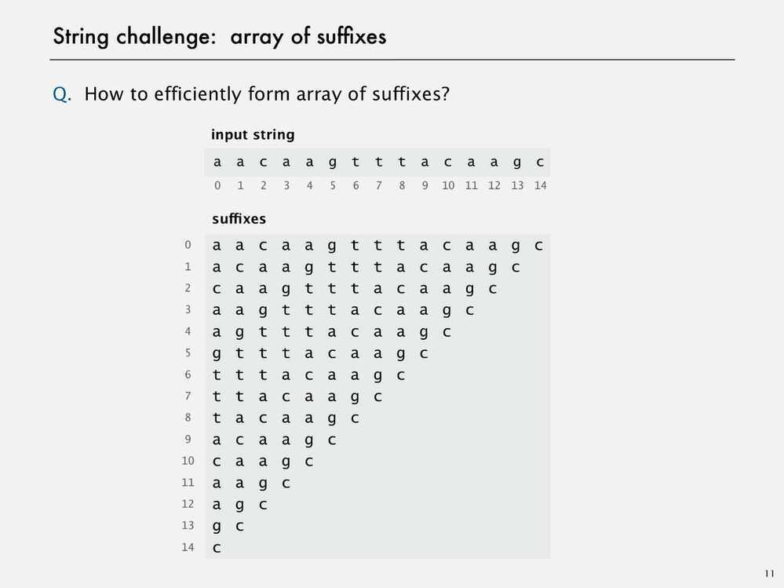
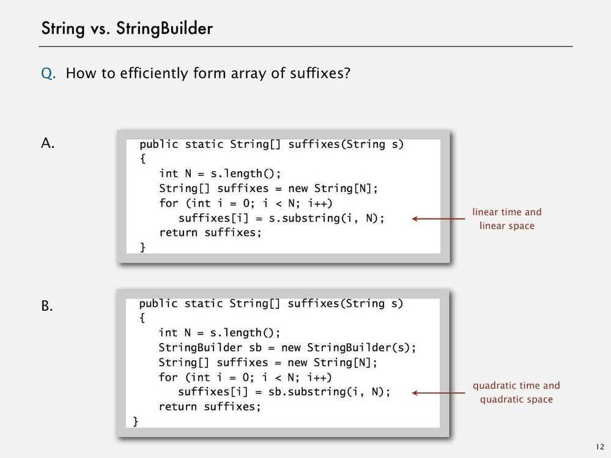

# Suffix Array

## *A suffix array is a sorted array of all suffixes of a given string*. The definition is similar to [Suffix Tree which is compressed trie of all suffixes of the given text](https://www.geeksforgeeks.org/pattern-searching-set-8-suffix-tree-introduction/). Any suffix tree based algorithm can be replaced with an algorithm that uses a suffix array enhanced with additional information and solves the same problem in the same time complexity

A suffix array can be constructed from Suffix tree by doing a DFS traversal of the suffix tree. In fact Suffix array and suffix tree both can be constructed from each other in linear time.
Advantages of suffix arrays over suffix trees include improved space requirements, simpler linear time construction algorithms (e.g., compared to Ukkonen's algorithm) and improved cache locality

## Applications

- Full text indices
- Data compression algorithms
- Field of bibliometrics

## Suffix Arrays and Suffix Sort

## Longest common prefix (LCP)

