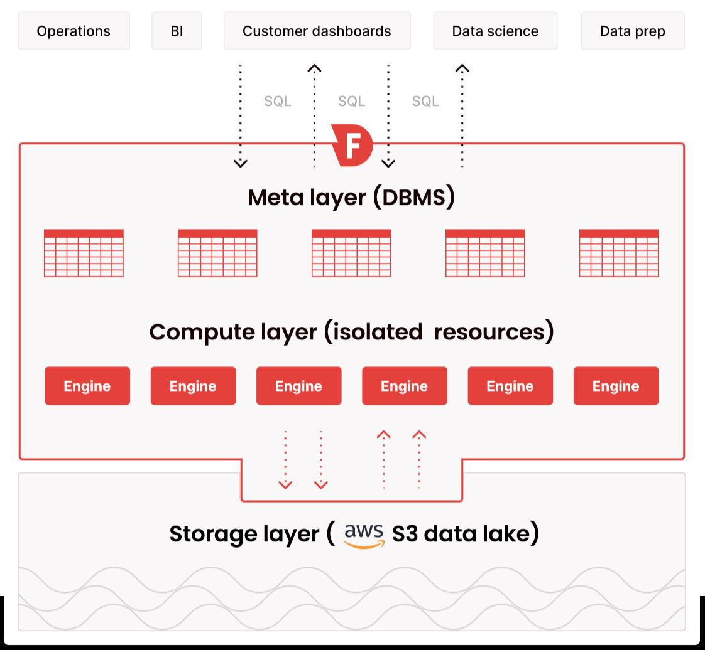

# Others

## Firebolt

A new class of cloud data warehouses built for AWS

Firebolt has completely redesigned the cloud data warehouse to deliver a super fast, incredibly efficient analytics experience at any scale

Firebolt's serverless architecture connects to your S3 data lake as its data source and to the entire data ecosystem using standard SQL as its destination

- [GitHub - firebolt-db/firebolt-core: Firebolt Core is a free, self-hosted edition of Firebolt's distributed query engine (https://www.firebolt.io/); it provides high-performance data warehousing capabilities that can be deployed anywhere from a single laptop to enterprise datacenters.](https://github.com/firebolt-db/firebolt-core) ⭐ 195
- [The Data Warehouse for Data and AI Apps](https://www.firebolt.io/)
- [Firebolt: Why Powering User Facing Applications on Iceberg is Hard (Benjamin Wagner) - YouTube](https://www.youtube.com/watch?v=Vf-N3JzWz0g)

## Doris

Open Source, Real-Time Data Warehouse

Apache Doris is a modern data warehouse for real-time analytics. It delivers lightning-fast analytics on real-time data at scale.

Apache Doris is an easy-to-use, high-performance and real-time analytical database based on MPP architecture, known for its extreme speed and ease of use. It only requires a sub-second response time to return query results under massive data and can support not only high-concurrency point query scenarios but also high-throughput complex analysis scenarios.

All this makes Apache Doris an ideal tool for scenarios including report analysis, ad-hoc query, unified data warehouse, and data lake query acceleration. On Apache Doris, users can build various applications, such as user behavior analysis, AB test platform, log retrieval analysis, user portrait analysis, and order analysis.

[Apache Doris: Open source data warehouse for real time data analytics - Apache Doris](https://doris.apache.org/)

[GitHub - apache/doris: Apache Doris is an easy-to-use, high performance and unified analytics database.](https://github.com/apache/doris) ⭐ 15k

[Is Apache Doris the next big thing? : r/dataengineering](https://www.reddit.com/r/dataengineering/comments/141eswm/is_apache_doris_the_next_big_thing/)

[Apache Doris: an alternative lakehouse solution for real-time analytics - YouTube](https://www.youtube.com/watch?v=QKtZfg5OA8g)

[Real-Time Database for fast analytics and AI, powered by Apache Doris \| VeloDB](https://www.velodb.io/)

## Others

[Floe: A SQL Query Service for the Modern Data Lakehouse (Kurt Westerfeld + Mark Cusack) - Carnegie Mellon Database Group](https://db.cs.cmu.edu/events/floe-a-sql-query-service-for-the-data-lakehouse-kurt-westerfeld-mark-cusack/)
